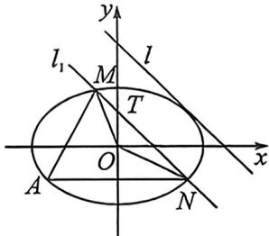

> [!faq]- 例题解析
>
> > [!success]- **【答案】** 详见解析
>
> > [!note]- **【解析】**
> > 解析 (1) 因为 $C$ 的焦距为 $2\sqrt{3}$ , 所以 $a^2 = b^2 + 3$ , 由 $\left\{ \begin{array}{l} \frac{x^2}{b^2 + 3} + \frac{y^2}{b^2} = 1 \\ x + y = 3 \end{array} \right.$ 得 $(2b^2 + 3)x^2 - 6(b^2 + 3)x - b^4 + 6b^2 + 27 = 0$ , 则 $\Delta = 36(b^2 + 3)^2 - 4(2b^2 + 3)(-b^4 + 6b^2 + 27) = 8b^2(b^2 + 3)(b^2 - 3) = 0$ , 得 $b^2 = 3$ , 则 $a^2 = b^2 + 3 = 6$ , 则 $C$ 的方程为 $\frac{x^2}{6} + \frac{y^2}{3} = 1$ ;
> >
> > (2) 设 $M(x_{1}, y_{1}), N(x_{2}, y_{2})$ ，由 $\left\{ \begin{array}{l} \frac{x^{2}}{6} + \frac{y^{2}}{3} = 1 \\ y = x + t \end{array} \right.$ ，得 $3x^{2} + 4tx + 2t^{2} - 6 = 0$ .
> >
> > $\Delta = 16t^2 - 12(2t^2 - 6) = 72 - 8t^2 > 0 \Rightarrow -3 < t < 3, x_1 + x_2 = -\frac{4t}{3}, x_1x_2 = \frac{2t^2 - 6}{3}$ . 设 $l_1: y = x + t$ 与 $y$ 轴交于 $T(0, t)$ , 则 $\triangle OMN$ 的面积为: $S = \frac{1}{2} |OT| |x_2 - x_1| = \frac{1}{2} |t| \sqrt{(x_1 + x_2)^2 - 4x_1x_2} = \frac{|t| \sqrt{72 - 8t^2}}{6} = \frac{4}{3}$ .
> >
> > 整理得 $t^4 - 9t^2 + 8 = 0$ ，得 $t^2 = 8$ 或 $t^2 = 1$ ，则 $t = \pm 2\sqrt{2}$ 或 $t = \pm 1$ .
> >
> > 
> >
> > (3) 法一: 设 $A(m, n)$ , 则 $k_{1} + k_{2} = \frac{y_{1} - m}{x_{1} - m} + \frac{y_{2} - n}{x_{2} - m} = \frac{x_{1} + t - n}{x_{1} - m} + \frac{x_{2} + t - n}{x_{2} - m} = \frac{(x_{1} + t - n)(x_{2} - m) + (x_{2} + t - n)(x_{1} - m)}{(x_{1} - m)(x_{2} - m)} = \frac{2x_{1}x_{2} + (t - m - n)(x_{1} + x_{2}) - 2m(t - n)}{x_{1}x_{2} - m(x_{1} + x_{2}) + m^{2}}$ 由 (2) 知, $x_{1} + x_{2} = -\frac{4t}{3}, x_{1}x_{2} = \frac{2t^{2} - 6}{3}$ , 则 $k_{1} + k_{2} = \frac{6mn - 2tm + 4tn - 12}{2t^{2} + 4tm + 3m^{2} - 6}$ . 假设 $k_{1} + k_{2}$ 为定值 $T$ , 则 $6mn - 2tm + 4tn - 12 = T(2t^{2} + 4tm + 3m^{2} - 6)$ ,
> >
> > 要使方程恒成立，则 $\left\{ \begin{array}{l} T = 0 \\ 4n - 2m = 0 \\ 6mn - 12 = 0 \end{array} \right.$ ，解得 $\left\{ \begin{array}{l} m = 2 \\ n = 1 \end{array} \right.$ 或 $\left\{ \begin{array}{l} m = -2 \\ n = -1 \end{array} \right.$ ，且 $\frac{(\pm 2)^2}{6} + \frac{(\pm 1)^2}{3} = 1$ ，故存在定点 $A(2,1)$ 或 $A$
> >
> > $$
> > (- 2, - 1)
> > $$
> >
> > $$
> > k _ {1} + k _ {2}
> > $$
> >
> > 法二：设 $A:(x_0,y_0)$ ，将椭圆按 $\overrightarrow{AO} (-x_0, - y_0)$ 平移， $\frac{(x + x_0)^2}{6} +\frac{(y + y_0)^2}{3} = 1,\frac{x^2}{6} +\frac{y^2}{3} +\frac{xx_0}{3} +\frac{2yy_0}{3} = 0$ ，平移后 $M$
> >
> >
> > $\rightarrow M^{\prime}, N \rightarrow N^{\prime}$ , 由于 $k_{MN} = k_{MN^{\prime}} = 1$ , 不妨设 $M^{\prime}N^{\prime}: mx - my = 1$ , 进行齐次化联立: $\frac{x^{2}}{6} + \frac{y^{2}}{3} + \left(\frac{xx_{0}}{3} + \frac{2yy_{0}}{3}\right)(mx - my) = 0$ , 由于斜率存在, 故 $x \neq 0$ , 同除以 $x^{2}$ 得: $\left(\frac{1}{3} - \frac{2my_{0}}{3}\right)\left(\frac{y}{x}\right)^{2} + \left(\frac{2my_{0}}{3} - \frac{mx_{0}}{3}\right)\frac{y}{x} + \frac{1}{6} + \frac{mx_{0}}{3} = 0, k_{1} + k_{2} = -\frac{2my_{0} - mx_{0}}{1 - 2my_{0}}$ 为定值, 所以 $2y_{0} - x_{0} = 0, A: (x_{0}, y_{0})$ 是椭圆上的点, $\left\{ \begin{array}{l} \frac{y_{0}}{x_{0}} = \frac{1}{2} \\ \frac{x_{0}^{2}}{6} + \frac{y_{0}^{2}}{3} = 1 \end{array} \right.$ , 所以 $x_{0} = 2, y_{0} = 1$ 或 $x_{0} = -2, y_{0} = -1$ .
