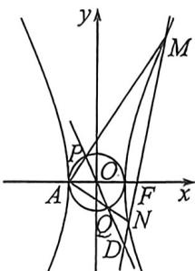

> [!faq]- 例题解析
>
> > [!success]- **【答案】** 详见解析
>
> > [!note]- **【解析】**
> > 解析 (1) 因为圆 $O: x^{2} + y^{2} = 1$ 与 $C$ 恰有两个交点, 由双曲线及圆的对称性知, 圆过双曲线的左右顶点, 所以 $a = 1$ , 又 $e = \frac{c}{a} = 2$ , 所以 $c = 2$ , 故 $b^{2} = c^{2} - a^{2} = 4 - 1 = 3$ , 所以双曲线 $C$ 的方程为 $x^{2} - \frac{y^{2}}{3} = 1$ .
> >
> > 
> >
> > (2)(|)将双曲线与圆按： $\overrightarrow{AO}(1,0)$ 平移， $(x-1)^{2}-\frac{y^{3}}{3}=1,(x-1)^{2}+y^{2}=1$ ；即 $x^{2}-\frac{y^{2}}{3}-2x=0,x^{2}+y^{2}-2x=0$ ；令 $M^{\prime}N^{\prime}:\frac{x}{3}+ny=1;P^{\prime}Q^{\prime}:px+qy=1$ ，齐次化联立得： $\left\{\begin{aligned}x^{2}-\frac{y^{2}}{3}-2x\left(\frac{x}{3}+ny\right)=0\\ x^{2}+y^{2}-2x(px+qy)=0\end{aligned}\right.$ ，由于斜率均存在，故同除以 $x^{2}$ ：一 $\frac{1}{3}\left(\frac{y}{x}\right)^{2}-2n\frac{y}{x}+\frac{1}{3}=0$ ；所以 $k_{1}\cdot k_{2}=k_{AM}\cdot k_{AN}=-1$ ，所以 $\angle MAN=90^{\circ}$ ，所以O,P,Q三点共线.
> >
> > (3)又因为 $\left(\frac{y}{x}\right)^{2}-2q\frac{y}{x}+1-2p=0$ ，所以1-2p=-1，所以p=1且 $k_{1}+k_{2}=-\frac{-2n}{-\frac{1}{3}}=2q$ ，所以q=-3n，所以 $\left\{\begin{aligned}\frac{x}{3}+ny=1\\x-3ny=1\end{aligned}\right.$ ，所以 x=2，即 $P^{\prime}Q^{\prime}$ 与 $M^{\prime}N^{\prime}$ 交于 x=2，平移回去，所以 PQ 与 MN 交于 x=1.
> >
> >
> > 注题 此类型题不算新型考题,21年22年就比较常见了,属于齐次化最佳练手类型,下一题就是此类型的练手题型。
