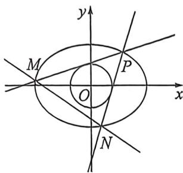

> [!faq]- 例题解析
>
> > [!success]- **【答案】** 详见解析
>
> > [!note]- **【解析】**
> > 解析 (1)由题知, $\left\{ \begin{array}{l} \frac{6}{9a^2} + \frac{6}{9b^2} = 1 \\ b = 1 \end{array} \right.$ , 解得 $a = \sqrt{2}, b = 1$ , 所以椭圆 $C$ 的方程为 $\frac{x^2}{2} + y^2 = 1$ .
> >
> > 
> >
> > (2)设切线方程为 $y - \frac{\sqrt{6}}{3} = k\left(x - \frac{\sqrt{6}}{3}\right)$ ，即 $kx - y + \frac{\sqrt{6}}{3}(1 - k) = 0$ ，则 $\frac{\left|\frac{\sqrt{6}}{3}(1 - k)\right|}{\sqrt{k^2 + 1}} = r$ ，整理得 $\left(r^2 - \frac{2}{3}\right) k^2 + \frac{4}{3} k + r^2 - \frac{2}{3} = 0$ ，因为 $0 < r < \frac{\sqrt{6}}{3}$ ，所以直线 $PM, PN$ 斜率存在，且不为 0，记为 $k_1, k_2$ ，
> >
> > 由韦达定理可知 $k_{1}k_{2} = 1$ ，将椭圆按照 $\overrightarrow{PO}\left(-\frac{\sqrt{6}}{3}, - \frac{\sqrt{6}}{3}\right)$ 平移， $\frac{\left(x + \frac{\sqrt{6}}{3}\right)^2}{2} +\left(y + \frac{\sqrt{6}}{3}\right)^2 = 1,\frac{x^2}{2} +y^2 +\frac{\sqrt{6}}{3} x + \frac{2\sqrt{6}}{3} y = 0,$ 令 $M^{\prime}N^{\prime}:mx + ny = 1$ ，齐次化联立： $\frac{x^2}{2} +y^2 +\left(\frac{2\sqrt{6}}{3} m + \frac{\sqrt{6}}{3} n\right)\frac{y}{x} +\frac{1}{2} +\frac{\sqrt{6}m}{3} = 0,k_1k_2 = \frac{\frac{1}{2} + \frac{\sqrt{6}}{3}m}{1 + \frac{2\sqrt{6}}{3}n} = 1$ ，所以 $\frac{2\sqrt{6}}{3} m-$ $\frac{4\sqrt{6}}{3} n = 1$ ，所以 $M^{\prime}N^{\prime}$ 过 $\left(\frac{2\sqrt{6}}{3}, - \frac{4\sqrt{6}}{3}\right)$ ，故MN过定点 $(\sqrt{6}, - \sqrt{6})$
> >
> > (3)由(2)知 $\left(r^2 -\frac{2}{3}\right)k^2 +\frac{4}{3} k + r^2 -\frac{2}{3} = 0$ ，所以 $k_{1} + k_{2} = -\frac{\frac{4}{3}}{r^{2} - \frac{2}{3}}$ ，当 $r = 2 - \sqrt{2}$ 时， $k_{1} + k_{2} = -\frac{\frac{4}{3}}{(2 - \sqrt{2})^{2} - \frac{2}{3}} =$ $\frac{3\sqrt{2} + 4}{2}$ ，由齐次化得： $k_{1} + k_{2} = \frac{\frac{2\sqrt{6}}{3}m + \frac{\sqrt{6}}{3}n}{1 + \frac{2\sqrt{6}}{3}n} = -\frac{4m + 2n}{\sqrt{6} + 4n} = \frac{3\sqrt{2} + 4}{2}$ 且 $\frac{2\sqrt{6}}{3} m - \frac{4\sqrt{6}}{3} n = 1$ ，即： $2m - 4n = \frac{\sqrt{6}}{2}$ 所以 $k_{MN}$ $= -\frac{m}{n} = -\frac{\sqrt{2}}{2}$ .所以直线MN的方程为 $y + \sqrt{6} = -\frac{\sqrt{2}}{2}(x - \sqrt{6})$ ，即 $\frac{\sqrt{2}}{2} x + y + \sqrt{6} -\sqrt{3} = 0$ ，因为圆心 $O(0,0)$ 到直线MN的距离 $d = \frac{\sqrt{6} - \sqrt{3}}{\sqrt{1 + \frac{1}{2}}} = 2 - \sqrt{2}$ ，所以直线MN与圆O相切.
> >
> > 注题 此类型题在心高考三问中比较常见,就是同构方程与齐次化综合的题型,值得好好去反复练习。下一题也是此类型的训练题。
