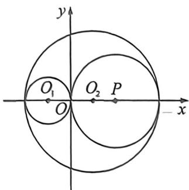
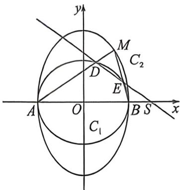

<!-- question-source:start -->
例35（湖北襄阳市第四中学高三开学综合测试·T18）已知圆 $O_{1}: (x + 1)^{2} + y^{2} = 1$ ，圆 $O_{2}: (x - 1)^{2} + y^{2} =$

9, 动圆 $P$ 与圆 $O_{1}$ 外切并与圆 $O_{2}$ 内切, 圆心 $P$ 的轨迹为曲线 $C_{1}$ ; 将曲线 $C_{1}$ 上每一点的纵坐标伸长为原来的 $\sqrt{3}$ 倍 (横坐标不变), 得到曲线 $C_{2}$ .

(1)求曲线 $C_1, C_2$ 的方程；

(2) 若 $A(-2,0), B(2,0), M$ 为曲线 $C_2$ 上一动点且在第一象限内, 直线 $MA, MB$ 分别交曲线 $C_1$ 与 $D, E$ 两点, 连接 $DE$ 交 $x$ 轴与 $N$ 点.

(1) 若 $\overrightarrow{AD} = \frac{5}{4} \overrightarrow{DM}$ ，求直线 AM 的方程；

(Ⅱ)曲线 $C_{1}$ 上是否存在定点 S 使得 M, S, N 三点的横坐标按一定顺序成等比数列？若存在，请求出满足条件的点 S 的坐标；若不存在，请说明理由.

<!-- question-source:end -->

![[高中/总复习/二轮/2026版高中《MST新思路思维拓展》二轮复习专题/下册/板块1_不等式/考点五_万能对合方程应用/questions/answers/Q00093435A1.md]]
