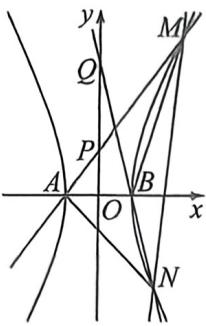

<!-- question-source:start -->
例37 (湖北圆创联盟26届高三第一次联合测评·T18)已知双曲线 $C_{1}\frac{x^{2}}{a^{2}} -\frac{y^{2}}{b^{2}} = 1(a > 0,b > 0)$ 的离心率为 $\sqrt{5}$ ,点 $(\sqrt{2},2)$ 在 $C$ 上， $A,B$ 为 $C$ 的左、右顶点.

(1) 求 $C$ 的方程；

(2) 若点 $M, N$ 在 $C$ 的右支上 ( $M$ 在第一象限), 直线 $AM, BN$ 分别交 $y$ 轴于 $P, Q$ 两点, 且 $\overrightarrow{OQ} = 3\overrightarrow{OP}$ .

(1) 探究: 直线 $MN$ 是否过定点? 若过定点, 求出该定点坐标; 若不过定点, 请说明理由;

(Ⅱ)设 $S_{1}, S_{2}$ 分别为 $\triangle AMN$ 和 $\triangle BMN$ 的面积, 求 $S_{1}-S_{2}$ 的取值范围.
<!-- question-source:end -->

![[高中/总复习/二轮/2026版高中《MST新思路思维拓展》二轮复习专题/下册/板块1_不等式/考点五_万能对合方程应用/questions/answers/Q00093437A1.md]]
