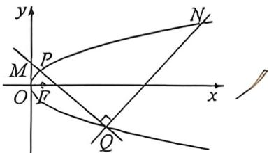

> [!faq]- 例题解析
>
> > [!success]- **【答案】** 详见解析
>
> > [!note]- **【解析】**
> > 解析 (1) 据题意, 当 $y_0 = 1$ 时, $x_0 = \frac{1}{2p}$ , 此时点 $P\left(\frac{1}{2p}, 1\right)$ . 面 $F\left(\frac{p}{2}, 0\right)$ , 所以 $|PF| = \sqrt{\left(\frac{1}{2p} - \frac{p}{2}\right)^2 + 1} = \frac{5}{4}$ . 化简得 $\left(\frac{1}{2p} - \frac{p}{2}\right)^2 = \frac{9}{16}$ , 解得 $\frac{1}{2p} - \frac{p}{2} = \pm \frac{3}{4}$ 继续化简得 $2p^2 \pm 3p - 2 = 0$ , 因为 $p > 1$ , 所以 $p = \frac{3 + \sqrt{9 + 16}}{4} = 2$ . 所以抛物线 $E$ 的方程为 $y^2 = 4x$ .
> >
> > (2)由题意知， $F(1,0)$ ，设 PF 中点为 M，则 $M\left(\frac{x_{0}+1}{2},\frac{y_{0}}{2}\right)$ 。而 $\omega$ 的半径 $r=\frac{1}{2}|PF|=\frac{x_{0}+1}{2}$ ，因此 M 到 y 轴的距离等于 $\omega$ 的半径，说明 $\omega$ 与 y 轴相切，有唯一公共点 $T\left(0,\frac{y_{0}}{2}\right)$ 。直线 PT 的斜率 $k=\frac{y_{0}}{2x_{0}}=\frac{2}{y_{0}}$ ，因此 PT； $x=\frac{y_{0}}{2}y-\frac{y_{0}^{2}}{4}$ 。 $\left\{\begin{aligned}y^{2}&=4x\\ x&=\frac{y_{0}}{2}y-\frac{y_{0}^{2}}{4}\end{aligned}\right.\Rightarrow y^{2}-2y_{0}y+y_{0}^{2}&=0,\Delta=4y_{0}^{2}-4y_{0}^{2}=0,$
> >
> > 故直线 PT 与抛物线 E 相切, 只有一个公共点 P.
> >
> > 
> >
> > (3) 设 $Q(x_{1}, y_{1}), N(x_{2}, y_{2}), PQ$ 的斜率 $k_{1} = \frac{y_{1} - y_{0}}{x_{1} - x_{0}} = \frac{4(y_{1} - y_{0})}{y_{1}^{2} - y_{0}^{2}} = \frac{4}{y_{1} + y_{0}}$ . 同理 $QN$ 斜率 $k_{2} = \frac{4}{y_{1} + y_{2}}$ .
> >
> > $PQ_{1}(y_{0}+y_{1})y=4x+y_{1}y_{0}$ （自证）， $x=0,y_{M}=\frac{y_{0}y_{1}}{y_{0}+y_{1}},QN:(y_{1}+y_{2})y=4x+y_{1}y_{2},k_{1}k_{2}=-1$ ，所以 $\frac{4}{y_{0}+y_{1}}\cdot\frac{4}{y_{1}+y_{2}}=-1$ ，所以 $y_{2}=\frac{-16-y_{1}^{2}-y_{0}y_{1}}{y_{0}+y_{1}}$ ，由(2)可得，若MN是抛物线的切线，有 $y_{M}=\frac{1}{2}y_{2}$ .
> >
> > 即 $\frac{2y_0y_1}{y_0 + y_1} = \frac{-16 - y_0y_1 - y_1^2}{y_0 + y_1}$ 整理得 $y_{0} = -\left(\frac{y_{1}}{3} +\frac{16}{3y_{1}}\right)$ 由 $y_0 > 0$ 可得 $y_{1} <   0$ ，因此 $y_0\geqslant \frac{1}{3}\times 2\times \sqrt{(-y_1)\times\left(\frac{16}{-y_1}\right)}$ $= \frac{8}{3}$ .故 $y_{0}$ 的最小值为 $\frac{8}{3}$
