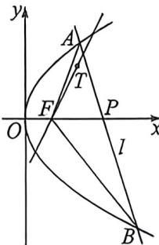
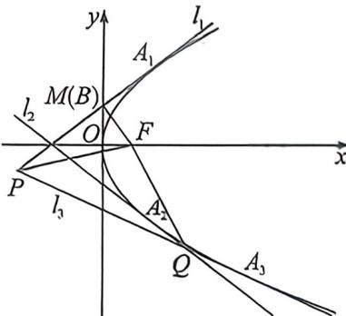

> [!faq]- 例题解析
>
> > [!success]- **【答案】** 详见解析
>
> > [!note]- **【解析】**
> > 解析 (1)由题意,当点A横坐标为2时,点A到准线 $x=-\frac{p}{2}$ 的距离为3,即 $2+\frac{p}{2}=3$ ,解得p=2,所以抛物线E的标准方程为: $y^{2}=4x$ .
> >
> > (2) 点 $F(1,0)$ , 设 $A(x_1, y_1), B(x_2, y_2)$ . $AB: (y_1 + y_2)y = 4x + y_1y_2$ (需自证), 由于过定点 $P(3,0)$ , 所以 $y_1y_2 = -12$ , 又由于过定点 $T(2,2)$ , 所以 $2(y_1 + y_2) = 8 - 12 = -4$ , 所以 $y_1 + y_2 = -2$ , 此时 $\triangle FAB$ 面积为 $\frac{1}{2} |FP| \cdot |y_1 - y_2| = \sqrt{(y_1 + y_2)^2 - 4y_1y_2} = \sqrt{(-2)^2 - 4 \times (-12)} = 2\sqrt{13}$ .
> >
> > 
> >
> > (3) 易知 $k_{FT}=\frac{2}{2-1}=2$ ,
> >
> > 法一(齐次化): 将抛物线按照 $\overrightarrow{FO}(-1,0)$ 平移, 得 $y^{2}-4(x+1)=y^{2}-4x-4=0$ , 平移后 $A^{\prime}B^{\prime}$ 过点 $P^{\prime}(2,0)$ , 设 $A^{\prime}B^{\prime}$ : $\frac{x}{2}+ny=1$ , 齐次化联立得: $y^{2}-4x\left(\frac{x}{2}+ny\right)-4\left(\frac{x}{2}+ny\right)^{2}=0$ , 同除以 $x^{2}, (1-4n^{2})\frac{y^{2}}{x^{2}}-8n\frac{y}{x}-3=0$ ,
> >
> > 设 $\tan \alpha = k_{FA} = k_1, \tan \beta = k_{FB} = k_2$ ，直线 $FT$ 平分 $\angle AFB$ ，则利用到角公式： $\frac{k_1 - 2}{1 + 2k_1} = \frac{2 - k_2}{1 + 2k_2}$ ，所以 $4k_1k_2 - 3(k_1 + k_2) - 4 = 0$ ，即 $\frac{-12}{1 - 4n^2} - \frac{24n}{1 - 4n^2} - 4 = 0, 2n^2 - 3n - 2 = 0$ ，解的： $n = 2$ ，此时 $k_{AB} = -\frac{1}{2n} = -\frac{1}{4}$ 由于 $k_{AB} < 0$ ，另一个根 $n = -\frac{1}{2}$ （舍）；
> >
> > 法二(向量投影):角平分线翻译为到两个边向量 $\overrightarrow{FA}$ 和 $\overrightarrow{FB}$ 的投影相等, $\overrightarrow{FT}\cdot\frac{\overrightarrow{FA}}{|FA|}=\overrightarrow{FT}\cdot\frac{\overrightarrow{FB}}{|FB|}$ ,
> >
> > 又 $\overrightarrow{FT} = (1,2),\overrightarrow{FA} = \left(\frac{y_1^2}{4} -1,y_1\right),\overrightarrow{FB} = \left(\frac{y_2^2}{4} -1,y_2\right)$ ，所以 $\frac{\frac{y_1^2}{4} + 2y_1 - 1}{\sqrt{\left(\frac{y_1^2}{4} + 1\right)^2}} = \frac{\frac{y_2^2}{4} + 2y_2 - 1}{\sqrt{\left(\frac{y_2^2}{4} + 1\right)^2}}$ ，所以 $1 + \frac{2y_1 - 2}{\frac{y_1^2}{4} + 1} = 1+$ $\frac{2y_2 - 2}{\frac{y_2^2}{4} + 1}$ 所以 $y_{1}y_{2}^{2} + 4y_{1} - y_{2}^{2} - 4 = y_{2}y_{1}^{2} + 4y_{2} - y_{1}^{2} - 4,$ 故 $y_{1} + y_{2} = y_{1}y_{2} - 4.$ 即 $\frac{4}{k} = -12 - 4$ ，解得： $k = -\frac{1}{4}$
> >
> > 例为（福瑞厦门外国语学校 2026 届高三 9 月月考 · T19）已知抛物线 $F_{1}y^{2}=2px (p>0)$ 的焦点为 $F, A_{1}$ 是 $\Gamma$ 上第一象限内的点，且 $A_{1}$ 到 $F$ 距离与 $A_{1}$ 到 $x=-1$ 的距离相等。过 $A_{1}$ 作 $\Gamma$ 的切线 $l_{1}$ 交 $y$ 轴于点 $M$ .
> >
> > (1)求 P 的标准方程；
> >
> > (2) 求证: $FM \perp l_{1}$ ;
> >
> > (3)记 $A_{1}$ 关于 $x$ 轴的对称点为 $A_{2}, l_{1}$ 关于 $x$ 轴的对称直线为 $l_{\perp}, A_{1}$ 为 $\Gamma$ 上第四象限的点（与 $A_{2}$ 不重合），过 $A_{3}$ 做 $\Gamma$ 的切线 $l_{3}$ ，分别交 $l_{1}, l_{2}$ 于 $P, Q$ 两点，若 $\angle PFM = 2\angle PQF$ ，直线 $FQ$ 的斜率为 $k_{1}$ ，直线 $FM$ 的斜率为 $k_{2}$ ，试判断 $\frac{k_{1}}{k_{2}}$ 是否为定值？若为定值，求 $\frac{k_{1}}{k_{2}}$ 的值，若不为定值，请说明理由。
> >
> > 解析 (1)由题意,抛物线准线方程为 x=-1,故 p=2,所以抛物线的标准方程为 $y^{2}=4x$ .
> >
> > (2)设 $A_{1}(x_{1},y_{1})$ ，由于 $A_{1}$ 在第一象限，故斜率存在，设直线 $l_{1}$ 的方程为 $y - y_{1} = k_{1}(x - x_{1})$
> >
> > 由于 $A_{1}$ 在第一象限，可得 $y = 2\sqrt{x}, y' = \frac{1}{\sqrt{x}}$ ，所以切线斜率为 $k_{l_1} = \frac{1}{\sqrt{x_1}} = \frac{2}{y_1}$ ，即直线 $l_{1}$ 的方程为 $y_{1}y = 2x - 2x_{1} + y_{1}^{2}$ $= 2(x + x_{1})$ ，令 $x = 0$ 得 $M\left(0, \frac{2x_{1}}{y_{1}}\right)$ ，由题意知 $F(1,0)$ ，故 $k_{FM} = -\frac{2x_{1}}{y_{1}}, k_{l_1} \cdot k_{FM} = -\frac{4x_{1}}{y_{1}^{2}} = -\frac{y_{1}^{2}}{y_{1}^{3}} = -1$ ，故 $FM \perp l_{1}$ .
> >
> > 
> >
> > (3)如图, 设 $A_{2}(x_{1}, -y_{1}), A_{3}(x_{3}, y_{3})$ , 由 $l_{1}, l_{2}$ 关于 $x$ 轴对称, 可得 $l_{2}: -y_{1}y = 2(x + x_{1})$ , 由 $y = -2\sqrt{x}, y' = -\frac{1}{\sqrt{x}}$ , 可得 $k_{l_{1}} = -\frac{1}{\sqrt{x_{3}}} = \frac{2}{y_{3}}$ , 所以 $l_{3}: y - y_{3} = \frac{2}{y_{3}} (x - x_{3})$ , 即 $l_{3}: y_{3}y = 2(x + x_{3})$ , 联立 $l_{3}$ 与 $l_{1}, \left\{ \begin{array}{l} y_{1}y = 2(x + x_{1}) \\ y_{3}y = 2(x + x_{3}) \end{array} \right.$ , 解得 $x_{P} = \frac{x_{1}y_{3} - x_{3}y_{1}}{y_{1} - y_{3}} = \frac{y_{1}^{2}y_{3} - y_{3}^{2}y_{1}}{4(y_{1} - y_{3})} = \frac{y_{1}y_{3}}{4}$ . 同理 $x_{Q} = -\frac{y_{1}y_{3}}{4}$ , 故 $x_{P} + x_{Q} = 0$ , 设直线 $l_{3}$ 与 $y$ 轴交于 $N$ , 则 $P, Q$ 关于点 $N$ 对称, 即 $NP = NQ$ ,
> >
> > 由 $l_{3}: y_{3}y = 2(x + x_{3})$ ，令 $x = 0$ ，得 $y = \frac{2x_{3}}{y_{3}}$ ，所以 $N\left(0, \frac{2x_{3}}{y_{3}}\right)$ ，故 $k_{FN} = -\frac{2x_{3}}{y_{3}}$ ，则 $k_{l_{1}} \cdot k_{FN} = -\frac{4x_{3}}{y_{3}^{2}} = -\frac{y_{3}^{2}}{y_{3}^{2}} = -1$ ，可得 $FN$ 垂直于 $l_{3}$ ，故 $FP = FQ$ ，可得 $\angle FPQ = \angle FQP$ ，
> >
> > 延长 $QF$ 交 $y$ 轴于 $B$ , 则 $\angle PFB = \angle FPQ + \angle FQP = 2\angle FQP$ , 又 $\angle PFM = 2\angle PQF$ , 故 $\angle PFB = \angle PFM$ , 从而 $B$ 与 $M$ 重合, 即 $M, F, Q$ 共线, 进而 $k_{1} = k_{2}$ , 注意到 $k_{1} \neq 0$ , 故 $\frac{k_{1}}{k_{2}} = 1$ .
