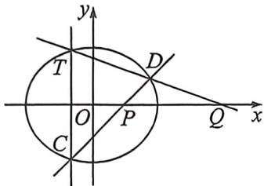
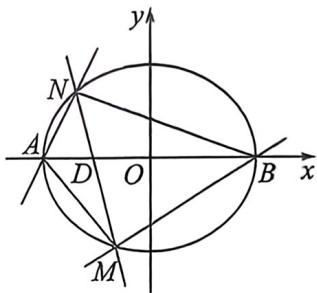

> [!faq]- 例题解析
>
> > [!success]- **【答案】** 详见解析
>
> > [!note]- **【解析】**
> > 解析 (1) 因为的一个焦点坐标是 $(1,0)$ , 短轴长是长轴长的 $\frac{\sqrt{3}}{2}$ , 所以 $c = 1, \frac{2b}{2a} = \frac{\sqrt{3}}{2}$ , 又 $a^2 = b^2 + c^2$ ,
> >
> > 解得 $a = 2, b = \sqrt{3}$ , 则椭圆 $E$ 的方程为 $\frac{x^2}{4} + \frac{y^2}{3} = 1$ ;
> >
> > 
> >
> > 
> >
> > (2)证明:设C、D两点对应的半角参数为 $t_{1}$ 和 $t_{2}$ ，利用两点对合式(步骤省略)， $CD:\frac{x}{2}(1-t_{1}t_{2})+\frac{y}{\sqrt{3}}(t_{1}+t_{2})=1+t_{1}t_{2}$ ，过 $P(m,0)$ ，所以 $t_{1}t_{2}=\frac{m-2}{m+2}$ ，由于T、C两点关于x轴对称，所以T点对应参数 $t_{3}=-t_{1}$ ， $TD:\frac{x}{2}(1+t_{1}t_{2})+\frac{y}{\sqrt{3}}(-t_{1}+t_{2})=1-t_{1}t_{2}$ ，过 $Q(n,0)$ ，所以 $t_{1}t_{2}=\frac{2-n}{2+n}$ ，所以 $\frac{m-2}{m+2}=\frac{2-n}{2+n}$ ，所以 $|OP|\cdot|OQ|=mn=4$ ；
> >
> > (3) 设 $M(2\cos \theta_1, \sqrt{3}\sin \theta_1), N(2\cos \theta_2, \sqrt{3}\sin \theta_2)$ ，则 $\sqrt{3}\sin \theta_1 = \frac{2\sqrt{3}\tan\frac{\theta_1}{2}}{1 + \tan^2\frac{\theta_1}{2}} = \frac{2\sqrt{3}t_1}{1 + t_1^2}, \sqrt{3}\sin \theta_2 = \frac{2\sqrt{3}t_2}{1 + t_2^2}, k_1 = \frac{\sqrt{3}\sin \theta_1}{2\cos \theta_1 + 2} = \frac{\sqrt{3}}{2}$ $\tan \frac{\theta_1}{2} = \frac{\sqrt{3}}{2} t_1, k_2 = \frac{\sqrt{3}\sin \theta_2}{2\cos \theta_2 - 2} = -\frac{\sqrt{3}}{2}\frac{1}{\tan\frac{\theta_2}{2}} = -\frac{\sqrt{3}}{2t_2}, k_1 = 2k_2 \Rightarrow t_1t_2 = -2,$
> >
> > 对比 $MN: \frac{x}{2} (1 - t_1t_2) + \frac{y}{\sqrt{3}} (t_1 + t_2) = 1 + t_1t_2$ 可知: $x = -\frac{2}{3}, y = 0$ 为其所过定点, 利用面积宽高模型,
> >
> > $$
> > \left| S _ {1} - S _ {2} \right| = \frac {\left| | B D | - | A D | \right| \cdot \left| y _ {1} - y _ {2} \right|}{2} = \frac {2}{3} \left| y _ {1} - y _ {2} \right| = \frac {4}{\sqrt {3}} \left| \frac {t _ {1}}{1 + t _ {1} ^ {2}} - \frac {t _ {2}}{1 + t _ {2} ^ {2}} \right| = \frac {4}{\sqrt {3}} \cdot \left| \frac {3 (t _ {1} - t _ {2})}{5 + t _ {1} ^ {2} + t _ {2} ^ {2}} \right| = 4 \sqrt {3}
> > $$
> >
> > $\left|\frac{t_1 + \frac{2}{t_1}}{5 + t_1^2 + \frac{4}{t_1^2}}\right|$ ，令 $m = \left|t_1 + \frac{2}{t_1}\right| \in [2\sqrt{2}, +\infty), |S_1 - S_2| = 4\sqrt{3} \left|\frac{m}{m^2 + 1}\right| = 4\sqrt{3} \cdot \frac{1}{m + \frac{1}{m}} \leqslant \frac{8\sqrt{6}}{9}$ ，当且仅当 $|t_1| = \sqrt{2}$
> >
> > 时等号成立；
