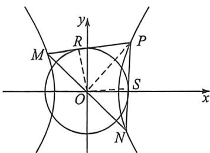

> [!faq]- 例题解析
>
> > [!success]- **【答案】** 详见解析
>
> > [!note]- **【解析】**
> > 解析（1）由题意知 $\left\{ \begin{array}{l}2c = 4\\ \frac{2}{a^2} -\frac{3}{b^2} = 1\Rightarrow \left\{ \begin{array}{l}a = 1\\ b = \sqrt{3} \end{array} \right.,\\ a^2 +b^2 = c^2 \end{array} \right.$ 所以 $C$ 的方程为 $x^{2} - \frac{y^{2}}{3} = 1$
> >
> > (2)令 $A(r_{1}\cos \theta ,r_{1}\sin \theta),B\left(r_{2}\cos \left(\theta -\frac{\pi}{2}\right),r_{2}\sin \left(\theta -\frac{\pi}{2}\right)\right)$ ，则 $\left\{ \begin{array}{l}r_1^2\cos^2\theta -\frac{r_1^2\sin^2\theta}{3} = 1\\ r_2^2\sin^2\theta -\frac{r_1^2\cos^2\theta}{3} = 1 \end{array} \right.\Rightarrow \frac{1}{r_1^2} +\frac{1}{r_2^2} = \frac{2}{3}$ ，由于 $S_{0AB} = \frac{1}{2}$ $r_1r_2 = \frac{1}{2}|AB|\cdot d,\frac{1}{r_1^2} +\frac{1}{r_2^2} = \frac{r_1^2 + r_2^2}{r_1^2r_2^2} = \frac{|AB|^2}{r_1^2r_2^2} = \frac{2}{3},$ 所以 $d = \frac{\sqrt{6}}{2}$ ，所以 $|AB|_{\max} = \frac{r_1r_{2\max}}{\frac{\sqrt{6}}{2}};$
> >
> > $\frac{1}{r_1^2} + \frac{1}{r_2^2} = \frac{2}{3} \geqslant \frac{2}{r_1 r_2} \Rightarrow r_1 r_2 \geqslant 3$ ，当且仅当 $r_1 = r_2$ 时取等， $|AB|_{\max} = \frac{r_1 r_{2\max}}{\frac{\sqrt{6}}{2}} = \sqrt{6}$ ， $|AB|$ 的取值范围为 $[\sqrt{6}, +\infty)$ ；
> >
> > 
> >
> > (3)若 $|PM| = |PN|$ ，则两切点 $|PR| = |PS|$ ， $\angle MPO = \angle NPO$ ，所以 $PO \perp MN$ ，根据(2)可知 $r^2 = \frac{3}{2}$ ，即 $r = \frac{\sqrt{6}}{2}$ 一定成立，我们仅需验证 $r = \frac{\sqrt{6}}{2}$ 是本题唯一解，令 $M\left(\frac{1}{\cos(-\theta_1)}, \sqrt{3} \tan(-\theta_1)\right), N\left(\frac{1}{\cos\theta_2}, \sqrt{3} \tan\theta_2\right), P\left(\frac{1}{\cos\theta_0}, \sqrt{3} \tan\theta_0\right)$ $PM: x(1 + t_0 t_1) - \frac{y}{\sqrt{3}} (t_0 + t_1) = 1 - t_0 t_1, PN: x(1 + t_0 t_2) - \frac{y}{\sqrt{3}} (t_0 + t_2) = 1 - t_0 t_2,$ $r = \frac{|1 - t_0 t_1|}{\sqrt{(1 + t_0 t_1)^2 + \frac{1}{3}(t_0 + t_1)^2}}$ ，所以 $t_1^2\left(\frac{r^2}{3} + r^2 t_0^2 - t_0^2\right) + t_1\left(\frac{8}{3} r^2 t_0 + 2t_0\right) + r^2 + \frac{r^2 t_0^2}{3} - 1 = 0,$
> >
> > 同理： $t_2^2\left(\frac{r^2}{3} + r^2 t_0^2 - t_0^2\right) + t_2\left(\frac{8}{3} r^2 t_0 + 2t_0\right) + r^2 + \frac{r^2 t_0^2}{3} - 1 = 0,$
> >
> > 所以 $t_1 + t_2 = -\frac{\frac{8}{3}r^2t_0 + 2t_0}{\frac{r^2}{3} + r^2t_0^2 - t_0^2}, t_1t_2 = \frac{r^2 + \frac{r^2t_0^2}{3} - 1}{\frac{r^2}{3} + r^2t_0^2 - t_0^2};$
> >
> > $$
> > M N: x (1 + t _ {1} t _ {2}) - \frac {y}{\sqrt {3}} (t _ {1} + t _ {2}) = 1 - t _ {1} t _ {2}, k _ {M N} k _ {O P} = - 1 \Rightarrow \frac {\sqrt {3} (1 + t _ {1} t _ {2})}{(t _ {1} + t _ {2})} \cdot \frac {\sqrt {3} \tan \theta_ {0}}{\frac {1}{\cos \theta_ {0}}} = 6 \frac {1 + t _ {1} t _ {2}}{t _ {1} + t _ {2}} \cdot \frac {t _ {0}}{1 + t _ {0} ^ {2}} = - 1,
> > $$
> >
> > 所以 $6t_{0}(1 + t_{1}t_{2}) = -(t_{1} + t_{2})(1 + t_{0}^{2})$ ，即 $(4r^2 -3)(1 + t_0^2) = \left(\frac{4}{3} r^2 +1\right)(1 + t_0^2)$ ，所以 $r^2 = \frac{3}{2}$ 故仅存在 $r = \frac{\sqrt{6}}{2}$ 符合题意.
