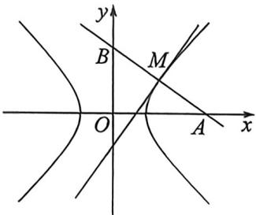
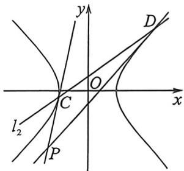

> [!faq]- 例题解析
>
> > [!success]- **【答案】** 详见解析
>
> > [!note]- **【解析】**
> > 解析 (1)依条件知 $\frac{b}{a} = 1$ ，且 $2a = 2$ ，所以 $a = 1, b = 1$ ，所以 $\Gamma$ 的标准方程为 $x^{2} - y^{2} = 1$ .
> >
> > 
> >
> > 
> >
> > (2)(1) 因为 $l: xx_0 - yy_0 = 1, k_l = \frac{x_0}{y_0}$ , 所以 $k_{AB} = -\frac{y_0}{x_0}, AB: y - y_0 = -\frac{y_0}{x_0} (x - x_0)$ , 分别代入 $x = 0$ , 则 $y_B = 2y_0, y = 0$ , 则 $x_A = 2x_0$ , 所以 $\left\{ \begin{array}{l} x = 2x_0 \\ y = 2y_0 \end{array} \right.$ , 代入 $x_0^2 - y_0^2 = 1$ , 所以曲线 $E$ 的方程是 $\frac{x^2}{4} - \frac{y^2}{4} = 1 (y \neq 0)$ ;
> >
> > (Ⅱ)令 $C:(x_{1},y_{1}),D(x_{2},y_{2})$ ，则 $CP:xx_{1}-yy_{1}=4,DP:xx_{2}-yy_{2}=4$ ，由于两直线均过点 $P(x_{0},y_{0})$ ，所以 $\left\{\begin{aligned}x_{0}x-y_{0}y_{1}&=4\\ x_{0}x_{2}-y_{0}y_{2}&=4\end{aligned}\right.$ ，所以 CD: $xx_{0}-yy_{0}=4$ ，由于 CD 过点 Q(0,1)，所以 $y_{0}=-4$ ，故 CD: $y=kx+1=-\frac{x_{0}}{4}x+1$ ，所以 k=- $\frac{x_{0}}{4}$ ，当 $x=x_{0}$ 时， $y_{M}=-\frac{x_{0}^{2}}{4}=1-4k^{2}$ ，所以 $S_{\Delta PCD}=\frac{1}{2}\cdot|y_{M}-y_{P}|\cdot|x_{C}-x_{D}|,\left\{\begin{aligned}y=kx+1\\ x^{2}-y^{2}&=4\end{aligned}\right.$ ，所以 $(1-k^{2})x^{2}-2kx-5=0,\left\{\begin{aligned}\Delta&=4k^{2}+20(1-k^{2})>0\\ k&\neq\pm\frac{1}{2}\\ &-\frac{5}{1-k^{2}}<0\end{aligned}\right.$ ， $k^{2}<1$ 且 $k\neq\pm\frac{1}{2};x_{1}+x_{1}=\frac{2k}{1-k^{2}},x_{1}x_{2}=-\frac{5}{1-k^{2}}$
> >
> > 所以 $S_{\triangle PCD} = \frac{1}{2}\left|5 - 4k^2\right|\sqrt{(x_1 + x_2)^2 - 4x_1x_2} = \frac{1}{2}\cdot \frac{\left|5 - 4k^2\right|\sqrt{5 - 4k^3}}{1 - k^2}$ ，令 $t = \sqrt{5 - 4k^2}(t > 1$ 且 $t\neq 2)$ ，则 $f(t) = S_{\triangle PCD} = \frac{4t^3}{t^2 - 1} (t > 1$ 且 $t\neq 2)$ .因为 $f^{\prime}(t) = \frac{4t^{2}(t^{2} - 3)}{(t^{2} - 1)^{2}}$ ，由 $f^{\prime}(t) > 0$ 得 $t > \sqrt{3}$ ，且 $t\neq 2$ ；由 $f^{\prime}(t) <   0$ 得 $1 <   t <   \sqrt{3}$ ，所以 $f(t)$ 在 $(1,\sqrt{3})$ 上单调递减，在 $(\sqrt{3},2),(2, + \infty)$ 上单调递增.
> >
> > 所以 $f(t)_{\min} = f(\sqrt{3}) = 6\sqrt{3}$ ，即 $\triangle PCD$ 面积的最小值为 $6\sqrt{3}$ .
