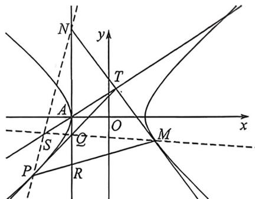

> [!faq]- 例题解析
>
> > [!success]- **【答案】** 详见解析
>
> > [!note]- **【解析】**
> > 解析 (1) $x^{2}-\frac{y^{2}}{4}=1$
> >
> > (2)(i):(t,t+1)在切点弦 $xx_{T}-\frac{yy_{T}}{4}=1$ 上，所以 $tx-\frac{(t+1)y}{4}=1$ ，过定点 $R(-1,-4)$ （调和共轭属性），联立 $\left\{\begin{aligned} &tx-\frac{(t+1)y}{4}=1\\ &x^{2}-\frac{y^{2}}{4}=1\end{aligned}\right.$ $\Delta=16[4-\left(\frac{4t}{t+1}\right)^{2}+\left(\frac{4}{t+1}\right)^{2}]>0\Rightarrow-1<t<\frac{5}{3}$ 且 $t\neq1,t\neq-\frac{1}{3}$ （渐近线）
> >
> > 
> >
> > (Ⅱ):(两点对合方程):令 $P\left(\frac{1}{\cos(-\theta_{1})},\frac{2\sin(-\theta_{1})}{\cos(-\theta_{1})}\right)$ (位于左支), $M\left(\frac{1}{\cos\theta_{2}},\frac{2\sin\theta_{2}}{\cos\theta_{2}}\right)$ (位于右支),
> >
> > $$
> > \cos \theta_ {1} \cos \frac {\theta_ {1} + \theta_ {2}}{2} + \sin \theta_ {1} \sin \frac {\theta_ {1} + \theta_ {2}}{2} = \cos \frac {\theta_ {1} - \theta_ {2}}{2}, \cos \theta_ {2} \cos \frac {\theta_ {1} + \theta_ {2}}{2} + \sin \theta_ {2} \sin \frac {\theta_ {1} + \theta_ {2}}{2} = \cos \frac {\theta_ {1} - \theta_ {2}}{2},
> > $$
> >
> > 故 $P\left(\frac{1}{\cos(-\theta_1)}, \frac{2\sin(-\theta_1)}{\cos(-\theta_1)}\right), M\left(\frac{1}{\cos\theta_2}, \frac{2\sin\theta_2}{\cos\theta_2}\right)$ ，均在对合方程 $x \cos \frac{\theta_1 + \theta_2}{2} - \frac{y}{2} \sin \frac{-\theta_1 + \theta_2}{2} = \cos \frac{\theta_1 - \theta_2}{2}$ 上，
> >
> > 即弦 $PM$ 的对合方程是： $x\cos \frac{\theta_1 + \theta_2}{2} - \frac{y}{2}\sin \frac{-\theta_1 + \theta_2}{2} = \cos \frac{\theta_1 - \theta_2}{2}$ ，令 $t_1 = \tan \left(-\frac{\theta_1}{2}\right), t_2 = \tan \frac{\theta_2}{2}$ ，
> >
> > 所以 $PM; x(1 + t_1 t_2) - \frac{y}{2}(t_1 + t_2) = 1 - t_1 t_2$ ，由于过点 $(-1, -4)$ ，所以 $t_1 + t_2 = 1$
> >
> > $TP: \frac{x}{\cos(-\theta_1)} - \frac{y \sin(-\theta_1)}{2 \cos(-\theta_1)} = 1$ ，所以 $Q: \left(-1, \frac{2 \cos(-\theta_1) + 2}{-\sin(-\theta_1)}\right)$ ，即 $\left(-1, \frac{-2}{t_1}\right)$ ，
> >
> > $TM: \frac{x}{\cos\theta_2} - \frac{y\sin\theta_2}{2\cos\theta_2} = 1$ ，所以 $N: \left(-1, \frac{2\cos\theta_2 + 2}{-\sin\theta_2}\right)$ ，即 $\left(-1, \frac{-2}{t_2}\right)$ ，
> >
> > <!-- source-part:3 pages:101-150 -->
> >
> > $S, Q, M$ 三点共线: $\frac{y_0 + \frac{2}{t_1}}{x_0 + 1} = \frac{\frac{2}{t_1} + \frac{2\sin\theta_2}{\cos\theta_2}}{1 + \frac{1}{\cos\theta_2}} = \frac{1 + 2t_1t_2 - t_3^2}{t_1}$
> >
> > $N$ 三点共线： $\frac{y_0 + \frac{2}{t_2}}{x_0 + 1} = \frac{\frac{2}{t_2} + \frac{2\sin(-\theta_1)}{\cos(-\theta_1)}}{1 + \frac{1}{\cos(-\theta_1)}} = \frac{1 + 2t_1t_2 - t_1^2}{t_2}$
> >
> > ,所以 $\left\{\begin{aligned}t_{1}y_{0}+2=(x_{0}+1)(1+2t_{1}t_{2}-t_{2}^{2})\\ t_{2}y_{0}+2=(x_{0}+1)(1+2t_{1}t_{2}-t_{1}^{2})\end{aligned}\right.$ ;
> >
> > 两式相减，得： $(t_1 - t_2)y_0 = (x_0 + 1)(t_1^2 -t_2^2)$ ，所以 $y_{0} = x_{0} + 1$
