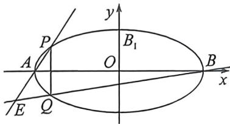
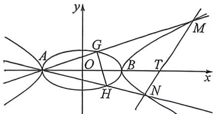

> [!faq]- 例题解析
>
> > [!success]- **【答案】** 详见解析
>
> > [!note]- **【解析】**
> > 解析 (1) 由题意: a=2, 设 $D(x,y)$ , 所以 $A(-2,0)$ , $B(2,0)$ ;
> >
> > 由 $k_{DA} \cdot k_{DB} = -\frac{1}{4} \Rightarrow \frac{y}{x + 2} \cdot \frac{y}{x - 2} = -\frac{1}{4} \Rightarrow \frac{x^2}{4} + y^2 = 1.$ 故椭圆 $C_1: \frac{x^2}{4} + y^2 = 1.$
> >
> > (2)(1)如图
> >
> > 
> >
> > 
> >
> > 设 $P(x_0, y_0), Q(x_0, -y_0), x_0 \in [-2, 2]$ ，且 $\frac{x_0^2}{4} + y_0^2 = 1$ 。当 $x_0 \in \pm 2$ 时，
> >
> > 直线 $AP: \frac{y}{y_0} = \frac{x + 2}{x_0 + 2} \Rightarrow (x_0 + 2)y - y_0x - 2y_0 = 0$ ，直线 $BQ: \frac{y}{-y_0} = \frac{x - 2}{x_0 - 2} \Rightarrow (x_0 - 2)y + y_0x - 2y_0 = 0$
> >
> > 由 \( \left\{\begin{aligned}(x\_{0}+2)y-y\_{0}x-2y\_{0}&=0\\(x\_{0}-2)y+y\_{0}x-2y\_{0}&=0\end{aligned}\right.\Rightarrow\left\{\begin{aligned}x\_{0}&=\frac{4}{x}\\ y\_{0}&=\frac{2y}{x}\end{aligned}\right. \)  由 \( \frac{x\_{0}^{2}}{4}+y\_{0}^{2}&=1\Rightarrow\frac{4}{x^{2}}+\frac{4y^{2}}{x^{2}}=1\Rightarrow\frac{x^{2}}{4}-y^{2}=1. \)  另 A, B 两点也适合上述方程. 故
> >
> > E 点轨迹 $C_{2}$ 的方程为: $\frac{x^{2}}{4}-y^{2}=1$ .
> >
> > (Ⅱ)(对合): 设 $G(2\cos\theta_{1}, \sin\theta_{1})$ , $H(2\cos\theta_{2}, \sin\theta_{2})$ , $M\left(\frac{2}{\cos\theta_{3}}, \tan\theta_{3}\right)$ , $N\left(\frac{2}{\cos\theta_{4}}, \tan\theta_{4}\right)$ , $t_{1} = \tan\frac{\theta_{1}}{2}$ , $t_{2} = \tan\frac{\theta_{2}}{2}$ , $t_{3} = \tan\frac{\theta_{3}}{2}$ , $t_{4} = \tan\frac{\theta_{4}}{2}$ , $k_{AM} = k_{AG} = \frac{\sin\theta_{1}}{2 + 2\cos\theta_{1}} = \frac{1}{2} \tan\frac{\theta_{1}}{2} = \frac{t_{1}}{2}$ , $k_{AO} = \frac{\tan\theta_{3}}{\frac{2}{\cos\theta_{3}} + 2} = \frac{1}{2} \tan\frac{\theta_{3}}{2} = \frac{1}{2} t_{3}$ , 所以 $t_{1} = t_{3}$ , $\theta_{1} = \theta_{3}$ , 同理 $t_{2} = t_{4}$ , $\theta_{2} = \theta_{4}$ ; 所以 $MN: \frac{x}{2}(1 + t_{1}t_{2}) - y(t_{1} + t_{2}) = 1 - t_{1}t_{2}$ , 代入点 $T(4,0)$ 得: $t_{1}t_{2} = -\frac{1}{3}$ ,
> >
> > $$
> > \frac {S _ {1}}{S _ {2}} = \frac {\frac {1}{2} | A M | | A N | \sin \angle P A Q}{\frac {1}{2} | A G | | A H | \sin \angle M A N} = \frac {| A M |}{| A G |} \cdot \frac {| A N |}{| A H |} = \frac {\tan \theta_ {1}}{\sin \theta_ {1}} \cdot \frac {\tan \theta_ {2}}{\sin \theta_ {2}} = \frac {1}{\cos \theta_ {1} \cos \theta_ {2}} = \frac {(1 + t _ {1} ^ {2}) (1 + t _ {2} ^ {2})}{(1 - t _ {1} ^ {2}) (1 - t _ {2} ^ {2})} = \frac {1 0 + 9 (t _ {1} ^ {2} + t _ {2} ^ {2})}{1 0 - 9 (t _ {1} ^ {2} + t _ {2} ^ {2})}
> > $$
> >
> > $$
> > t _ {1} ^ {2} + t _ {2} ^ {3} = t _ {1} ^ {2} + \frac {1}{9 t _ {1} ^ {2}} \geqslant \frac {2}{3}, \text {所以} \frac {S _ {1}}{S _ {2}} = \frac {1 0 + 9 (t _ {1} ^ {2} + t _ {2} ^ {2})}{1 0 - 9 (t _ {1} ^ {2} + t _ {2} ^ {2})} = - 1 + \frac {2 0}{1 0 - 9 (t _ {1} ^ {2} + t _ {2} ^ {2})} = - 1 + \frac {2 0}{1 0 - \left(9 t _ {1} ^ {2} + \frac {1}{t _ {1} ^ {2}}\right)} \geqslant 4.
> > $$
