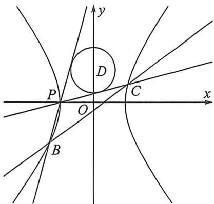
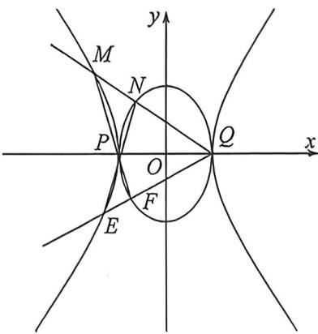

> [!faq]- 例题解析
>
> > [!success]- **【答案】** 详见解析
>
> > [!note]- **【解析】**
> > 解析 (1)由双曲线 $\Gamma: \frac{x^2}{a^2} - \frac{y^2}{b^2} = 1 (a > 0, b > 0)$ 的焦距为 $2\sqrt{3}$ 可得 $c = \sqrt{a^2 + b^2} = \sqrt{3}$ , 又其中一条渐近线方程为 $\sqrt{2}x - y = 0$ , 则 $\frac{b}{a} = \sqrt{2}$ , 解得 $a = 1, b = \sqrt{2}$ , 所以双曲线 $\Gamma$ 的方程为 $x^2 - \frac{y^2}{2} = 1$ .
> >
> > 
> >
> > 
> >
> > (2) 设 $B\left(\frac{1}{\cos\theta_1}, \sqrt{2}\tan\theta_1\right), C\left(\frac{1}{\cos\theta_2}, \sqrt{2}\tan\theta_2\right), t_1 = \tan \frac{\theta_1}{2}, t_2 = \tan \frac{\theta_2}{2}$ , 则 $k_{PB} = \sqrt{2} t_1, k_{FC} = \sqrt{2} t_2$ , 所以 $\begin{cases} PB: y = \sqrt{2} t_1 (x + 1) \\ PC: y = \sqrt{2} t_2 (x + 1) \end{cases}$ , 以圆心 $D(0,1)$ 到切线 $l$ 的距离为 $d = \frac{|\sqrt{2}t_1 - 1|}{\sqrt{2t_1^2 + 1}} = r^2 \Leftrightarrow 2t_1^2 (r^2 - 1) + 2\sqrt{2}t_1r + r^2 - 1 = 0$ , 同理$d=\frac{\left|\sqrt{2}t_{2}-1\right|}{\sqrt{2}t_{2}^{1}+1}=r^{2}\Leftrightarrow2t_{2}^{2}(r^{2}-1)+2\sqrt{2}t_{2}r+r^{2}-1=0$ ，所以 $\left\{\begin{aligned}t_{1}+t_{2}&=-\frac{\sqrt{2}r}{r^{2}-1}\\ t_{1}t_{2}&=\frac{1}{2}\end{aligned}\right.$ ，对比BC的两点对合方程 $BC: x(1+t_{1}t_{2})-\frac{y}{\sqrt{2}}(t_{1}+t_{2})=1-t_{1}t_{2}$ ，可知 $\left\{\begin{aligned}x&=\frac{1}{3}\\ y&=0\end{aligned}\right.$ 时满足题意，直线BC过定点 $\left(\frac{1}{3},0\right)$ .
> > (3)由(1)知P(-1,0),Q(1,0)，设H(x,y)，依题意， $\left|\frac{y}{x+1}\cdot\frac{y}{x-1}\right|=2$ ，化简得： $y^{2}=2|x^{2}-1|$ ，两边取平方，整理即得动点H的轨迹方程为G： $\left(x^{2}-\frac{y^{2}}{2}-1\right)\left(x^{2}+\frac{y^{2}}{2}-1\right)=0$ ，其中 $y\neq0$ .
> > (对合):由于M、E均在左支上,故设 $M\left(\frac{1}{\cos(-\theta_{1})},\sqrt{2}\tan(-\theta_{1})\right),E\left(\frac{1}{\cos(-\theta_{2})},\sqrt{2}\tan(-\theta_{2})\right),t_{1}&=\tan\left(-\frac{\theta_{1}}{2}\right),t_{2}= \\ \tan\left(-\frac{\theta_{2}}{2}\right)$ ，同理，令 $N(\cos\theta_{3},\sqrt{2}\sin\theta_{3}),F(\cos\theta_{4},\sqrt{2}\sin\theta_{4}),t_{3}&=\tan\frac{\theta_{3}}{2},t_{4}=\tan\frac{\theta_{4}}{2},\\ k_{MN}=\frac{\sqrt{2}\tan(-\theta_{1})}{\frac{1}{\cos(-\theta_{1})}-1}=\frac{\sqrt{2}}{\tan\left(-\frac{\theta_{1}}{2}\right)}=\frac{\sqrt{2}}{t_{1}}$ ，同理， $k_{MN}=\frac{\sqrt{2}\sin\theta_{3}}{\cos\theta_{3}-1}=-\frac{\sqrt{2}}{\tan\frac{\theta_{3}}{2}}=-\frac{\sqrt{2}}{t_{3}}$ ，所以 $t_{1}=-t_{3}$ ，类似，也能证明 $t_{2}=-t_{4}$ ，即 $\theta_{1}=\theta_{3},\theta_{2}=\theta_{4}$ 利用直线两点式： $\frac{y-y_1}{y_2-y_1}=\frac{x-x_1}{x_2-x_1}\Leftrightarrow x_1y_2-x_2y_1=x(y_2-y_1)-y(x_2-x_1)$ , $\left\{\begin{aligned}MF:\frac{1}{\cos(-\theta_{1})}\cdot\sqrt{2}\sin\theta_{4}-\cos\theta_{4}\cdot\sqrt{2}\tan(-\theta_{1})&=x(\sqrt{2}\sin\theta_{4}-\sqrt{2}\tan(-\theta_{1}))-y\left(\cos\theta_{4}-\frac{1}{\cos(-\theta_{1})}\right)\\ NE:\frac{1}{\cos(-\theta_{2})}\cdot\sqrt{2}\sin\theta_{3}-\cos\theta_{3}\cdot\sqrt{2}\tan(-\theta_{2})&=x(\sqrt{2}\sin\theta_{3}-\sqrt{2}\tan(-\theta_{2}))-y\left(\cos\theta_{3}-\frac{1}{\cos(-\theta_{2})}\right)\end{aligned}\right.$ ，代入 $\theta_{1}=\theta_{3},\theta_{2}=$ $= \theta _ { 4 } ,$ 通分消掉 $y,\left\{\begin{aligned}MF:\sqrt{2}\sin\theta_{2}+\sqrt{2}\cos\theta_{2}\cdot\sin\theta_{1}&=x(\sqrt{2}\sin\theta_{2}\cos\theta_{1}+\sqrt{2}\sin\theta_{1})-y(\cos\theta_{1}\cos\theta_{2}-1)\\ NE:\sqrt{2}\sin\theta_{1}+\sqrt{2}\cos\theta_{1}\cdot\sin\theta_{2}&=x(\sqrt{2}\sin\theta_{1}\cos\theta_{2}+\sqrt{2}\sin\theta_{2})-y(\cos\theta_{1}\cos\theta_{2}-1)\end{aligned}\right.$ 解得:x=-1.
