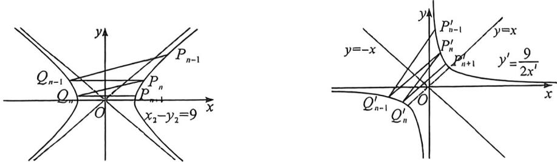
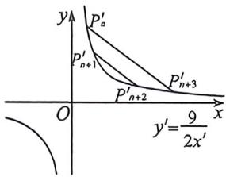

> [!faq]- 例题解析
>
> > [!success]- **【答案】** 详见解析
>
> > [!note]- **【解析】**
> > 解析 (1) 因为 $P_{1}(5,4)$ 在 $C$ 上, 所以 $25 - 16 = m$ , 解得 $m = 9$ , 过 $P(5,4)$ 且斜率为 $k = \frac{1}{2}$ 的直线方程为 $y - 4 = \frac{1}{2}(x - 5)$ , 即 $x - 2y + 3 = 0$ , 联立 $\left\{ \begin{array}{l} x^{2} - y^{2} = 9 \\ x - 2y + 3 = 0 \end{array} \right.$ , 解得 $\left\{ \begin{array}{l} x = 5 \\ y = 4 \end{array} \right.$ 或 $\left\{ \begin{array}{l} x = -3 \\ y = 0 \end{array} \right.$ ,
> >
> > 故 $Q_{1}(-3,0), P_{2}(3,0)$ , 过 $P_{n-1}$ 斜率为 $k$ 的直线与 $C$ 的左支交于点 $Q_{n-1}$ , 令 $P_{n}$ 为 $Q_{n-1}$ 关于 $y$ 轴的对称点, 所以 $x_{2}=3, y_{2}=0$ ;
> >
> > 
> >
> > (2)将等轴双曲线 $x^{2} - y^{2} = 9$ 逆时针旋转 $\frac{\pi}{4}$ , 记原双曲线上任意一点 $P_{n}; (x_{n}, y_{n})$ 满足: $z_{P_{n}} = x_{n} + y_{n}i$ , 作复数逆时针旋
> >
> >
> > 转 $\frac{\pi}{4}$ 得到 $Z_{P_n'} = x'_n + y'_n i$ ，则： $Z_{P_n'} = (x_n + y_n i)\left(\cos \frac{\pi}{4} + i \sin \frac{\pi}{4}\right) = \frac{\sqrt{2}}{2}(x_n - y_n) + \frac{\sqrt{2}}{2}(x_n + y_n) i$ ，故 $\left\{ \begin{array}{l} x'_n = \frac{\sqrt{2}}{2} (x_n - y_n) \\ y'_n = \frac{\sqrt{2}}{2} (x_n + y_n) \end{array} \right.$ ，由于 $x_n^2 - y_n^2 = 9$ ，故 $x'_n y'_n = \frac{1}{2} (x_n^2 - y_n^2) = \frac{9}{2}$ ，本题仅需证 $\frac{x'_n}{x'_{n-1}}$ 为定值，由于 $Q_{n-1}$ 与 $P_n$ 关于 $y$ 轴对称，故 $Q'_{n-1}$ 与 $P'_n$ 关于 $y = -x$ 对称，且新坐标系 $k' = \frac{1+k}{1-k} (0 < k < 1)$ ，记 $P'_{n-1}(x'_{n-1}, y'_{n-1})$ ， $P'_n(x'_n, y'_n)$ ，则 $Q'_{n-1}(-y'_n, -x'_n), k' = k_{P_{n-1}Q_{n-1}} = \frac{\frac{9}{2x'_{n-1}} + \frac{9}{2y'_n}}{x'_{n-1} + y'_n} = \frac{9}{2x'_{n-1}y'_n} = \frac{x'_n}{x'_{n-1}}$ ，故 $\frac{x_n - y_n}{x_{n-1} - y_{n-1}} = \frac{1+k}{1-k}$ .
> >
> > 
> >
> > (3)根据旋转后平行性质不变，故需要证明 $P_{n}^{\prime}P_{n + 3}^{\prime} / / P_{n + 1}^{\prime}P_{n + 2}^{\prime}$ ，由(2)得， $P_{i}^{\prime}\left(x_{i},\frac{9}{2x_{i}}\right),P_{j}^{\prime}\left(x_{j},\frac{9}{2x_{j}}\right),k^{\prime} = k_{P_{i}^{'}P_{j}^{''}} =$ $-\frac{9}{2x_i^{'}x_j^{'}}$ ，反比例函数任意两点的对合式方程为： $\frac{2x_ix_j}{9} y + x = x_i + x_j,$ 所以 $k_{P_{n}^{'}P_{n + 1}^{''}} = -\frac{9}{2x_{n + 3}^{'}x_n^{'}},k_{P_{n + 1}^{'}P_{n + 1}^{''}} = -\frac{9}{2x_{n + 2}^{'}x_{n + 1}^{'}}$ ，由于 $\{x_n^\prime \}$ 是等比数列，故 $x_{n}^{\prime}x_{n + 3}^{\prime} = x_{n + 1}^{\prime}x_{n + 2}^{\prime}$ ，故 $k_{P_{n}^{'}P_{n + 1}^{''}} = k_{P_{n + 1}^{'}P_{n + 2}^{''}}.$
