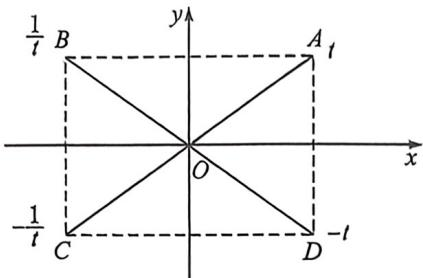
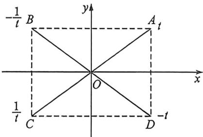
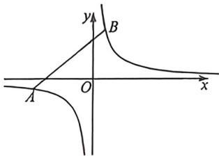
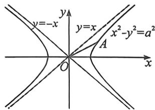
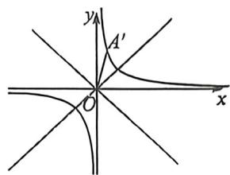

## 考点五_万能对合方程应用

过抛物线 $y^{2} = 2px$ 上两点 $A(x_{1},y_{1})$ 、 $B(x_{2},y_{2})$ 的直线 $AB$ 方程是: $(y_{1} + y_{2})y = 2px + y_{1}y_{2}$ .

证明:利用 $k_{AB}=\frac{y_{2}-y_{1}}{x_{2}-x_{1}}=\frac{y_{2}-y_{1}}{\frac{y_{2}^{2}}{2p}-\frac{y_{1}^{2}}{2p}}$ ，得到 $k_{AB}=\frac{2p}{y_{1}+y_{2}}$ ，故直线 AB 方程为： $y-y_{1}=\frac{2p}{y_{1}+y_{2}}\left(x-\frac{y_{1}^{2}}{2p}\right)$ ，化简可得： $(y_{1}+y_{2})y=2px+y_{1}y_{2}$ .

记忆方法: 把抛物线化成标准方程, 然后将最左端的二次自动降为一次, 再在最左端和最右端加上“ $y_{1} + y_{2}, y_{1}y_{2}$ ”皆可.

同理,如果抛物线的形式是 $x^{2}=2py(p>0)$ ，直线 AB 的方程是： $(x_{1}+x_{2})x=2by+x_{1}a_{2}$

注意: 考试时, 最好给出 $(y_{1}+y_{2})y=2px+y_{1}y_{2}$ 的推导过程。

关于对合, 如果我们设立某种法则 $f$ , 我们发现 $(y_1 + y_2)y = 2px + y_1y_2$ 中, $y_1 = \frac{2px - yy_2}{y - y_2}$ , 同时 $y_2 = \frac{yx - yy_1}{y - y_1}$ , 故令 $f(y_1) = \frac{2px - yy_1}{y - y_1}, f(y_1) = y_2, f(y_2) = y_1$ , 这样用 $y_3$ 表示 $y_1$ 和用 $y_1$ 表示 $y_2$ 是一样的, 这就是一种对合方程, 并且 $y_1 = f(f(y_1))$ , 只要两个完全能轮换对称的变量构成的方程, 比如二次韦达, 都是一种对合方程的形式, 诸如 $ak_1k_2 + b(k_1 + k_2) + c = 0, at_1t_2 + b(t_1 + t_2) + c = 0 (t$ 为参数).

## ·、抛物线的两点对合方程 T18 类型

![[高中/总复习/二轮/2026版高中《MST新思路思维拓展》二轮复习专题/下册/板块1_不等式/考点五_万能对合方程应用/questions/Q00093433.md]]
![[高中/总复习/二轮/2026版高中《MST新思路思维拓展》二轮复习专题/下册/板块1_不等式/考点五_万能对合方程应用/questions/Q00093434.md]]

## 二、椭圆双曲线的两点对合方程 T18 类型

由于 $\cos \alpha \cos \frac{\alpha + \beta}{2} + \sin \alpha \sin \frac{\alpha + \beta}{2} = \cos \frac{\alpha - \beta}{2}$ ,

$$
\cos \beta \cos \frac {\alpha + \beta}{2} + \sin \beta \sin \frac {\alpha + \beta}{2} = \cos \frac {\alpha - \beta}{2},
$$

知识点 1: 椭圆两点对合式

设 $A(a\cos \alpha ,b\sin \alpha)$ 、 $B(a\cos \beta ,b\sin \beta)$ ，故弦 $AB$ 的方程是 $\frac{x}{a}\cos \frac{\alpha + \beta}{2} +\frac{y}{b}\sin \frac{\alpha + \beta}{2} = \cos \frac{\alpha - \beta}{2},$

证明：由于 $\cos \alpha \cos \frac{\alpha + \beta}{2} + \sin \alpha \sin \frac{\alpha + \beta}{2} = \cos \frac{\alpha - \beta}{2}$

$$
\cos \beta \cos \frac {\alpha + \beta}{2} + \sin \beta \sin \frac {\alpha + \beta}{2} = \cos \frac {\alpha - \beta}{2},
$$

故 $A(a\cos \alpha ,b\sin \alpha)$ 、 $B(a\cos \beta ,b\sin \beta)$ 均在同构方程 $\frac{x}{a}\cos \frac{\alpha + \beta}{2} +\frac{y}{b}\sin \frac{\alpha + \beta}{2} = \cos \frac{\alpha - \beta}{2}$ 上，

即弦 $AB$ 的对合方程是 $\frac{x}{a}\cos \frac{\alpha + \beta}{2} + \frac{y}{b}\sin \frac{\alpha + \beta}{2} = \cos \frac{\alpha - \beta}{2}$ ,

令 $t_1 = \tan \frac{\alpha}{2}, t_2 = \tan \frac{\beta}{2}$ , 同除以 $\cos \frac{\alpha}{2} \cos \frac{\beta}{2} (\alpha \neq \pi, \beta \neq \pi)$ , 则 $\frac{x}{a} (1 - t_1 t_2) + \frac{y}{b} (t_1 + t_2) = 1 + t_1 t_2$ ;

接下来我们来解读斜率关系,以椭圆 $\frac{x^{2}}{a^{2}}+\frac{y^{2}}{b^{2}}=1(a>b>0)$ 为例,

设 $A(a\cos \alpha ,b\sin \alpha),B(a\cos \beta ,b\sin \beta),P(a\cos \theta ,b\sin \theta)$ ，其中 $\theta$ 是定值， $\alpha ,\beta$ 是变化数，令 $t_0 = \tan \frac{\theta}{2},t_1 =$ $\tan \frac{\alpha}{2},t_2 = \tan \frac{\beta}{2},\theta \neq \pi ,\alpha \neq \pi ,\beta \neq \pi ,$

又易知直线 $PA, PB$ 的方程分别是

直线 $PA: \frac{x}{a} \cos \frac{\theta + \alpha}{2} + \frac{y}{b} \sin \frac{\theta + \alpha}{2} = \cos \frac{\theta - \alpha}{2}$ , 或者 $\frac{x}{a} (1 - t_0 t_1) + \frac{y}{b} (t_0 + t_1) = 1 + t_0 t_1$

直线 $PB: \frac{x}{a} \cos \frac{\theta + \beta}{2} + \frac{y}{b} \sin \frac{\theta + \beta}{2} = \cos \frac{\theta - \beta}{2}$ , 或者 $\frac{x}{a} (1 - t_0 t_2) + \frac{y}{b} (t_0 + t_2) = 1 + t_0 t_2$

所以，直线 $PA, PB$ 的斜率分别是 $k_{PA} = -\frac{b}{a\tan\frac{\theta + \alpha}{2}} = -\frac{b}{a}\frac{1 - t_0t_1}{t_0 + t_1}; k_{PB} = -\frac{b}{a\tan\frac{\theta + \beta}{2}} = -\frac{b}{a}\frac{1 - t_0t_2}{t_0 + t_2}$

特别的情况，

(1)当 $P$ 为左顶点，则 $\theta = \pi, k_{PA} = -\frac{b}{a\tan\frac{\alpha + \pi}{2}} = \frac{b}{a} t_1$ ，或者 $k_{PA} = \frac{b\sin\theta}{a\cos\theta + a} = \frac{b}{a}\tan \frac{\theta}{2} = \frac{b}{a} t_1$ ；

(2)当 $P$ 为右顶点，则 $\theta = 0, k_{PA} = -\frac{b}{a\tan\frac{\alpha}{2}} = -\frac{b}{at_1}$ ，或者 $k_{PA} = \frac{b\sin\theta}{a\cos\theta - a} = -\frac{b}{a\tan\frac{\theta}{2}} = -\frac{b}{at_1}$

(3)当 $P$ 为上顶点，则 $\theta = \frac{\pi}{2}, k_{PA} = -\frac{b}{a\tan\left(\frac{\alpha}{2} + \frac{\pi}{4}\right)} = -\frac{b}{a}\frac{1 - t_1}{1 + t_1};$

(4)当 $P$ 为下顶点，则 $\theta = \frac{3\pi}{2}, k_{PA} = -\frac{b}{a\tan\left(\frac{\alpha}{2} + \frac{3\pi}{4}\right)} = \frac{b}{a}\frac{1 + t_1}{1 - t_1};$

知识点 2: 双曲线右支的两点对合式

设 $A\left(\frac{a}{\cos\alpha}, \frac{b\sin\alpha}{\cos\alpha}\right), B\left(\frac{a}{\cos\beta}, \frac{b\sin\beta}{\cos\beta}\right)$ ，故弦 $AB$ 的方程是 $\frac{x}{a} \cos \frac{\alpha - \beta}{2} = \frac{y}{b} \sin \frac{\alpha + \beta}{2} = \cos \frac{\alpha + \beta}{2}$ ， $(\alpha, \beta$ 为一四象限角，即在双曲线右支上的两点对合式）

证明:由于 $\cos\alpha\cos\frac{\alpha+\beta}{2}+\sin\alpha\sin\frac{\alpha+\beta}{2}=\cos\frac{\alpha-\beta},\cos\beta\cos\frac{\alpha+\beta}{2}+\sin\beta\sin\frac{\alpha+\beta}{2}=\cos\frac{\alpha-\beta},$ 故 $A\left(\frac{a}{\cos\alpha},\frac{b\sin\alpha}{\cos\alpha}\right)$ 、 $B\left(\frac{a}{\cos\beta},\frac{b\sin\beta}{\cos\beta}\right)$ 均在同构方程 $\frac{a}{x}\cos\frac{\alpha+\beta}{2}+\frac{ay}{bx}\sin\frac{\alpha+\beta}{2}=\cos\frac{\alpha-\beta}{2}$ 上，
即 $\frac{x}{a}\cos\frac{\alpha-\beta}{2}-\frac{y}{b}\sin\frac{\alpha+\beta}{2}=\cos\frac{\alpha+\beta}{2}$ ，即弦 AB 的方程是 $\frac{x}{a}\cos\frac{\alpha-\beta}{2}-\frac{y}{b}\sin\frac{\alpha+\beta}{2}=\cos\frac{\alpha+\beta}{2}$ 令 $t_{1}=\tan\frac{\alpha}{2},t_{2}=\tan\frac{\beta}{2}$ ，同除以 $\cos\frac{\alpha}{2}\cos\frac{\beta}{2}$ ，则 $\frac{x}{a}(1+t_{1}t_{2})-\frac{y}{b}(t_{1}+t_{2})=1-t_{1}t_{2};$

所以，直线 $PA, PB$ 的斜率分别是 $k_{PA} = \frac{b\cos\frac{\theta - \alpha}{2}}{a\sin\frac{\theta + \alpha}{2}} = \frac{b}{a}\frac{1 + t_0t_1}{t_0 + t_1}; k_{PB} = \frac{b\cos\frac{\theta - \beta}{2}}{a\sin\frac{\theta + \beta}{2}} = \frac{b}{a}\frac{1 + t_0t_2}{t_0 + t_2}$

特别的情况，

(1)当 $P$ 为左顶点， $k_{PA} = \frac{b\frac{\sin\alpha}{\cos\alpha}}{a\left(\frac{1}{\cos\alpha} + 1\right)} = \frac{b}{a} t_1;$

(2)当 $P$ 为右顶点， $k_{PA} = \frac{b\frac{\sin\alpha}{\cos\alpha}}{a\left(\frac{1}{\cos\alpha} - 1\right)} = \frac{b}{at_1}$ ;

知识点 3: 双曲线左支的两点对合式

关于双曲线左支上两点, 涉及到符号的变化, 比如第二三象限 $A\left(\frac{a}{\cos \alpha}, -\frac{b \sin \alpha}{\cos \alpha}\right), B\left(\frac{a}{\cos \beta}, -\frac{b \sin \beta}{\cos \beta}\right)$ ,

不妨换元为 $A\left(\frac{a}{\cos(-\alpha)}, \frac{b\sin(-\alpha)}{\cos(-\alpha)}\right), B\left(\frac{a}{\cos(-\beta)}, \frac{b\sin(-\beta)}{\cos(-\beta)}\right)$ ，故弦 $AB$ 的方程是 $\frac{x}{a} \cos \frac{-\alpha + \beta}{2} + \frac{y}{b} \sin \frac{-\alpha - \beta}{2} = \cos \frac{-\alpha - \beta}{2}$ ，令 $\tan \left(-\frac{\alpha}{2}\right) = t_1, \tan \left(-\frac{\beta}{2}\right) = t_2$ ，

即 $\frac{x}{a} (1 + t_1t_2) - \frac{y}{b} (t_1 + t_2) = 1 - t_1t_2;$

(1)当 $P$ 为左顶点， $k_{PA} = \frac{b\frac{\sin(-\alpha)}{\cos(-\alpha)}}{a\left(\frac{1}{\cos(-\alpha)} + 1\right)} = \frac{b}{a} t_1;$

(2)当 $P$ 为右顶点， $k_{PA} = \frac{b\frac{\sin(-\alpha)}{\cos(-\alpha)}}{a\left(\frac{1}{\cos(-\alpha)} - 1\right)} = \frac{b}{at_1}$

知识点 4: 双曲线左右两支的两点对合式

关于双曲线两支上两点, 涉及到符号的变化, 比如第一二象限 $A\left(\frac{a}{\cos \alpha}, \frac{b \sin \alpha}{\cos \alpha}\right)$ 、和位于第三四象限的 $B$ $\left(\frac{a}{\cos(-\beta)}, \frac{b \sin(-\beta)}{\cos(-\beta)}\right)$ , 故弦 $AB$ 的方程是 $\frac{x}{a} \cos \frac{\alpha + \beta}{2} + \frac{y}{b} \sin \frac{\alpha - \beta}{2} = \cos \frac{\alpha - \beta}{2}$ , 令 $\tan \frac{\alpha}{2} = t_1, \tan \left(-\frac{\beta}{2}\right) = t_2$ , 即 $\frac{x}{a} (1 + t_1 t_2) - \frac{y}{b} (t_1 + t_2) = 1 - t_1 t_2$ ;

知识点 5: 对合方程简化单动点模型

1.椭圆

(1) 若 AB 关于 y 轴对称, 则 $t_{A}t_{B}=1$ ;

(2) 若 AD 关于 x 轴对称, 则 $t_{A} + t_{D} = 0$ ;

(3)若 AC 关于原点对称,则 $t_{A}t_{C}=-1$ ;

证明：(1) $\tan \frac{B}{2} = \tan \frac{\pi - A}{2} = \frac{1}{\tan \frac{A}{2}}$ ，所以 $t_A t_B = 1$ ；(2) $\tan \frac{D}{2} = \tan \frac{2\pi - A}{2} = -\tan \frac{A}{2}$ ，所以 $t_A + t_D = 0$ ； $\tan \frac{C}{2} = \tan \frac{\pi + A}{2} = -\frac{1}{\tan \frac{A}{2}}$ ，所以 $t_A t_C = -1$ ；

2. 双曲线

(1) 若 AB 关于 y 轴对称, 则 $t_{A}t_{B} = -1$ ;

(2) 若 AD 关于 x 轴对称, 则 $t_{A} + t_{D} = 0$ ;

(3) 若 AC 关于原点对称, 则 $t_{A}t_{C}=1$ ;

![[高中/总复习/二轮/2026版高中《MST新思路思维拓展》二轮复习专题/下册/板块1_不等式/考点五_万能对合方程应用/questions/Q00093435.md]]
![[高中/总复习/二轮/2026版高中《MST新思路思维拓展》二轮复习专题/下册/板块1_不等式/考点五_万能对合方程应用/questions/Q00093436.md]]

## 三、两点对合方程解决面积和差 T18 类型

![[高中/总复习/二轮/2026版高中《MST新思路思维拓展》二轮复习专题/下册/板块1_不等式/考点五_万能对合方程应用/questions/Q00093437.md]]
![[高中/总复习/二轮/2026版高中《MST新思路思维拓展》二轮复习专题/下册/板块1_不等式/考点五_万能对合方程应用/questions/Q00093438.md]]

## 四、两点对合方程妙解切线 T18 或 T19 类型

![[高中/总复习/二轮/2026版高中《MST新思路思维拓展》二轮复习专题/下册/板块1_不等式/考点五_万能对合方程应用/questions/Q00093439.md]]
![[高中/总复习/二轮/2026版高中《MST新思路思维拓展》二轮复习专题/下册/板块1_不等式/考点五_万能对合方程应用/questions/Q00093440.md]]
![[高中/总复习/二轮/2026版高中《MST新思路思维拓展》二轮复习专题/下册/板块1_不等式/考点五_万能对合方程应用/questions/Q00093441.md]]
![[高中/总复习/二轮/2026版高中《MST新思路思维拓展》二轮复习专题/下册/板块1_不等式/考点五_万能对合方程应用/questions/Q00093442.md]]

## 椭圆双曲线共轴共参数对合方程 T18 或 T19 类型

本类型可以在例题中寻找考题的隐藏椭圆双曲线等参数构造.

![[高中/总复习/二轮/2026版高中《MST新思路思维拓展》二轮复习专题/下册/板块1_不等式/考点五_万能对合方程应用/questions/Q00093443.md]]
![[高中/总复习/二轮/2026版高中《MST新思路思维拓展》二轮复习专题/下册/板块1_不等式/考点五_万能对合方程应用/questions/Q00093444.md]]

## 五、双曲线与反比例对合方程转化T18和T19类型

2024 年新高考Ⅱ卷 19 题, 就是考查了神奇的反比例对合方程!

如图, $A(x_{1},y_{1})$ 和 $B(x_{2},y_{2})$ 分别是反比例函数(等轴双曲线) $y = \frac{m}{x}$ 上的两点, 则 $AB$ 的两点对合式方程为: $\frac{x_1x_2}{m} y + x = x_1 + x_2$ .

证明：由于 $k_{AB} = \frac{\frac{m}{x_1} - \frac{m}{x_2}}{x_1 - x_2} = -\frac{m}{x_1x_2}$ ，故 $AB: y - \frac{m}{x_1} = -\frac{m}{x_1x_2}(x - x_1)$ ，即 $\frac{x_1x_2}{m} y + x = x_1 + x_2$

和抛物线的两点对合式一样,在这个两步就能证明的式子背后,隐藏了很多我们平时没抓住的信息,比如斜率的简化,比如构造相切的点到直线距离的快速同构,由于斜率只需要两点的坐标即可表示,命题者就抓住了这个特点,进行了圆锥与数列综合的命题。

重点:等轴双曲线仿射后旋转 $45^{\circ}$ 形成反比例函数

如图, 将等轴双曲线 $x^{2}-y^{2}=a^{2}$ 逆时针旋转 $45^{\circ}$ , 即变成了初中的反比例函数 $y=\frac{k}{x}\left(k=\frac{a^{2}}{2}\right)$ ,

证明：记原双曲线上任意一点 $A$ 满足： $z_A = x + yi$ ，作复数逆时针旋转 $\frac{\pi}{4}$ 得 $OA' = x' + y'i$ ，则： $z_A' = (x +$

$y^{i})\left(\cos\frac{\pi}{4}+i\sin\frac{\pi}{4}\right)=\frac{\sqrt{2}}{2}(x-y)+\frac{\sqrt{2}}{2}(x+y)i,$ 故 $\left\{\begin{aligned}x^{\prime}&=\frac{\sqrt{2}}{2}(x-y)\\ y^{\prime}&=\frac{\sqrt{2}}{2}(x+y)\end{aligned}\right.$ ，由于 $x^{2}-y^{2}=a^{2}$ ，

故 $x^{\prime}y^{\prime} = \frac{1}{2} (x^{2} - y^{2}) = \frac{a^{2}}{2};$

![[高中/总复习/二轮/2026版高中《MST新思路思维拓展》二轮复习专题/下册/板块1_不等式/考点五_万能对合方程应用/questions/Q00093445.md]]
