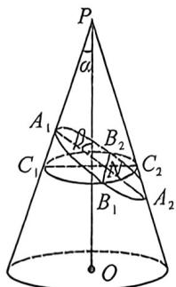
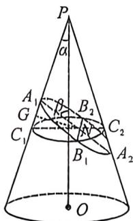
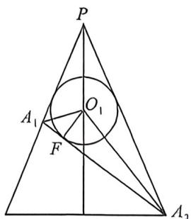

<!-- question-source:start -->
例43 (2026 届江西高三九月调研·T11)如图,已知圆锥 $PO$ 的轴 $PO$ 与母线所成的角为 $\alpha$ , 过 $A_{1}$ 的平面与圆锥的轴所成的角为 $\beta (\beta > \alpha)$ , 该平面截这个圆锥所得的截面为椭圆, 椭圆的长轴为 $A_{1}A_{2}$ , 短轴为 $B_{1}B_{2}$ , 长半轴长为 $a$ , 短半轴长为 $b$ , 椭圆的中心为 $N$ , 再以 $B_{1}B_{2}$ 为弦且垂直于 $PO$ 的圆截面, 记该圆与直线 $PA_{1}$ 交于 $C_{1}$ , 与直线 $PA_{2}$ 交于 $C_{2}$ , 则下列说法正确的是 ( )

A. 当 $\beta < \alpha$ 时, 平面截这个圆锥所得的截面也为椭圆
B. $|NC_{1}| \cdot |NC_{2}| = a^{2} \frac{\sin(\beta + \alpha) \sin(\beta - \alpha)}{\cos^{2} \alpha}$ C. 平面截这个圆锥所得椭圆的离心率 $e = \frac{\cos \beta}{\cos \alpha}$ D. 平面截这个圆锥所得椭圆的离心率 $e = \frac{\sin \alpha}{\sin \beta}$
<!-- question-source:end -->

![[高中/总复习/二轮/2026版高中《MST新思路思维拓展》二轮复习专题/下册/板块1_不等式/考点五_圆锥曲线新定义与其它板块综合/questions/answers/Q00093396A1.md]]
