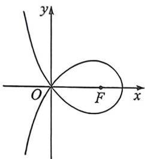
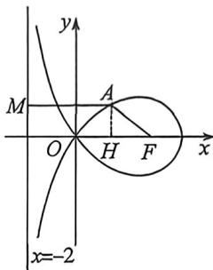

<!-- question-source:start -->
例47 (2024 新高考 I 卷·T11) 造型可以做成美丽的丝带, 将其看作图中曲线 $C$ 的一部分. 已知 $C$ 过坐标原点 $O$ . 且 $C$ 上的点满足横坐标大于 -2 , 到点 $F(2,0)$ 的距离与到定直线 $x=a(a<0)$ 的距离之积为 4 , 则 ( )

A. $a = -2$ B.点 $(2\sqrt{2},0)$ 在 $C$ 上

C. $C$ 在第一象限的点的纵坐标的最大值为1 D.当点 $(x_0,y_0)$ 在 $C$ 上时， $y_{0}\leqslant \frac{4}{x_{0} + 2}$
<!-- question-source:end -->

![[高中/总复习/二轮/2026版高中《MST新思路思维拓展》二轮复习专题/下册/板块1_不等式/考点五_圆锥曲线新定义与其它板块综合/questions/answers/Q00093400A1.md]]
