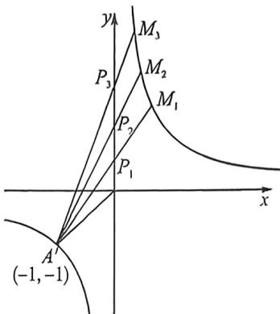

> [!faq]- 例题解析
>
> > [!success]- **【答案】** B
>
> > [!note]- **【解析】**
> > 解析 法一: 双曲线的一条渐近线 y=2x，所以 b=2，即 $C: x^{2}-\frac{y^{2}}{4}=1, A(-1,0)$ ，点 P 在渐近线 y=2x 上，设 $P(t, 2t), t \neq 0, l_{AP}: y=\frac{2t}{t+1}(x+1)$ ，联立曲线方程得 $(2t+1)x^{2}-2t^{2}x-2t^{2}-2t-1=(2t+1)(x+1)\left(x-\frac{2t^{2}+2t+1}{2t+1}\right)=0$ ，可得 $M\left(\frac{2t^{2}+2t+1}{2t+1}, \frac{4t^{2}+4t}{2t+1}\right)$ ，因为 M 在右支，所以 $\frac{2t^{2}+2t+1}{2t+1}=\frac{2\left(t+\frac{1}{2}\right)^{2}+\frac{1}{2}}{2t+1}>0$ ，解得 $2t+1>0, S_{\triangle OAP}=\frac{1}{2}|OP||y_{p}|=|t|, S_{\triangle OAM}=\frac{1}{2}|OP||y_{M}|=\left|\frac{2t^{2}+2t}{2t+1}\right|$ ，则 $S_{\triangle OPM}=S_{\triangle OAM}-S_{\triangle OAP}=\left|\frac{t}{2t+1}\right|, S(P)=\frac{S_{\triangle OAP}}{S_{\triangle OPM}}=|2t+1|=2t+1$ ，设 $P_{1}(t_{1}, 2t_{1}), P_{2}(t_{2}, 2t_{2}), P_{3}(t_{3}, 2t_{3})$ ，因为 $P_{2}$ 为 $P_{1}P_{3}$ 中点，所以 $t_{1}+t_{3}=2t_{2}, S(P_{1})+S(P_{3})=2t_{1}+1+2t_{3}+1=2(t_{1}+t_{3})+2=4t_{2}+2=2S(P_{2})$ ，
> >
> > 
> >
> > 法二：由于 $C_{1}x^{2} - \frac{y^{2}}{b^{2}} = 1$ 渐近线为 $y = 2x$ ，故 $b = 2$ ，本题涉及面积比，双曲线跟渐近线相关的作出仿射旋转成反比例函数，构造 $\left\{ \begin{array}{l} x' = x - \frac{y}{2} \\ y' = x + \frac{y}{2} \end{array} \right.$ 所以 $y' = \frac{1}{2}$ ，则 $A'(-1, -1)$ ，渐近线变为 $y$ 轴，如图所示， $S(P) = \frac{S_{\triangle OAP}}{S_{\triangle OPM}} = \frac{S_{\triangle OA'P'}}{S_{\triangle OP'M'}} = \frac{-x_A'}{x_M'} = \frac{1}{x_M'}, A'M_i: y - y_A' = \frac{y_M - y_A'}{x_M - x_A'} (x - x_A')$ ，即 $-x_M y + x = -1 + x_M$ ，当 $x = 0$ 时， $y_{P_1} = \frac{1 - x_M}{x_M'}$ ，由于 $P_2$ 为 $P_1 P_3$ 中点，所以 $\frac{1 - x_M}{x_M} + \frac{1 - x_M}{x_M'} = 2\frac{1 - x_M}{x_M'}$ ，即 $\frac{1}{x_{M_1}} + \frac{1}{x_{M_1}} = \frac{2}{x_{M_1}}$ ，所以 $S(P_1) + S(P_3) = 2S(P_2)$ ，
> >
> > 故选 **B**.
