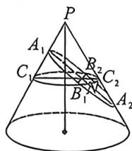
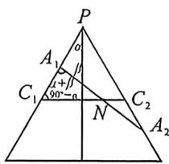

## 考点五_圆锥曲线新定义与其它板块综合

## 一、截口曲线离心率与截面角之间的关系

在空间中, 已知圆锥 $O$ 是由 $l'$ 围绕 $l$ 旋转得到的, 我们把 $l$ 称为轴, 轴与母线所成角为 $\alpha$ . 用平面 $\pi$ 截圆锥, 得到的截口曲线取决于平面与圆锥轴 $l$ 所成的线面角 $\beta$ (显然, 当 $\pi$ 与 $l$ 平行时, $\beta = 0$ ), 具体关系如下:

(1) 若 $\beta > \alpha, 0 < \frac{\cos \beta}{\cos a} < 1$ ，平面 $\pi$ 截圆锥面所得截口曲线为椭圆；

(2) 若 $\beta = \alpha, \frac{\cos \beta}{\cos a} = 1$ ，平面 $\pi$ 截圆锥面所得截口曲线为抛物线：

(3) 若 $\beta < \alpha, \frac{\cos \beta}{\cos \alpha} > 1$ ，平面 $\pi$ 截圆锥面所得截口曲线为双曲线。

这个比值 $\frac{\cos\beta}{\cos\alpha}$ 就是圆锥曲线的离心率，离心率是一个比.

证明：

作图如上, 不妨考虑截面为椭圆的情况, 记椭圆的长轴为 $A_{1}A_{2}$ , 短轴 $B_{1}B_{2}$ , 椭圆中心为 $N$ , 长半轴长为 $a$ , 短半轴长为 $b$ , 作以 $C_{1}C_{2}$ 为直径且垂直于轴的圆截面, 则在截面圆中, 由相交弦定理可得 $b^{2}=NB_{1} \cdot NB_{2}=NC_{1} \cdot NC_{2}$ 作圆锥的轴截面等腰三角形如图:

在 $\triangle A_{1}NC_{1}$ 中,由正弦定理可得 $\frac{A_{1}N}{\sin(90^{\circ}-\alpha)}=\frac{NC_{1}}{\sin(\alpha+\beta)}=\frac{a}{\sin(90^{\circ}-\alpha)}$ ,同理,在 $\triangle A_{2}NC_{2}$ 中,由正弦定理可得 $\frac{A_{2}N}{\sin(90^{\circ}+\alpha)}=\frac{NC_{2}}{\sin(\beta-\alpha)}=\frac{a}{\sin(90^{\circ}+\alpha)}$ ,整理可得 $NC_{1}\cdot NC_{2}=a^{2}\frac{\sin(\beta+\alpha)\sin(\beta-\alpha)}{\cos^{2}\alpha}=b^{2}$ ,所以离心率 $e^{2}=1-\frac{b^{2}}{a^{2}}=1-\frac{\sin(\beta+\alpha)\sin(\beta-\alpha)}{\cos^{2}\alpha}=1-\frac{\sin^{2}\beta-\sin^{2}\alpha}{\cos^{2}\alpha}=\frac{\cos^{2}\beta}{\cos^{2}\alpha}$ ,综上,离心率的表达式为 $e=\frac{\cos\beta}{\cos\alpha}$ .

![[高中/总复习/二轮/2026版高中《MST新思路思维拓展》二轮复习专题/下册/板块1_不等式/考点五_圆锥曲线新定义与其它板块综合/questions/Q00093396.md]]

## 二、坐标旋转转化斜椭圆反比例函数

1. 向量旋转公式与图象转化: 已知对任意平面向量 $\overrightarrow{AB} = (x, y)$ , 把 $\overrightarrow{AB}$ 绕其起点 $A$ 沿逆时针方向旋转 $\theta$ 角得到向量 $\overrightarrow{AP} = (x\cos \theta - y\sin \theta, x\sin \theta + y\cos \theta)$ , 叫做把点 $B$ 绕点 $A$ 逆时针方向旋转 $\theta$ 角得到点 $P$ .

逆时针旋转 $45^{\circ}$ ： $\left\{ \begin{array}{l}x^{\prime} = \frac{\sqrt{2}}{2} (x - y)\\ y^{\prime} = \frac{\sqrt{2}}{2} (x + y) \end{array} \right.$ ，通常将等轴双曲线转化为反比例函数，将斜椭圆旋转为直椭圆.

![[高中/总复习/二轮/2026版高中《MST新思路思维拓展》二轮复习专题/下册/板块1_不等式/考点五_圆锥曲线新定义与其它板块综合/questions/Q00093397.md]]
![[高中/总复习/二轮/2026版高中《MST新思路思维拓展》二轮复习专题/下册/板块1_不等式/考点五_圆锥曲线新定义与其它板块综合/questions/Q00093398.md]]

## 2. 非等轴双曲线的仿射换元

由于 $\frac{x^2}{a^2} -\frac{y^2}{a^2} = 1$ ，令 $\left\{ \begin{array}{l}x^{\prime} = \frac{x}{a} -\frac{y}{a}\\ y^{\prime} = \frac{x}{a} +\frac{y}{a} \end{array} \right.$ ，则 $x^{\prime}y^{\prime} = 1$ ，由于(1,0)逆时针旋转 $45^{\circ}$ 后得到点 $\left(\frac{\sqrt{2}}{2},\frac{\sqrt{2}}{2}\right),(0,1)$ 逆时针旋转 $45^{\circ}$ 后得到点 $\left(-\frac{\sqrt{2}}{2}, \frac{\sqrt{2}}{2}\right)$ ，所以 $\left\{ \begin{array}{l} x' = \frac{x}{a} - \frac{y}{a} = \frac{\sqrt{2}}{2} \left( \frac{\sqrt{2}x}{a} - \frac{\sqrt{2}y}{a} \right) \\ y' = \frac{x}{a} + \frac{y}{a} = \frac{\sqrt{2}}{2} \left( \frac{\sqrt{2}x}{a} + \frac{\sqrt{2}y}{a} \right) \end{array} \right.$ 变换是将原来 $P(x, y)$ 横坐标和纵坐标缩小 $\frac{a}{\sqrt{2}}$ 倍后逆时针旋转 $45^{\circ}$ 得来.

综上，双曲线都可以转化为反比例或者对勾函数，当 $e = \sqrt{2}$ 时，按照旋转都能得出反比例，当 $e \neq \sqrt{2}$ 时，旋转后会得到对勾或者飘带函数。按照换元法，就需要先对坐标进行伸缩变换，如下： $\frac{x^2}{a^2} - \frac{y^2}{b^2} = 1$ ，令 $\left\{ \begin{array}{l} x' = \frac{x}{a} - \frac{y}{b} = \frac{\sqrt{2}}{2} \left( \frac{\sqrt{2}x}{a} - \frac{\sqrt{2}y}{b} \right) \\ y' = \frac{x}{a} + \frac{y}{b} = \frac{\sqrt{2}}{2} \left( \frac{\sqrt{2}x}{a} - \frac{\sqrt{2}y}{b} \right) \end{array} \right.$ ，则此变换是将原来 $P(x, y)$ 横坐标和纵坐标分别缩小 $\frac{a}{\sqrt{2}}$ 倍和 $\frac{b}{\sqrt{2}}$ 后逆时针旋转 $45^\circ$ 得来，新坐标方程为 $x' y' = 1$ .

![[高中/总复习/二轮/2026版高中《MST新思路思维拓展》二轮复习专题/下册/板块1_不等式/考点五_圆锥曲线新定义与其它板块综合/questions/Q00093399.md]]

## 三、新定义曲线线类型

![[高中/总复习/二轮/2026版高中《MST新思路思维拓展》二轮复习专题/下册/板块1_不等式/考点五_圆锥曲线新定义与其它板块综合/questions/Q00093400.md]]
![[高中/总复习/二轮/2026版高中《MST新思路思维拓展》二轮复习专题/下册/板块1_不等式/考点五_圆锥曲线新定义与其它板块综合/questions/Q00093401.md]]

## 四、直线族与包络线

![[高中/总复习/二轮/2026版高中《MST新思路思维拓展》二轮复习专题/下册/板块1_不等式/考点五_圆锥曲线新定义与其它板块综合/questions/Q00093402.md]]

## 大题篇

解答题我们最直接的就是“直曲联立”，将直线代入圆锥曲线，得到二次方程，这也是最常规的方法，被广泛认同，甚至成为了标答。

但是,这个真的好算吗?教学中常见的就是联立后交给学生们去自行操作,巨大的计算量不知不觉“劝退”了不少学生,他们拿第一问分数,第二问技巧性的联立“骗分”。新高考模式下,尤其转化为三问模式的18和19题,除了被刻意前置的考题,一些常规联立能解决的问题由于都考过,所以越来越少,所以导致简单的大家都会,难一点的大家都跪。我们陆陆续续介绍了圆锥曲线的各种方法,并给予解答题的汇总,以及什么情况下用什么方法,以便我们更加高效地学习并理解圆锥曲线。

<table><tr><td>年份</td><td>新高考1</td><td>新高考2</td><td>甲卷</td><td>乙卷</td><td>北京</td><td>天津</td><td>浙江</td></tr><tr><td>2025</td><td>隐藏圆轨迹+单动点最值</td><td>简单面积问题</td><td></td><td></td><td>相切的单动点转化</td><td>相切单动点转化角平分线</td><td></td></tr><tr><td>2024</td><td>简单面积问题</td><td>坐标旋转后的反比例对合方程</td><td>调和线束平行中点定理</td><td></td><td>极点极线背景+内外角角平分线</td><td>向量乘积</td><td></td></tr><tr><td>2023</td><td>垂直背景+弦长最值</td><td>1.简单极点极线自极三角形翻译</td><td>抛物线焦半径简单面积处理</td><td>斜率和定值调和线束平行中点定理</td><td>单动点五边形帕斯卡定理背景</td><td>面积比转化为坐标比</td><td></td></tr><tr><td>2022</td><td>斜率和2.面积</td><td>1.中点2.斜率3.渐近线退化二次曲线联立</td><td>1.抛物线截距等比2.最大张角</td><td>调和线束平行中点定理隐藏斜率倒数和定值</td><td>调和线束平行中点定理2.隐藏斜率倒数和为定值</td><td>切线单动点</td><td>隐藏斜率积为定值弦长最值</td></tr><tr><td>2021</td><td>退化二次曲线与四点共圆倾斜角互补</td><td>弦长焦点弦</td><td>抛物线彭塞列闭合</td><td>阿基米德三角形面积</td><td>隐藏斜率积为定值</td><td>1.切线2.单动点</td><td>斜率和为零的退化二次曲线联立</td></tr></table>

通过对近五年的高考题进行分析, 当 2020 年新高考在山东卷进行试点时, 圆锥曲线作为压轴题出现, 将椭圆上共顶点的两垂直弦作为条件, 隐藏第三条边过定点, 从而开启了新高考圆锥曲线的命题核心——“藏”。2020 年, 就是新高考起点, 促使我们需要学习一些解决圆锥曲线的新技能。

2021年高考，属于老教材新高考最后一年，题型不会大幅度创新，但是“藏”的命题逻辑和新方法引入已经是不可逆趋势,新高考一卷的四点共圆问题,可以常规联立,也可以用参数方程快速求出,尤其用曲线系就是实现了秒杀,甲卷和乙卷的抛物线问题涉及到了两点对合式方程和同构方程思想,此思想方法在北京卷2018年就出现,阿基米德三角形在2013年江西卷和2019年Ⅱ卷也出现,属于老题新作。北京卷则延续了2020年的风格,延续了轴点弦,同时将斜率积为定值做了隐藏,这个命题逻辑延续到了2022年,北京卷总是一个风向标,值得我们重视。

2022 年高考,来到了斜率和积隐藏的最高峰,除了新高考 2 卷和多年风格不变的天津卷,连浙江卷也加入了斜率积为定值的隐藏。甲卷延续之前Ⅲ卷风格,抛物线常规联立即可破解,其背景加入了米勒定理。这一年高考,成为了常规联立越来越难在考场中操作完成,甚至因为选填题的难度加大导致很多考生做不到圆锥曲线第二问,而乙卷的计算量巨大也导致了很多师生开始怀疑之前的圆锥曲线学习方法,其对极点极线背景的隐藏,最终还是指向了调和线束平行线中点定理。新课标 2 卷,当大家在思考如何简化计算时,按照退化二次曲线方程的解法完全实现了降维打击,其背景也是指向了布利安桑定理,新高考的圆锥曲线,越来越强调对背景的挖掘和翻译。

2023 年高考,北京卷再次创新,引入了帕斯卡六边形为背景,乙卷继续沿用 22 年的调和线束平行线中点定理,2 卷沿用 2020 年 I 卷的简单极点极线的自极三角形翻译,区别仅仅是解读在了双曲线上,1 卷的弦长问题,则是在垂直环境下的一道经典题型,可追溯到 2009 年的垂直弦,最佳方法是复数旋转来解读垂直,将函数方程不等式思想在最后一题用抛物线为载体呈现。

2024 圆锥曲线难度最大的是新高考Ⅱ卷的压轴题,除了前两问的铺垫,涉及数列的双元递推后,最后一问背景又源于帕斯卡六边形,也可以利用对边斜率和为零构造四点共圆,最快的方法就是坐标旋转将等上两点轴双曲线转化为反比例函数,利用反比例函数的两点对合方程 $\frac{x_{1}x_{2}}{m}y+x=x_{1}+x_{2}$ (反比例函数 $y=\frac{m}{x}$ 上两点横坐标为 $x_{1}$ 和 $x_{2}$ ),也出了一个三问圆锥曲线难题的命题模板,就是隐藏等量关系,层层递进。北京卷出了个送分的老题型——调和梯形+内外角平分线,甲卷则是近三年最火的模型——调和线束平行中点定理,不过最佳解答方法是坐标翻译——定比点差,天津卷延续了纯计算少背景传统,I卷由于是第二道解答题,算面积,可以通过换元和对称来简化。

到了 2025 年高考,以及最近全国各地模拟题的三问命题逻辑,我们给出关键词:通法难算,挖掘隐藏!对合无敌,方法多元!

2025 全国二卷将圆锥曲线作为第二道解答题,刻意降低难度,类似去年刻意降低导数难度一样,天津卷向来重导数轻圆锥,上海卷今年也是简单的联立计算。所以圆锥的重头戏,一般来自北京卷和全国一卷了(去年把圆锥放在第二道解答题),北京卷在 23 年以前,其考查的极点极线背景为全国各地的命题提供了良好的素材,研究起来确实很有趣味。但是容易被过度解读,比如某位博主强哥,经常搞一题多少解,事实上学生只能在考场中拿出自己平常训练最擅长的一两种解法,当然,明年圆锥会不会出现在 19 题?如果出现会是什么形式?

本章节会针对近年高考题,以及最近两三个月全国26届模考题进行解读,针对二轮复习的专题性和一些核心的考题隐藏进行深度挖掘。

<!-- source-part:2 pages:51-100 -->
