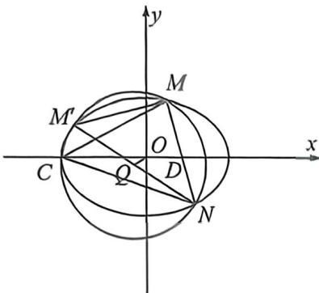
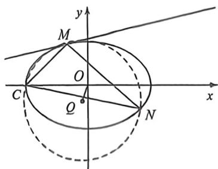

<!-- question-source:start -->
例48 (2025届T8联考·T18)已知过 $A(-1,0), B(1,0)$ 两点的动抛物线的准线始终与圆 $x^{2} + y^{2} = 9$ 相切，该抛物线焦点 $P$ 的轨迹是某圆锥曲线 $E$ 的一部分.

(1)求曲线 E 的标准方程;

(2)已知点 $C(-3,0), D(2,0)$ , 过点 $D$ 的动直线与曲线 $E$ 交于 $M, N$ 两点, 设 $\triangle CMN$ 的外心为 $Q, O$ 为坐标原点, 问: 直线 $OQ$ 与直线 $MN$ 的斜率之积是否为定值, 如果是定值, 求出该定值; 如果不是定值, 说明理由.

<!-- question-source:end -->

![[高中/总复习/二轮/2026版高中《MST新思路思维拓展》二轮复习专题/下册/板块1_不等式/考点六_隐藏的曲线上四点共圆与曲线系/questions/answers/Q00093448A1.md]]
