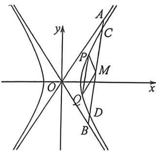

<!-- question-source:start -->
例49 (2022 新高考Ⅱ卷) 设双曲线 $C: \frac{x^2}{a^2} - \frac{y^2}{b^2} = 1 (a > 0, b > 0)$ 右焦点为 $F(2,0)$ , 渐近线方程为 $y = \pm \sqrt{3} x$ ,

(1)求 $C$ 的方程

(2)过 F 的直线与 C 的两条渐近线分别交于 A, B 两点，点 $P(x_{1}, y_{1}), Q(x_{2}, y_{2})$ 在 C 上，且 $x_{1} > x_{2} > 0, y_{1} > 0$ ，过 P 且斜率为 $-\sqrt{3}$ 的直线与过 Q 且斜率为 $\sqrt{3}$ 的直线交于点 M。请从下面①②③中选取两个作为条件，证明另一个条件成立：

①M在AB上；②PQ//AB；③|MA|=|MB|。

<!-- question-source:end -->

![[高中/总复习/二轮/2026版高中《MST新思路思维拓展》二轮复习专题/下册/板块1_不等式/考点六_隐藏的曲线上四点共圆与曲线系/questions/answers/Q00093568A1.md]]
