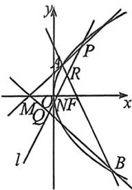

<!-- question-source:start -->
例2 (2026届杭州高级中学9月考·T19)如图,已知F是抛物线 $y^{2}=2px(p>0)$ 的焦点,M是抛物线的准线与x轴的交点,且 $|MF|=2$ .

(1)求抛物线的方程;

(2)设过点 $F$ 的直线交抛物线与 $A, B$ 两点, 斜率为 2 的直线 $l$ 与直线 $MA, MB, AB, x$ 轴依次交于点

$P, Q, R, N$ , 且 $|RN|^2 = |PN| \cdot |QN|$ , 求直线 $l$ 在 $x$ 轴上截距的范围.
<!-- question-source:end -->

![[高中/总复习/二轮/2026版高中《MST新思路思维拓展》二轮复习专题/下册/板块1_不等式/考点六_隐藏的曲线上四点共圆与曲线系/questions/answers/Q00093569A1.md]]
