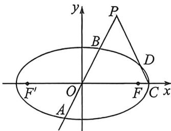

> [!faq]- 例题解析
>
> > [!success]- **【答案】** A
>
> > [!note]- **【解析】**
> > 解析 (1) 已知椭圆的离心率 $e = \frac{c}{a} = \frac{\sqrt{3}}{2}$ ，短轴长 $2b = 2$ ，则 $b = 1, c = \frac{\sqrt{3}}{2} a$ . 根据椭圆的性质可知 $a^2 - b^2 = c^2$ ，所以 $a^2 - 1 = \left(\frac{\sqrt{3}}{2} a\right)^2 \Rightarrow a^2 = 4$ ，所以，椭圆 $E$ 的方程为： $\frac{x^2}{4} + y^2 = 1$ .
> >
> > 
> >
> > (3)(i)如上图所示，设 $D:(2\cos \theta ,\sin \theta),t_0 = \tan \frac{\theta}{2},k_{CD} = \frac{\sin\theta}{2\cos\theta - 2} = -\frac{1}{2t_0},CD:y = -\frac{1}{2t_0}(x - 2)$ ，代入点 $P(1,t)$ ，即 $t = -\frac{1}{2t_0} (-1) = \frac{1}{2t_0}$ 所以 $t_0 = \frac{1}{2t},x_D = 2\cos \theta = 2\cdot \frac{1 - t_0^2}{1 + t_0^2} = 2\cdot \frac{1 - \frac{1}{4t^2}}{1 + \frac{1}{4t^2}} = \frac{2(4t^2 - 1)}{4t^2 + 1}.$
> >
> > (Ⅱ)法一(强哥硬解): 直线 OP 的方程为 y=tx, 代入椭圆方程得 $x^{2}+4t^{2}x^{2}=4$ , 设 $A(x_{1},y_{1}), B(x_{2},y_{2})$ ,
> >
> > 则 $\left\{ \begin{array}{l} x_{1} + x_{2} = 0 \\ x_{1} \cdot x_{2} = \frac{-4}{1 + 4t^{2}} \end{array} \right.$ ，根据两点间距离公式 $\left\{ \begin{array}{l} |PA| = \sqrt{(x_1 - 1)^2 + (y_1 - t)^2} = \sqrt{(1 + t^2)(x_1 - 1)^2} \\ |PB| = \sqrt{(x_2 - 1)^2 + (y_2 - t)^2} = \sqrt{(1 + t^2)(x_2 - 1)^2} \end{array} \right.$
> >
> > 所以 $|PA|\cdot |PB| = (1 + t^2)|x_1x_2 - (x_1 + x_2) + 1| = (1 + t^2)\left|\frac{4t^2 - 3}{1 + 4t^2}\right|$ . 设 $D(x_{D},y_{D})$ ，由（|）知 $x_{D} = \frac{2(4t^{2} - 1)}{1 + 4t^{2}},y_{D} = -t(x_{D} - 2)$ ，根据两点间距离公式： $|PD| = \sqrt{(x_D - 1)^2 + (y_D - t)^2} = \sqrt{(x_D - 1)^2 + t^2(x_D - 1)^2}$ $= \sqrt{1 + t^2}|x_D - 1| = \sqrt{1 + t^2}\left|\frac{4t^2 - 3}{1 + 4t^2}\right|$ ;
> >
> > $\left|PC\right| = \sqrt{(1 - 2)^2 + t^2} = \sqrt{1 + t^2}$ 所以 $\left|PC\right|\cdot \left|PD\right| = (1 + t^2)\left|\frac{4t^2 - 3}{1 + 4t^2}\right| = \left|PA\right|\cdot \left|PB\right|$ 命题得证.
> >
> > 法二(曲线系):由(Ⅰ)易知 $k_{AB}=t, k_{CD}=-\frac{1}{2t_{0}}=-t, AB:y=tx, CD:y=-t(x-2)$ 所以以 A、B、C、D 构成曲线系方程为： $(tx - y)(tx + y = 2t) + \lambda \left(\frac{x^2}{4} +y^2 -1\right) = 0$ ，由于无 $xy$ 项，故总存在一个 $\lambda$ ，使得 $A,B,C,D$ 四点共圆，利用圆幂定理可知： $|PA|\cdot |PB| = |PC|\cdot |PD|$
