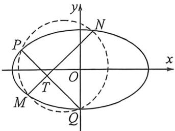
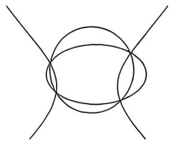
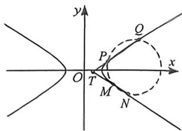

## 考点六_隐藏的曲线上四点共圆与曲线系

知识点: 四点共圆曲线系原理

圆锥曲线 $f_{1}(x,y) = Ax^{2} + By^{2} + Dx + Ey + F = 0$ 上存在四点 $P, Q, M, N$ , 且 $PQ$ 与 $MN$ 相交于点 $T$ , 由于是 $f_{1}(x,y) = Ax^{2} + By^{2} + Dx + Ey + F = 0$ 上四点形成的圆, 不妨设 $l_{MN}: k_{1}x - y + m_{1} = 0, l_{PQ}: k_{2}x - y + m_{2} = 0$ , 而 $f_{2}(x,y) = (k_{1}x - y + m_{1}) \cdot (k_{2}x - y + m_{2}) = 0$ 表示满足直线 $MN$ 和直线 $PQ$ 上的任意点方程, $f_{1}(x,y) + \lambda f_{2}(x,y) = 0$ 表示过圆锥曲线和两直线构成的退化二次曲线交点的一系列曲线方程, 而这一系列曲线中, 有一个满足圆的方程 $f_{3}(x,y) = x^{2} + y^{2} + D_{1}x + E_{1}y + F_{1} = 0$ , 即 $Ax^{2} + By^{2} + Dx + Ey + F + \lambda (k_{1}x - y + m_{1})(k_{2}x - y + m_{2}) = 0$ ,

$$
A x ^ {2} + B y ^ {2} + D x + E y + F + \lambda (k _ {1} x - y + m _ {1}) (k _ {2} x - y + m _ {2}) = \mu (x ^ {2} + y ^ {2} + D _ {1} x + E _ {1} y + F _ {1})
$$

由于没有 $xy$ 的项，必有一 $k_{1} - k_{2} = 0$ 。即 $PQ$ 与 $MN$ 斜率互为相反数。

## 一、圆锥曲线上隐藏四点共圆转化的 T18 类型

![[高中/总复习/二轮/2026版高中《MST新思路思维拓展》二轮复习专题/下册/板块1_不等式/考点六_隐藏的曲线上四点共圆与曲线系/questions/Q00093446.md]]
![[高中/总复习/二轮/2026版高中《MST新思路思维拓展》二轮复习专题/下册/板块1_不等式/考点六_隐藏的曲线上四点共圆与曲线系/questions/Q00093447.md]]
![[高中/总复习/二轮/2026版高中《MST新思路思维拓展》二轮复习专题/下册/板块1_不等式/考点六_隐藏的曲线上四点共圆与曲线系/questions/Q00093448.md]]

## 二、双曲线渐近线退化二次曲线联立T19类型

双曲线方程为 $\frac{x^2}{a^2} -\frac{y^2}{b^2} = 1(a > 0,b > 0)$ ，双曲线两条渐近线构成的退化二次曲线为 $\frac{x^2}{a^2} -\frac{y^2}{b^2} = 0$ ，我们发现直线可以跟双曲线联立，也可以跟退化的渐近线曲线系联立，能通过韦达的两根之和证出它们共中点，也能通过两根之差求出它们的长度比.

我们也发现双曲线 $\frac{x^{2}}{a^{2}}-\frac{y^{2}}{b^{2}}=1(a>0,b>0)$ 与渐近线构成的退化二次曲线 $\frac{x^{2}}{a^{2}}-\frac{y^{2}}{b^{2}}=0$ 是没有交点的，但是双曲线 $\frac{x^{2}}{a^{2}}-\frac{y^{2}}{b^{2}}=1(a>0,b>0)$ ①和与渐近线平行的退化二次曲线会有两个交点P、Q，即过不在渐近线上
的点 $M(x_{0},y_{0})$ 且与渐近线平行的两条直线 $\left\{\begin{aligned}y-y_{0}&=\frac{b}{a}(x-x_{0})\\ y-y_{0}&=-\frac{b}{a}(x-x_{0})\end{aligned}\right.\Rightarrow\left\{\begin{aligned}\frac{x}{a}-\frac{y}{b}-\frac{x_{0}}{a}+\frac{y_{0}}{b}=0\\ \frac{x}{a}+\frac{y}{b}-\frac{x_{0}}{a}-\frac{y_{0}}{b}=0\end{aligned}\right.$ 构成的退化二次
曲线为 $\frac{x}{a}-\frac{y^{2}}{b^{2}}-\frac{2xx_{0}}{a^{2}}+\frac{2yy_{0}}{b^{2}}+\frac{x_{0}^{2}}{a^{2}}-\frac{y_{0}^{2}}{b^{2}}=0$ ②，①②两式相减得： $\frac{2xx_{0}}{a^{2}}-\frac{2yy_{0}}{b^{2}}-\frac{x_{0}^{2}}{a^{2}}+\frac{y_{0}^{2}}{b^{2}}-1=0$ ，这是一条直线得方程，就是 PQ 的直线方程。通常只要斜率互为相反数的两条直线构成的退化二次曲线跟原曲线相减即可得到这条直线的方程。

![[高中/总复习/二轮/2026版高中《MST新思路思维拓展》二轮复习专题/下册/板块1_不等式/考点六_隐藏的曲线上四点共圆与曲线系/questions/Q00093568.md]]
![[高中/总复习/二轮/2026版高中《MST新思路思维拓展》二轮复习专题/下册/板块1_不等式/考点六_隐藏的曲线上四点共圆与曲线系/questions/Q00093450.md]]
![[高中/总复习/二轮/2026版高中《MST新思路思维拓展》二轮复习专题/下册/板块1_不等式/考点六_隐藏的曲线上四点共圆与曲线系/questions/Q00093451.md]]

## 三、退化二次曲线系方程速解斜率互为相反数直线 $T19$ 类型

![[高中/总复习/二轮/2026版高中《MST新思路思维拓展》二轮复习专题/下册/板块1_不等式/考点六_隐藏的曲线上四点共圆与曲线系/questions/Q00093569.md]]
