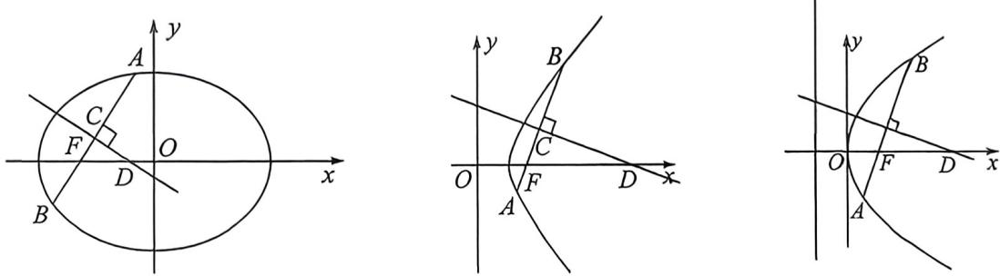

<!-- question-source:start -->
例29 (2024 北京海淀二模改篇题·T18)已知椭圆 E 的焦点在 x 轴上, 中心在坐标原点. 以 E 的一个顶点

和两个焦点为顶点的三角形是等边三角形,且其周长为 $6\sqrt{2}$ .

(I)求椭圆 E 的方程;

(Ⅱ)设过点 $M(2,0)$ 的直线 $l$ 与椭圆 $E$ 交于不同的两点 $A,C$ , 与直线 $x = 16$ 交于点 $P$ . 点 $B$ 在 $y$ 轴上, $D$ 为坐标平面内的一点, 四边形ABCD是菱形.

(1) 求 $\left| OB \right|$ 最大值；

(Ⅱ)求证:直线 PD 过定点.
<!-- question-source:end -->

![[高中/总复习/二轮/2026版高中《MST新思路思维拓展》二轮复习专题/下册/板块1_不等式/考点四_中点弦与中垂线隐藏轨迹方程/questions/answers/Q00093430A1.md]]
