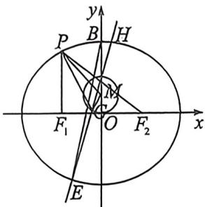

> [!faq]- 例题解析
>
> > [!success]- **【答案】** 详见解析
>
> > [!note]- **【解析】**
> > 解析 (1)依题意, $|PF_1| + |PF_2| = 2a = 4$ , 解得 $a = 2$ , 把 $x = -c$ 代入 $\frac{x^2}{4} + \frac{y^2}{b^2} = 1$ 中, 可得 $y^2 = \frac{b^2(4 - c^2)}{4}$ , 因 $|PF_1| = \frac{3}{2}$ , 则得 $\frac{b^2(4 - c^2)}{4} = \left(\frac{3}{2}\right)^2$ , 将 $c^2 = 4 - b^2$ 代入, 解得 $b = \sqrt{3}$ , 故椭圆 $C$ 的方程为 $\frac{x^2}{4} + \frac{y^2}{3} = 1$ .
> >
> > 
> >
> > (2)(i)将椭圆按 $\overrightarrow{BO}(0, -\sqrt{3})$ 平移. $\frac{x^2}{4} + \frac{y^2}{3} + \frac{2\sqrt{3}}{3} y = 0$ , 令 $E'H' = mx + ny = 1$ , 齐次化联立得: $\frac{x^2}{4} + \frac{y^2}{3} + \frac{2\sqrt{3}}{3} y = (mx + ny) = 0$ , $k_1 k_2 = \frac{\frac{1}{4}}{\frac{1}{3} + \frac{2\sqrt{3}}{3} n} = -\frac{1}{4}$ , 所以 $n = -\frac{2\sqrt{3}}{3}$ , 所以 $E'H'$ 过点 $(0, -\frac{\sqrt{3}}{2})$ , 故 $EH$ 过 $(0, \frac{\sqrt{3}}{2})$ , 由于 $k_{EX} \cdot k_{EH} = -1$ , 设 $G(x_0, y_0)$ , 所以 $\frac{y_0}{x_0} \cdot \frac{y_0 - \frac{\sqrt{3}}{2}}{x_0} = -1$ , 所以 $x_0^2 + y_0^2 - \frac{\sqrt{3}}{2} y_0 = 0$ (去掉原点)
> >
> > 动点 $G$ 的轨迹方程为 $x^2 + y^2 - \frac{\sqrt{3}}{2} y = 0$ (去掉原点).
> >
> > (ii)由(i)可得点 $M\left(0, \frac{\sqrt{3}}{4}\right)$ 恰为圆 $x^2 + y^2 - \frac{\sqrt{3}}{2} y = 0$ 的圆心, 故 $\triangle MPG$ 的边 $PM$ 上的高的最大值为半径长 $\frac{\sqrt{3}}{4}$ , 设 $P(x_0, y_0)$ , 则 $|PM| = \sqrt{x_0^2 + \left(y_0 - \frac{\sqrt{3}}{4}\right)^2} = \sqrt{4\left(1 - \frac{y_0^2}{3}\right) + \left(y_0 - \frac{\sqrt{3}}{4}\right)^2} = \sqrt{-\frac{1}{3}\left(y_0 - \frac{3\sqrt{3}}{4}\right)^2 + \frac{19}}$ , 因 $-\sqrt{3} \leqslant y_0 \leqslant \sqrt{3}$ , 故当 $y_0 = -\frac{3\sqrt{3}}{4}$ 时, $|PM|$ 取得最大值 $\frac{\sqrt{19}}{2}$ , 故 $\triangle MPG$ 的面积最大值为 $\frac{1}{2} \times \frac{\sqrt{3}}{4} \times \frac{\sqrt{19}}{2} = \frac{\sqrt{57}}{16}$ .
