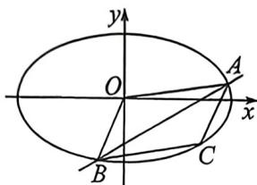

> [!faq]- 例题解析
>
> > [!success]- **【答案】** D
>
> > [!note]- **【解析】**
> > 解析 (1) 由题意, 当 $P$ 在短轴顶点时 $S_{\triangle OFP}$ 最大, 此时 $S_{\triangle OFP} = \frac{1}{2}\sqrt{a^2 - 1} = \frac{1}{2}$ , 解得 $a^2 = 2$ , 所以椭圆方程为: $\frac{x^2}{2} + y^2 = 1$ ;
> >
> > 
> >
> > (2)(i)由题意可得,直线l的斜率存在,设AB中点 $M(x_{0},y_{0})$ ,利用点差法(考试补充过程)可得: $k_{OM}k_{AB}=-\frac{b^{2}}{a^{2}}$ ,即 $\frac{y_{0}}{x_{0}}\cdot\frac{y_{0}}{x_{0}-1}=-\frac{1}{2}$ ,所以 $\frac{x_{0}^{2}-x_{0}}{2}+y_{0}^{2}=0$ ,由于 $\left\{\begin{aligned}x_{C}&=2x_{0}\\ y_{C}&=2y_{0}\end{aligned}\right.$ ,且C在椭圆上,所以 $\frac{(2x_{0})^{2}}{2}+(2y_{0})^{2}=1$ ,所以 $\left\{\begin{aligned}\frac{x_{0}^{2}-x_{0}}{2}+y_{0}^{2}&=0\\ 2x_{0}^{2}+4y_{0}^{2}&=1\end{aligned}\right.$ ,所以 $x_{0}=\frac{1}{2},y_{0}=\pm\frac{\sqrt{2}}{4}$ ,所以 $k_{AB}=\pm\frac{\sqrt{2}}{2}$ ,利用对称性,不妨设 $k=\tan\alpha=\frac{\sqrt{2}}{2}$ ,则 $\sin\alpha=\frac{\sqrt{3}}{3}$ ,利用焦长公式(考试需证明) $S_{OACB}=|AB|\cdot h=\frac{2ab^{2}}{b^{2}+c^{2}\sin^{2}\alpha}\cdot c\sin\alpha=\frac{2\sqrt{2}\cdot\frac{\sqrt{3}}{3}}{1+\frac{1}{3}}=\frac{\sqrt{6}}{2};$ (Ⅱ)(曲线系)由(1)(2)得 $l_{AB}:y=k(x-1)$ 即 $kx-y-k=0,l_{CD}:y=-\frac{1}{2k}x$ 即 $x+2ky=0$ ,
> > 所以过A,B,C,D的二次曲线系为 $\frac{1}{2}x^{2}+y^{2}-1+\lambda(kx-y-k)(x+2ky)=0,\lambda\in\mathbb{R}$ , $x^{2},y^{2},xy$ 的系数依次为 $\frac{1}{2}+\lambda k,1-2\lambda k,\lambda(2k^{2}-1)$ ，由(2)得 $k^{2}=\frac{1}{2}$ ，所以xy的系数 $\lambda(2k^{2}-1)=0$ ,
> > 又令 $\frac{1}{2}+\lambda k=1-2\lambda k$ ,得 $\lambda k=\frac{1}{6}$ ,所以 $\lambda=\frac{1}{6k}=\pm\frac{\sqrt{2}}{6}$ ,所以 $\lambda$ 存在.所以A,B,C,D四点共圆.
> >
> > 注意 曲线系设法不同, $\lambda$ 的取值不同,因此,只需 $\lambda$ 有解即可.
