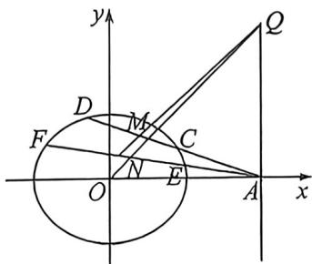

> [!faq]- 例题解析
>
> > [!success]- **【答案】** 详见解析
>
> > [!note]- **【解析】**
> > 解析 (1) 设点 $P(x, y)$ , 得 $\frac{\sqrt{(x-1)^2 + y^2}}{|x-4|} = \frac{1}{2}$ , 化简得 $3x^2 + 4y^2 = 12$ , 即 $\Gamma$ 的轨迹方程为 $\frac{x^2}{4} + \frac{y^2}{3} = 1$ .
> >
> > 
> >
> > (2)法一(强哥硬解): 设 $l_{1}: y = k_{1} (x - 4)$ ，联立 $\left\{\begin{aligned} y &= k_{1}(x - 4) \\ 3x^{2} + 4y^{2} &= 12 \end{aligned}\right.$ ，化简得 $(3 + 4k_{1}^{2})x^{2} - 32k_{1}^{2}x + 64k_{1}^{3} - 12 = 0$ ，设 C
> >
> >
> > $(x_{1},y_{1}),D(x_{2},y_{2})$ ，依题意 $\Delta = (-32k_1^{\mathrm{f}})^2 -4(3 + 4k_1^{\mathrm{g}})(64k_1^{\mathrm{g}} - 12) > 0$ ，则 $\left\{ \begin{array}{l}x_{1} + x_{2} = \frac{32k_{1}^{2}}{3 + 4k_{1}^{2}}\\ x_{1}x_{2} = \frac{64k_{1}^{2} - 12}{3 + 4k_{1}^{2}} \end{array} \right.$ ， $M$ 为 $CD$ 的中点，所以 $M\left(\frac{16k_1^2}{3 + 4k_1^2},\frac{-12k_1}{3 + 4k_1^2}\right)$ ，设 $E(x_{3},y_{3}),F(x_{4},y_{4})$ ，同理可得 $N\left(\frac{16k_2^2}{3 + 4k_2^2},\frac{-12k_2}{3 + 4k_2^2}\right)$ ，因为直线 $MN$ 与直线 $l$ 交于点 $Q$ 设 $Q(4,t)$ ，所以 $k_{MN} = k_{MQ}$ ，即 $\frac{\frac{-12k_1}{3 + 4k_1^2} + \frac{12k_2}{3 + 4k_3^2}}{\frac{16k_1^2}{3 + 4k_1^2} - \frac{16k_2^2}{3 + 4k_2^2}} = \frac{t + \frac{12k_1}{3 + 4k_1^2}}{4 - \frac{16k_1^2}{3 + 4k_1^2}}$ ，化简得 $\frac{4k_1k_2 - 3}{(k_1 + k_2)} = \frac{t(3 + 4k_1^2) + 12k_1}{3},t = \frac{-3}{(k_1 + k_2)}$ ，所以 $k_{3} = -\frac{3}{4(k_{1} + k_{2})}$ ，所以 $k_{1}k_{3} + k_{2}k_{3} = (k_{1} + k_{2})k_{3} = -\frac{3}{4}$ 故 $k_{1}k_{3} + k_{2}k_{3}$ 为定值，并该定值为一 $\frac{3}{4}$ 法二（对合）： $M:(x_0,y_0)$ ，利用点差法易证 $k_{OM}\cdot k_{CO} = -\frac{3}{4}$ 所以 $\frac{y_0}{x_0}\cdot \frac{y_0}{x_0 - 4} = -\frac{3}{4}$ 即 $\frac{(x_0 - 2)^2}{4} +\frac{y_0^2}{3} = 1(y_0\neq 0)$ 由于点 $N$ 也符合 $k_{ON}\cdot k_{EF} = -\frac{3}{4}$ 所以 $M,N$ 均在 $C:\frac{(x - 2)^2}{4} +\frac{y^3}{3} = 1(y\neq 0)$ 上，故将 $C$ 向左平移2个单位得： $C^\prime$ ： $\frac{x^2}{4} +\frac{y^2}{3} = 1$ ，设 $M\rightarrow M^{\prime}(2\cos \theta_{1},\sqrt{3}\sin \theta_{1}),N\rightarrow N^{\prime}(2\cos \theta_{2},\sqrt{3}\sin \theta_{2})$ ，令 $\tan \frac{\theta_1}{2} = t_1,\tan \frac{\theta_2}{2} = t_2,k_{AM} = k_{A'M} = k_1 =$ $\frac{\sqrt{3}\sin\theta_1}{2\cos\theta_1 - 2} = -\frac{\sqrt{3}}{2\tan\frac{\theta_1}{2}} = -\frac{\sqrt{3}}{2t_1}$ ，同理 $k_{2} = -\frac{\sqrt{3}}{2t_{2}},M^{\prime}N^{\prime} = \frac{x}{2}(1 - t_{1}t_{2}) + \frac{y}{\sqrt{3}} (t_{1} + t_{2}) = 1 + t_{1}t_{2}$ （请自证），当 $x = 2$ 时， $y^{\prime}_{Q}$ $= \frac{2\sqrt{3}t_1t_2}{t_1 + t_2}$ 所以 $k_{3} = \frac{y_{Q}^{\prime}}{x_A^{\prime} - x_O^{\prime}} = \frac{y_Q^{\prime}}{2 - (-2)} = \frac{\sqrt{3}t_1t_2}{2(t_1 + t_2)},(k_1 + k_2)k_3 = -\frac{\sqrt{3}}{2}\cdot \frac{t_1 + t_2}{t_1t_2}\cdot \frac{\sqrt{3}t_1t_2}{2(t_1 + t_2)} = -\frac{3}{4}.$
