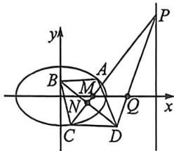

> [!faq]- 例题解析
>
> > [!success]- **【答案】** 详见解析
>
> > [!note]- **【解析】**
> > 解析（1）因为椭圆 $E$ 的焦点在 $x$ 轴上，中心在坐标原点，不妨设椭圆 $E$ 的方程为 $\frac{x^2}{a^2} +\frac{y^2}{b^2} = 1(a > b > 0)$
> >
> > 因为以 E 的一个顶点和两个焦点为顶点的三角形是等边三角形, 且其周长为 $6\sqrt{2}$ , 所以 $2a + 2c = 6\sqrt{2}$ 且 $\frac{c}{a} = \frac{1}{2}$ , ①,
> > 又 $a^{2}=b^{2}+c^{2}$ ，②，联立①②，解得 $a=2\sqrt{2}, b=\sqrt{6}, c=\sqrt{2}$ ，则椭圆 E 的方程为 $\frac{x^{2}}{8}+\frac{y^{2}}{6}=1$ ;
> >
> > 
> >
> > (Ⅱ)(Ⅰ)令 $AC:y = k(x - 2),AC$ 中点 $N(x_0,y_0)$ ，利用点差法（省略）可得 $k_{CN}k_{AC} = -\frac{3}{4}$ ①，且利用菱形性质可知 $k_{BN}$ $k_{AC} = -1②$ ，① $\div$ ②得： $\frac{k_{CN}}{k_{BN}} = \frac{3}{4} = \frac{y_0}{y_0 - y_B}$ 所以 $y_{B} = -\frac{y_{0}}{3}$
> >
> > 由于 $\left\{ \begin{array}{l} y_0 = k(x_0 - 2) \\ k = -\frac{3x_0}{4y_0} \end{array} \right.$ 得： $y_0^2 = -\frac{3}{4}(x_0^2 - 2x_0)$ ，所以 $\frac{(x_0 - 1)^2}{3} + \frac{4y_0^2}{9} = \frac{1}{3}, -\frac{\sqrt{3}}{2} \leqslant y_0 \leqslant \frac{\sqrt{3}}{2}$ ，所以 $|y_B|_{\max} = \frac{\sqrt{3}}{6}$
> >
> > (Ⅱ)由于 $B: \left(0, -\frac{y_0}{3}\right)$ , 故 $D: (2x_0, \frac{7}{3}y_0), AC: y = k(x - 2) = -\frac{3x_0}{4y_0}(x - 2)$ , 代入 $x = 16$ , 则 $P\left(16, -\frac{21x_0}{2y_0}\right)$ ,
> >
> > 利用对称性可知定点一定出现在 $x$ 轴上，设定点为 $(t,0)$ ，则 $\frac{y_P}{y_D} = \frac{16 - t}{x_D - t}$ ，即 $-\frac{9x_0}{2y_0^2} = \frac{16 - t}{2x_0 - t} = \frac{6x_0}{x_0^2 - 2x_0}$ ，所以 $t = 4$ ，故直线 $PD$ 过定点(4,0).
