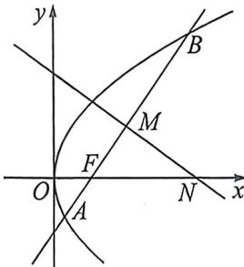

> [!faq]- 例题解析
>
> > [!success]- **【答案】** $x + y - 2 = 0$ 或 x - y - 2 = 0
>
> > [!note]- **【解析】**
> > 解析 法一: 设直线 $l: x = ty + 2$ ，与抛物线方程联立可得 $y^{2} - 8ty - 16 = 0, \Delta = 64(1 + t^{2}) > 0$ ， $y_{1}:y_{2}=8t,y_{1}y_{2}=-16$ ，因此 $M(4t^{2}+2,4t)$ ，MN: $tx+y-4t^{3}-6t=0$ ，得 $N(4t^{2}+6,0)$ ，所以 $S_{\triangle FMN}=\left|\frac{1}{2}\cdot4t\cdot(4t^{2}+6-2)\right|=16$ ，解得 $t=\pm1$ ，因此直线 l 的方程为 $x+y-2=0$ 或 x-y-2=0。
> >
> > 
> >
> > 法二: 设 $\angle BFx = \alpha$ ，则隐藏结论 $\frac{|NF|}{|AB|} = \frac{1}{2}$ ， $|AB| = \frac{2p}{\sin^{2}\alpha} = \frac{8}{\sin^{2}\alpha}$ ， $S_{\triangle FMN} = \frac{1}{2} |FN|^{2} \cdot \sin\alpha\cos\alpha = \frac{1}{8} |AB|^{2}\sin\alpha\cos\alpha = \frac{8\cos\alpha}{\sin^{3}\alpha} = 16$ ，所以 $\sin\alpha = \frac{\sqrt{2}}{2}$ ，故答案为： $x + y - 2 = 0$ 或 x - y - 2 = 0。
