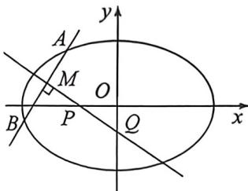

## 考点四_中点弦与中垂线隐藏轨迹方程

## 一、由垂直关系构造隐藏二次曲线 T18 类型

![[高中/总复习/二轮/2026版高中《MST新思路思维拓展》二轮复习专题/下册/板块1_不等式/考点四_中点弦与中垂线隐藏轨迹方程/questions/Q00093426.md]]

## 二、中点弦隐藏的二次曲线轨迹方程 T18 或 T19 类型

以椭圆 $\frac{x^2}{a^2} +\frac{y^2}{b^2} = 1$ 的中点弦 $AB$ 为例，如果直线 $AB$ 方程为 $y = kx + m$ 或者 $x = \frac{1}{k} y + n$ ，那么弦中点 $M(x_0,y_0)$ 一定位于一个椭圆上，证明如下：

因为 $k_{AB} \cdot k_{OM} = -\frac{b^2}{a^2}$ , 故 $\frac{y_0 - m}{x_0} \cdot \frac{y_0}{x_0} = -\frac{b^2}{a^2}$ , 所以 $\frac{x_0^2}{a^2} + \frac{y_0^2 - my_0}{b^2} = 0$ , 也可以表示为 $\frac{x_0^2}{a^2} + \frac{\left(y_0 - \frac{m}{2}\right)^2}{b^2} = \frac{m^2}{4b^2}$ .

因为 $k_{AB} \cdot k_{CM} = -\frac{b^2}{a^2}$ , 故 $\frac{y_0}{x_0 - n} \cdot \frac{y_0}{x_0} = -\frac{b^2}{a^2}$ , 所以 $\frac{x_0^2 - nx_0}{a^2} + \frac{y_0^2}{b^2} = 0$ , 也可以表示为 $\frac{\left(x_0 - \frac{n}{2}\right)^2}{a^2} + \frac{y_0^2}{b^2} = \frac{n^2}{4a^2}$ .

易知弦中点的轨迹都是椭圆,求出轨迹,则很容易求出中点的取值范围.双曲线的中点弦轨迹也是小的双曲线,抛物线中点弦轨迹也是小的抛物线。

![[高中/总复习/二轮/2026版高中《MST新思路思维拓展》二轮复习专题/下册/板块1_不等式/考点四_中点弦与中垂线隐藏轨迹方程/questions/Q00093427.md]]
![[高中/总复习/二轮/2026版高中《MST新思路思维拓展》二轮复习专题/下册/板块1_不等式/考点四_中点弦与中垂线隐藏轨迹方程/questions/Q00093428.md]]
![[高中/总复习/二轮/2026版高中《MST新思路思维拓展》二轮复习专题/下册/板块1_不等式/考点四_中点弦与中垂线隐藏轨迹方程/questions/Q00093429.md]]

## 三、中垂线隐藏的二次曲线轨迹方程 T18 或 T19 类型

中垂线问题: 若 A、B 关于直线 PQ 对称, 可以知道线段 AB 被直线 PQ 垂直平分, 其中 $P(n,0)$ , $Q(0,m)$ 则能得出以下定理(不妨设焦点在 x 轴上):

$m = -\frac{y_0c^2}{b^2}$ （椭圆）， $m = \frac{y_0c^2}{b^2}$ （双曲线）； $m = p + y_0$ （抛物线）；

$n = \frac{x_0c^2}{a^2}$ （椭圆）， $n = \frac{x_0c^2}{a^2}$ （双曲线）. $n = p + x_0$ （抛物线）；

我们这里以焦点在 $x$ 轴上的椭圆为例来证明：

$k_{AB} \cdot k_{OM} = -\frac{b^{2}}{a^{2}}, k_{AB} \cdot k_{PQ} = -1, \frac{k_{OM}}{k_{PQ}} = \frac{b^{2}}{a^{2}}$ , 故 $\frac{\frac{y_{0}}{x_{0}}}{\frac{y_{0}-m}{x_{0}}} = \frac{b^{2}}{a^{2}}$ , 即 $m = -\frac{y_{0}c^{2}}{b^{2}}$ ; 同理 $\frac{\frac{y_{0}}{x_{0}}}{\frac{y_{0}}{x_{0}-n}} = \frac{b^{2}}{a^{2}}$ , 即 $n = \frac{x_{0}c^{2}}{a^{2}}$ .

![[高中/总复习/二轮/2026版高中《MST新思路思维拓展》二轮复习专题/下册/板块1_不等式/考点四_中点弦与中垂线隐藏轨迹方程/questions/Q00093430.md]]

## 四、焦点弦中垂线隐藏的比值 T18 类型

知识点:焦点弦中垂线特殊性质

(1)设椭圆焦点弦 $AB$ 的中垂线与长轴的交点为 $D$ , 则 $|FD| = \frac{e}{2} |AB|$ (如左图)

(2)设双曲线焦点弦 $AB$ 的中垂线与焦点所在轴的交点为 $D$ , 则 $\left|FD\right| = \frac{e}{2}\left|AB\right|$ (如中图)

(3)抛物线焦点弦 $AB$ 的中垂线与对称轴的交点为 $D$ , 则 $|FD| = \frac{1}{2} |AB|$ (如右图)

①证明：根据椭圆焦长公式： $|BF|=\frac{b^{2}}{a-c\cos\alpha},|AF|=\frac{b^{2}}{a+c\cos\alpha},|AB|=\frac{2ab^{2}}{a^{2}-c^{2}\cos^{2}\alpha}$

$$
| C F | = \left| \frac {| A B |}{2} - | A F | \right| = \left| \frac {| A F | + | B F |}{2} - | A F | \right| = \left| \frac {| B F | - | A F |}{2} \right| = \left| \frac {b ^ {2}}{a - c \cos \alpha} \frac {b ^ {2}}{a + c \cos \alpha} \right| = \frac {b ^ {2} c | \cos \alpha |}{a ^ {2} - c ^ {2} \cos^ {2} \alpha},
$$

$$
| D F | = \frac {| C F |}{| \cos \alpha |} = \frac {b ^ {2} c}{a ^ {2} - c ^ {2} \cos^ {2} \alpha}, \text {故} \frac {| D F |}{| A B |} = \frac {b ^ {2} c}{2 a b ^ {2}} = \frac {c}{2 a} = \frac {e}{2}.
$$

②证明:当直线AB与双曲线交于一支时,证明过程同椭圆一致;当直线AB与双曲线交于两支时,

$|BF|=\frac{b^{2}}{c\cos\alpha-a},|AF|=\frac{b^{2}}{c\cos\alpha+a},|AB|=\frac{2ab^{2}}{c^{2}\cos^{2}\alpha-a^{2}},|CF|=\frac{b^{2}c\cos\alpha}{c^{2}\cos^{2}\alpha-a^{2}}$ ，其余过程与椭圆一致.

③证明:抛物线 $y^{2}=2px(p>0)$ 焦点弦公式: $\left|AF\right|=\frac{p}{1+\cos\alpha};\left|BF\right|=\frac{p}{1-\cos\alpha};\left|AB\right|=\frac{2p}{\sin^{2}\alpha}.$

$|CF|=\left|\frac{|AB|}{2}-|AF|\right|=\left|\frac{|AF|+|BF|}{2}-|AF|\right|=\left|\frac{|BF|-|AF|}{2}\right|=\frac{p\left|\cos\alpha\right|}{\sin^{2}\alpha},|DF|=\frac{|CF|}{|\cos\alpha|}=\frac{p}{\sin^{2}\alpha}$ ，故 $\frac{|DF|}{|AB|}=\frac{1}{2}$ .

![[高中/总复习/二轮/2026版高中《MST新思路思维拓展》二轮复习专题/下册/板块1_不等式/考点四_中点弦与中垂线隐藏轨迹方程/questions/Q00093431.md]]
![[高中/总复习/二轮/2026版高中《MST新思路思维拓展》二轮复习专题/下册/板块1_不等式/考点四_中点弦与中垂线隐藏轨迹方程/questions/Q00093432.md]]
