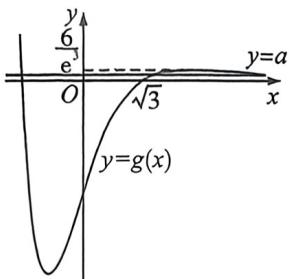
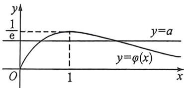

> [!faq]- 例题解析
>
> > [!success]- **【答案】** 详见解析
>
> > [!note]- **【解析】**
> > 解析 (1) 当 $a = 1$ 时, $f(x) = e^{x} - \frac{1}{3} x^{3} + 3x$ , 则 $f'(x) = e^{x} - x^{2} + 3$ , 因此 $f(0) = 1$ , 则 $f'(0) = 4$ ,
> >
> > 因此 $f(x)$ 的图象在点 $(0, f(0))$ 处的切线方程为 y-1=4x，即 $4x-y+1=0$ .
> >
> > (2)由题知, $f'(x)=ae^{x}-x^{2}+3(a\in\mathbb{R})$ ,因为 $f'(x)$ 有三个不同的零点,
> >
> > 因此方程 $ae^x - x^2 + 3 = 0$ 有三个不等实根，化简可得方程 $a = \frac{x^2 - 3}{e^x}$ 有三个不等实根，
> >
> > 即可看成直线 $y = a$ 与曲线 $g(x) = \frac{x^2 - 3}{e^x}$ 有三个不同的交点， $g'(x) = \frac{2x - x^2 + 3}{e^x} = -\frac{(x + 1)(x - 3)}{e^x}$ ，
> >
> > 因此当 $x \in (-\infty, -1)$ 或 $x \in (3, +\infty)$ 时， $g'(x) < 0$ ， $g(x)$ 单调递减；当 $x \in (-1, 3)$ 时， $g'(x) > 0$ ， $g(x)$ 单调递增，因此当 $x = -1$ 时， $g(x)$ 有极小值为 $g(-1) = -2e$ ，当 $x = 3$ 时， $g(x)$ 有极大值为 $g(3) = \frac{6}{e^3}$ ，当 $x \to +\infty$ 时， $g(x) \to 0$ ，且当 $|x| > \sqrt{3}$ 时， $g(x) > 0$ ，因此作出函数 $g(x) = \frac{x^2 - 3}{e^x}$ 的图象如图1所示，可知 $0 < a < \frac{6}{e^3}$ ，即实数 $a$ 的取值范围为 $\left(0, \frac{6}{e^3}\right)$ .（本题不进行找点，同学们可以自行补充零点证明）
> >
> > 
> > 图1
> >
> > (3)由题知, $h(x)=\frac{ae^{x}}{x}-x+\ln x$ ,其定义域为 $(0,+\infty)$ ，则 $h'(x)=\frac{(ax-a)e^{x}}{x^{2}}-1+\frac{1}{x}=\frac{(ae^{x}-x)(x-1)}{x^{2}}(x>0)$ ，
> > 令 $h'(x)=0$ , 得 x=1 或 $a=\frac{x}{e^{x}}$ , 设 $\varphi(x)=\frac{x}{e^{x}}(x>0)$ , 则 $\varphi'(x)=\frac{1-x}{e^{x}}$ , 当 $x\in(0,1)$ 时, $\varphi'(x)>0$ , 因此 $\varphi(x)$ 单调递增; 当 $x\in(1,+\infty)$ 时, $\varphi'(x)<0$ , 因此 $\varphi(x)$ 单调递减, 又当 $x\to0$ 时, $\varphi(x)\to0$ ; 当 $x\to+\infty$ 时, $\varphi(x)\to0$ , 且 $\varphi(1)=\frac{1}{e}$ , 因此 $\varphi(x)$ 的大致图象如图 2 所示,
> >
> > 
> > 图2
> >
> > 因为 $h(x)$ 在定义域内有三个不同的极值点 $x_{1}, x_{2}, x_{3}$ , 因此 $\varphi(x)$ 与 $y = a$ 有两个不同的交点, 因此 $0 < a < \frac{1}{e}$ , 不妨设
> >
> >
> > $x_{1} < x_{2} < x_{3} +$ 则 $0 < x_{1} < 1 = x_{2} < x_{3}$ ，因此 $a = \frac{x_1}{e^{x_1}} = \frac{x_3}{e^{x_3}}$ ，因此 $\left\{ \begin{array}{l}\ln x_1 = x_1 + \ln a,\\ \ln x_3 = x_3 + \ln a, \end{array} \right.$
> >
> > $$
> > h (x _ {1}) \cdot h (x _ {2}) \cdot h (x _ {3}) = \left(\frac {a e ^ {x _ {1}}}{x _ {1}} - x _ {1} + \ln x _ {1}\right) (a e - 1) \cdot \left(\frac {a e ^ {x _ {2}}}{x _ {8}} - x _ {3} + \ln x _ {3}\right)
> > $$
> >
> > $=(ae-1)\cdot(1-x_{1}+\ln x_{1})\cdot(1-x_{0}+\ln x_{3})=(ae-1)(1+\ln a)^{2}$ ，令 $p(a)=(ae-1)(1+\ln a)^{2}\left(0<a<\frac{1}{e}\right)$ ，则 $p'(a)=(1+\ln a)\left(3e+e\ln a-\frac{2}{a}\right)$ ，因为 $y=e\ln a$ 在 $\left(0,\frac{1}{e}\right)$ 上单调递增， $y=\frac{2}{a}$ 在 $\left(0,\frac{1}{e}\right)$ 上单调递减，
> >
> > 因此 $y = 3e + e\ln a - \frac{2}{a}$ 在 $\left(0, \frac{1}{e}\right)$ 上单调递增，因此 $3e + e\ln a - \frac{2}{a} < 3e + e\ln \frac{1}{e} - 2e = 0$
> >
> > 又 $1 + \ln a < 1 + \ln \frac{1}{e} = 0$ ，因此 $p'(a) > 0$ ，因此 $p(a)$ 在 $\left(0, \frac{1}{e}\right)$ 上单调递增，因为 $p\left(\frac{1}{e^2}\right) = \left(\frac{1}{e} - 1\right)(1 - 2)^2 = \frac{1}{e} - 1$ ，因此当 $a \in \left[\frac{1}{e^2}, \frac{1}{e}\right)$ 时， $p(a) \geqslant \frac{1}{e} - 1$ 恒成立，即当 $a \in \left[\frac{1}{e^2}, \frac{1}{e}\right)$ 时， $h(x_1) \cdot h(x_2) \cdot h(x_3) \geqslant \frac{1}{e} - 1$ 恒成立，因此实数 $a$ 的取值范围是 $\left[\frac{1}{e^2}, \frac{1}{e}\right)$ .
