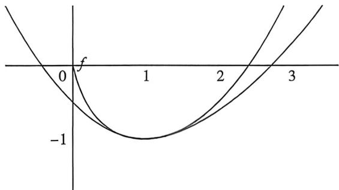

> [!faq]- 例题解析
>
> > [!success]- **【答案】** 详见解析
>
> > [!note]- **【解析】**
> > 解析 $f(x)=0$ 得: $k=\frac{x}{e^{x-1}}=xe^{1-x}$ , 设 $F(x)=xe^{1-x}$ ,
> >
> > 则 $F'(x)=(1-x)e^{1-x}$ ，由 $F'(x)>0$ 得：x<1；由 $F'(x)<0$ 得：x>1；
> >
> > 所以 $F(x)$ 在 $(-∞,1)$ 上单调递增， $(1,+∞)$ 上单调递减，
> >
> > 所以 $F(x)$ 的最大值为 $F(1) = 1$ 且当 $x \to +\infty$ 时， $F(x) \to 0$ ，且大于 0，
> >
> > 当 $x \to -\infty$ 时， $F(x) \to -\infty$ ，所以若 $F(x) = k$ 有两个不同的根 $x_1 < x_2$ 时， $k \in (0,1)$ .
> >
> > 同理: 令 $g(x)=0$ 得: $k=x(1-\ln x)$ . 设 $G(x)=x(1-\ln x), G'(x)=-\ln x$ . 由 $G'(x)>0$ 得: $0<x<1$ ; 由 $G'(x)<0$ 得: $x>1$ . 所以 $G(x)$ 在 $(0,1)$ 上单调递增, $(1,+\infty)$ 上单调递减, 所以 $G(x)$ 的最大值为 $G(1)=1$ 且当 $x\to0$ 且大于0时, $G(x)\to0$ 且大于0, 当 $x\to+\infty$ 时, $G(x)\to-\infty$ ,
> >
> > 所以若 $G(x)=k$ 有两个不同的根 $x_{3}<x_{4}$ 时， $k\in(0,1)$ . 综上： $k\in(0,1)$ .
> >
> > (2) 法一: 单调性调整: 先证: $x_{3} + x_{4} > 2$ , 即证 $(x_{3} + x_{4})(x_{4} - x_{3}) > 2(x_{4} - x_{3})$ , 即 $x_{4}^{2} - 2x_{4} > x_{3}^{2} - 2x_{3}$ ,
> >
> > 令 $h(x) = x^{2} - 2x + \lambda (x\ln x - x), h^{\prime}(x) = 2x - 2 + \lambda \ln x, h^{\prime \prime}(x) = 2 + \frac{\lambda}{x}, h^{\prime \prime}(1) = 2 + \lambda = 0, \lambda = -2,$
> >
> > 此时 $h^{\prime}(x) = 2x - 2 - 2\ln x\geqslant 0,h(x)$ 单调递增， $h(x_{4}) = x_{4}^{2} - 2x_{4} + \lambda (x_{4}\ln x_{4} - x_{4}) = x_{3}^{2} - 2x_{3} + \lambda (x_{3}\ln x_{3} - x_{3}) = h(x_{3})$ 即 $x_{3} + x_{4} > 2$ 得证.
> >
> > 法二:拟合,由图像,构造 $h(x)=x\ln x-x$ 的先小后大在 x=1 处取等的二次函数,即 $\ln x$ 的先小后大,在 x=1 处取
> >
> > 等，故考虑飘带函数 $\ln x\sim \frac{1}{2}\left(x - \frac{1}{x}\right)$ ，故易证 $\left\{ \begin{array}{l}x <   1,h(x) = x\ln x - x > x\left(\frac{1}{2} x - \frac{1}{2x}\right) - x = \frac{1}{2} x^2 -x - \frac{1}{2} = F(x)\\ x > 1,h(x) = x\ln x - x <   x\left(\frac{1}{2} x - \frac{1}{2x}\right) - x = \frac{1}{2} x^2 -x - \frac{1}{2} = F(x) \end{array} \right.$ ，(自证）
> >
> > 
> >
> > 易知 $x_{3}, x_{4}$ 为 $h(x) = x \ln x - x = -k$ 的两个解，令 $F(x) = \frac{1}{2} x^{2} - x - \frac{1}{2} = -k$ 解为 $x'_{3}, x'_{4}, x'_{3} + x'_{4} = 2$ 故 $2 = x_{3}' + x_{4}' < x_{3} + x_{4}$ 得证！
> >
> > 再证： $x_{3} + x_{4} <   x_{1} + x_{2}$ ，设 $H(x) = \frac{F(x) - G(x)}{x} = e^{1 - x} - 1 + \ln x(x > 0)$ 且 $H(1) = 0$
> >
> > 则 $H^{\prime}(x) = -e^{1 - x} + \frac{1}{x} = \frac{1 - xe^{1 - x}}{x}$ 且 $H^{\prime}(1) = 0.$ 令 $h(x) = 1 - xe^{1 - x}(x > 0)$ ，则 $h^{\prime}(x) = (x - 1)e^{1 - x}$ ，
> >
> > 由 $h'(x) > 0$ 得： $x > 1$ ；由 $h'(x) < 0$ 得： $0 < x < 1$ ；所以 $h(x)$ 在 $(0,1)$ 上单调递减， $(1, +\infty)$ 上单调递增，
> >
> > 所以 $h(x)\geqslant h(1) = 0$ ，即 $H^{\prime}(x)\geqslant 0$ ，所以 $H(x)$ 在 $(0, + \infty)$ 上单调递增，又因为 $H(1) = 0$ ，所以当 $0 <   x <   1$ 时， $H(x)$
> >
> > <0; 当 x>1 时, $H(x)>0$ , 即当 0<x<1 时, $F(x)<G(x)$ ; 当 x>1 时, $F(x)>G(x)$ , 由(1)知: $0<x_{1}<1<x_{2}, 0<x_{3}<1<x_{4}$ , 所以有 $F(x_{1})=k=G(x_{3})<G(x_{1})$ 且 $G(x)$ 在 (0,1) 上单调递增,
> >
> > 所以 $x_{3} < x_{1}$ , 同理可得: $x_{4} < x_{2}$ , 所以 $x_{3} + x_{4} < x_{1} + x_{2}$ 得证.
