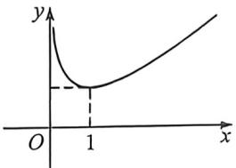

> [!faq]- 例题解析
>
> > [!success]- **【答案】** A
>
> > [!note]- **【解析】**
> > 解析 (1) 因为 $f(x) = \frac{1}{6} x^3 - \frac{1}{2} x^2 \ln x + \frac{3 - 2a}{4} x^2$ ，所以 $f'(x) = \frac{x^2}{2} - x \ln x + (1 - a)x$ .
> >
> > 则 $f''(x) = x - \ln x - a$ . 当 $a = 2$ 时, $f'(x) = \frac{x^2}{2} - x\ln x - x$ , $f''(x) = x - \ln x - 2$ .
> >
> > 则 $f^{\prime}(1) = -\frac{1}{2}, f^{\prime \prime}(1) = -1$ ，所以 $k = \frac{1}{\left[1 + \left(-\frac{1}{2}\right)^2\right]^+} = \frac{8\sqrt{5}}{25}$ .
> >
> > (2)(i)依题意 $f''(x)=x-\ln x-a=0$ 即 $a=x-\ln x$ 有两个不同的解.
> >
> > 令 $g(x)=x-\ln x$ ，则 $g'(x)=1-\frac{1}{x}=\frac{x-1}{x}$
> >
> > 因为 $x > 0$ ，所以当 $0 < x < 1$ 时， $g'(x) < 0, g(x)$ 单调递减，当 $x > 1$ 时， $g'(x) > 0, g(x)$ 单调递增，
> >
> > 所以 $g(x)\geqslant g(1)=1$ . 又 $x\to0$ 或 $x\to+\infty$ 时, $f(x)\to+\infty$ , 所以 a>1 时方程有两解. 所以 a 的取值范围为 $(1,+\infty)$ .
> >
> > 
> >
> > (Ⅱ)法一(对称化构造+帕德逼近证明):由(1)知, $0<x_{1}<1<x_{2}$ ，由 $x-\ln x-a=0$ ，得 $a=x_{1}-\ln x_{1}$ ，要证 $x_{1}+x_{2}<\frac{4a+2}{3}$ ， $x_{2}<\frac{4a+2}{3}-x_{1}=\frac{4(x_{1}-\ln x_{1})+2}{3}-x_{1}=\frac{x_{1}-4\ln x_{1}+2}{3}$ ，故构造函数 $g(x)=\frac{x_{1}-4\ln x_{1}+2}{3}$ ，(0<x<1)，则
> >
> >
> > $g'(x)=\frac{x-4}{3x}<0$ ，所以 $g(x)$ 在(0,1)单调递减， $g(x)>g(1)=1$ 。故 $x_{2}>1,\frac{x_{1}-4\ln x_{1}+2}{3}>1$ ，构造函数 $h(x)=f(x)-f\left(\frac{x-4\ln x+2}{3}\right),(0<x<1),h'(x)=\frac{2x+1}{3x}+\frac{1}{x-4\ln x+2}\cdot\frac{x-4}{x}$ ，下面证明 $h'(x)>0$ ，即证明 $\ln x-\frac{(x+5)(x-1)}{4x+2}<0$ 。这是 $\ln x$ 的帕德逼近 $R_{2,1}(x)=\frac{x^{2}+4x-5}{4x+2}$ ，直接构造函数 $H(x)=\ln x-\frac{(x+5)(x-1)}{4x+2},(0<x<1).H'(x)=\frac{(1-x)^{2}}{(2x+1)^{2}x}>0$ ，在(0,1)上恒成立，因此 $H(x)$ 在(0,1)递增，从而 $H(x)<H(1)=0$ ，故 $h'(x)>0,h(x)$ 在(0,1)递增，故 $h'(x)<h(1)=0$ ，故 $f(x_{1})<f\left(\frac{x_{1}-4\ln x_{1}+2}{3}\right),f(x_{2})<f\left(\frac{x_{1}-4\ln x_{1}+2}{3}\right)$ ，所以x>1时， $f'(x)>0,f(x)$ 单调递增，故 $x_{2}<\frac{x_{1}-4\ln x_{1}+2}{3}$ ，即 $x_{1}+x_{2}<\frac{4a+2}{3}$ 。
> >
> > 法二(单调性调整):要证 $x_{1}+x_{2}<\frac{4a+2}{3}$ ，只需 $x_{1}^{2}-\frac{4a+2}{3}x_{1}>x_{2}^{2}-\frac{4a+2}{3}x_{2}$ ，
> >
> > 只需 $3x_{1}^{2} - (4a + 2)x_{1} > 3x_{2}^{2} - (4a + 2)x_{2}$ ，由于 $a = x - \ln x,3x_1^2 -(4x_1 - 4\ln x_1 + 2)x_1 > 3x_2^2 -(4x_2 - 4\ln x_2 + 2)x_2,$ 由于 $g(x) = 3x^{2} - (4x - 4\ln x + 2)x = -x^{2} + 4x\ln x - 2x$ 为非单调减函数，
> >
> > 故令 $F_{1}(x) = -x^{2} + 4x\ln x - 2x + \lambda (x - \ln x)$ ，由于 $F^{\prime}_{1}(x) = 4\ln x - 2x + 2 + \lambda -\frac{\lambda}{x},F^{\prime}(1) = 0,F^{\prime \prime}_{1}(x) = \frac{4}{x} -2 + \frac{\lambda}{x^{2}}$
> >
> > $$
> > F ^ {\prime \prime} (1) = 0, \lambda = - 2, F _ {1} ^ {\prime \prime} (x) = \frac {4}{x} - 2 - \frac {2}{x ^ {2}} \leqslant 0
> > $$
> >
> > $$
> > x \in (0, 1)
> > $$
> >
> > $$
> > F ^ {\prime} (x)
> > $$
> >
> > $$
> > F ^ {\prime} (x) \geqslant F ^ {\prime} (1) = 0, F (x)
> > $$
> >
> > $$
> > F _ {2} (x) = - x ^ {2} + 4 x \ln x - 2 x + \lambda (x - \ln x) + \mu (x - \ln x) ^ {2}, F _ {2} ^ {\prime} (x) = (4 - 2 \mu) \ln x +
> > $$
> >
> > $$
> > (2 \mu - 2) x + 2 + \lambda - 2 \mu - \frac {\lambda}{x} + \frac {2 \mu \ln x}{x}, F _ {2} ^ {\prime} (1) = 0, F _ {2} ^ {\prime \prime} (x) = \frac {4 - 2 \mu}{x} + 2 \mu - 2 + \frac {\lambda}{x ^ {2}} + \frac {2 \mu (1 - \ln x)}{x ^ {2}}, F ^ {\prime \prime} (1) = 2 + \lambda + 2 \mu = 0,
> > $$
> >
> > $$
> > F _ {2} ^ {\prime \prime} (x) = - \frac {4 - 2 \mu}{x ^ {2}} - \frac {2 \lambda}{x ^ {3}} + \frac {2 \mu (2 \ln x - 3)}{x ^ {3}}, F ^ {\prime \prime} (1) = - 4 - 2 \lambda - 4 \mu = 0,
> > $$
> >
> > $F_{2}^{\prime \prime \prime}(x) = \frac{8 - 4\mu}{x^{3}} +\frac{6\lambda}{x^{4}} +\frac{2\mu(11 - 6\ln x)}{x^{4}},F^{\prime \prime \prime}(1) = 8 + 6\lambda +18\mu = 0,$ 所以 $\lambda = -\frac{10}{3},\mu = \frac{2}{3};$
> >
> > 所以当 $F_{2}(x) = -x^{2} + 4x\ln x - 2x - \frac{10}{3} (x - \ln x) + \frac{2}{3} (x - \ln x)^{2}$ 时， $F^{\prime}(x)\leqslant 0$ 恒成立，符合题意.
> >
> > 注意 函数 $F_{2}(x) = -x^{2} + 4x\ln x - 2x - \frac{10}{3} (x - \ln x) + \frac{2}{3} (x - \ln x)^{2}$ 导函数 $F_{2}^{\prime}(x) = (4 - 2\mu)\ln x + (2\mu - 2)$ $x + 2 + \lambda - 2\mu - \frac{\lambda}{x} + \frac{2\mu \ln x}{x}$ 在 $x = 1$ 处取得极大值 0, 符合导函数极点效应.
