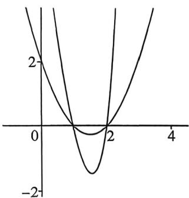
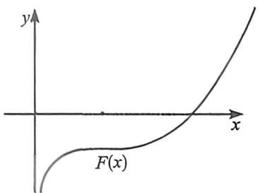
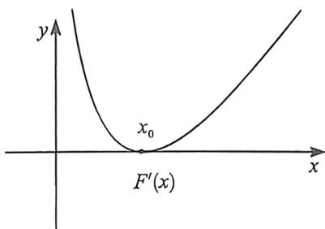
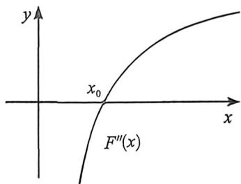
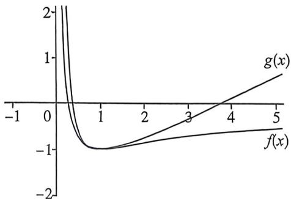
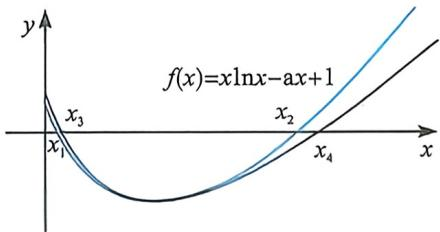

## 考点四_极值点偏移

## 一、基于常规指对与指对变形的 ALG 不等式的应用

对数均值不等式与指数均值不等式

飘带和帕德逼近这个黄金组合催生了高中阶段非常重要得不等式, 就是对数均值不等式, 我们称之为 ALG 不等式.

ALG不等式. 两个正数 $a$ 和 $b$ 的对数平均定义: $L(a, b) = \begin{cases} \frac{a - b}{\ln a - \ln b} (a \neq b) \\ a (a = b). \end{cases}$ , 对数平均与算术平均、几何平均的大小关系: $\sqrt{ab} \leqslant L(a, b) \leqslant \frac{a + b}{2}$ (此式记为对数平均不等式) 取等条件: 当且仅当 $a = b$ 时, 等号成立.

证明: 当 $a \neq b$ 时, $\sqrt{ab} < L(a, b) < \frac{a + b}{2}$ , 可设 a > b. (1) 先证: $\sqrt{ab} < L(a, b)$ ……①

不等式① $\Leftrightarrow \ln a - \ln b < \frac{a - b}{\sqrt{ab}} \Leftrightarrow \ln \frac{a}{b} < \sqrt{\frac{a}{b}} - \sqrt{\frac{b}{a}} \Leftrightarrow 2\ln x < x - \frac{1}{x}$ （其中 $x = \sqrt{\frac{a}{b}} > 1$ ）

构造函数 $f(x)=2\ln x-\left(x-\frac{1}{x}\right)$ ， $(x>1)$ ，则 $f'(x)=\frac{2}{x}-1-\frac{1}{x^{2}}=-\left(1-\frac{1}{x}\right)^{2}$

因为 $x > 1$ 时， $f'(x) < 0$ ，所以函数 $f(x)$ 在 $(1, +\infty)$ 上单调递减，故 $f(x) < f(1) = 0$ ，从而不等式①成立；

(2)再证: $L(a,b)<\frac{a+b}{2}$ ②不等式② $\Leftrightarrow\ln a-\ln b>\frac{2(a-b)}{a+b}\Leftrightarrow\ln\frac{a}{b}>\frac{2\left(\frac{a}{b}-1\right)}{\left(\frac{a}{b}+1\right)}\Leftrightarrow\ln x>\frac{2(x-1)}{(x+1)}$ （其中x= $\sqrt{\frac{a}{b}}>1$ ）

构造函数 $g(x)=\ln x-\frac{2(x-1)}{(x+1)}$ ，(x>1)，则 $g'(x)=\frac{1}{x}-\frac{4}{(x+1)^{2}}=\frac{(x-1)^{2}}{x(x+1)^{2}}$

因为 $x > 1$ 时, $g'(x) > 0$ , 所以函数 $g(x)$ 在 $(1, +\infty)$ 上单调递增, 故 $g(x) < g(1) = 0$ , 从而不等式②成立; 综合 (1)(2) 知, 对 $\forall a, b \in \mathbb{R}^{+}$ , 都有对数平均不等式 $\sqrt{ab} \leqslant L(a, b) \leqslant \frac{a + b}{2}$ 成立, 当且仅当 $a = b$ 时, 等号成立.

对数均值不等式是极值点偏移最常见处理方法,也是思维相对最容易得方法之一,本讲例题提供解答没有给到证明 ALG 不等式得过程,大家考试时候记得要先证再用.

令 $a = e^{t_1}, b = e^{t_2}$ ，则 $\sqrt{e^{t_1 + t_2}} < \frac{e^{t_2} - e^{t_1}}{t_2 - t_1} < \frac{e^{t_1} + e^{t_2}}{2}$ ，这就是我们所讲的指数均值不等式.

![[高中/总复习/二轮/2026版高中《MST新思路思维拓展》二轮复习专题/下册/板块1_不等式/考点四_极值点偏移/questions/Q00093530.md]]
![[高中/总复习/二轮/2026版高中《MST新思路思维拓展》二轮复习专题/下册/板块1_不等式/考点四_极值点偏移/questions/Q00093531.md]]
![[高中/总复习/二轮/2026版高中《MST新思路思维拓展》二轮复习专题/下册/板块1_不等式/考点四_极值点偏移/questions/Q00093532.md]]

## 例4 (2026届黑龙江大庆一模T18)已知函数 $f(x)=(x+m)\ln x$ , $g(x)=x+a\sin x+b\ln x$ .

(1) 当 m=1 时，

(1) 求曲线 $y=f(x)$ 在点 $(1, f(1))$ 处的切线方程；

(Ⅱ)当x>1时,证明: $f(x)>2(x-1)$ .

(2) 设 $0 < a < 1, b < 0$ , 若存在 $x_{1}, x_{2} \in (0, +\infty)$ , 使得 $g(x_{1}) = g(x_{2}) (x_{1} \neq x_{2})$ . 证明: $\sqrt{x_{1}} + \sqrt{x_{2}} > \frac{2\sqrt{-b}}{\sqrt{a+1}}$ .

解析 (1)(1) 当 $m = 1$ 时, $f(x) = (x + 1)\ln x$ , 则 $f'(x) = \ln x + \frac{x + 1}{x}$ , 所以 $f(1) = 0, f'(1) = 2$ ,

所以 $y=f(x)$ 在点 $(1,f(1))$ 处的切线方程为: $y=2(x-1)$ ，即 2x-y-2=0.

(Ⅱ)设 $h(x)=f(x)-2(x-1)(x>1)$ ，则 $h'(x)=\ln x+\frac{x+1}{x}-2=\ln x+\frac{1}{x}-1$ ，令 $\varphi(x)=h'(x)$ ，则 $\varphi'(x)=\frac{1}{x}-\frac{1}{x^{2}}=\frac{x-1}{x^{2}}>0$ ，所以 $h'(x)$ 在 $(1,+\infty)$ 上单调递增，又 $h'(1)=0+1-1=0$ ，所以 $h'(x)>0$ ，所以 $h(x)$ 在 $(1,+\infty)$ 上单调递增，又 $h(1)=f(1)-0=0$ ，所以 $h(x)>0$ ，即当 x>1 时， $f(x)>2(x-1)$ .

(2)不妨设 $x_{1} < x_{2}$ , 由 $g(x_{1}) = g(x_{2})$ 得: $x_{1} + a\sin x_{1} + b\ln x_{1} = x_{2} + a\sin x_{2} + b\ln x_{2}$ ,

即 $(x_{2} - x_{1}) + a(\sin x_{2} - \sin x_{1}) = b(\ln x_{1} - \ln x_{2}) = b\ln \frac{x_{1}}{x_{2}}$ ，令 $p(x) = x - \sin x(x > 0)$ ，则 $p^{\prime}(x) = 1 - \cos x\geqslant 0$ 所以 $p(x)$ 在 $(0, + \infty)$ 上单调递增，所以 $p(x_{2}) > p(x_{1})$ ，即 $x_{2} - \sin x_{2} > x_{1} - \sin x_{1}$

所以 $\sin x_{2} - \sin x_{1} < x_{2} - x_{1}$ ，所以 $(x_{2} - x_{1}) + a(\sin x_{2} - \sin x_{1}) < (a + 1)(x_{2} - x_{1})$ ；

所以 $(x_{2} - x_{1}) + a(\sin x_{2} - \sin x_{1}) < (a + 1)(x_{2} - x_{1})$ ，即 $(x_{2} - x_{1})(1 + a) > -b(\ln x_{2} - \ln x_{1})$

$\frac{(\sqrt{x_2} + \sqrt{x_1})^2}{2} > \frac{(\sqrt{x_2} + \sqrt{x_1})(\sqrt{x_2} - \sqrt{x_1})}{(\ln\sqrt{x_2} - \ln\sqrt{x_1})} > \frac{-2b}{(1 + a)}$ ，故因为 $0 < a < 1, b < 0$ ，所以 $\sqrt{x_2} + \sqrt{x_1} > \sqrt{-\frac{4b}{a + 1}} = \frac{2\sqrt{-b}}{\sqrt{a + 1}}.$

## 二、基于 ALG 不等式与韦达定理的综合运用

对于两个多零点函数相乘,如果符号始终不变,则必有两个函数共零点,这时候可以分别分析两个函数的性质,从而构造出参数之间的关系.

![[高中/总复习/二轮/2026版高中《MST新思路思维拓展》二轮复习专题/下册/板块1_不等式/考点四_极值点偏移/questions/Q00093533.md]]

## 例4 (2026届贵州新高考协作体第一次联考T18)已知函数 $f(x)=\ln x-ax,a\in\mathbb{R}$

(1) 讨论函数 $f(x)$ 的单调性。

(2) 若 $x_{1}, x_{2} (x_{1} < x_{2})$ 是方程 $f(x) = 0$ 的两根.

①证明： $x_{1} \cdot x_{2} > e^{2}$ ;

②若 $(x^{2}+bx+c)\cdot f(x)\leqslant0,b\in\mathbb{R}$ ，证明：ab<-2。

解析一（1）中 $f(x) = \ln x - ax$ ，得 $f^{\prime}(x) = \frac{1}{x} -a = \frac{1 - ax}{x} (x > 0)$ ，当 $a\leqslant 0$ 时， $f^{\prime}(x) > 0$ ，所以函数 $f(x)$ 在 $(0, + \infty)$ 上单调递增；当 $a > 0$ 时，令 $f^{\prime}(x) > 0$ ，则 $0 <   x <   \frac{1}{a}$ ，令 $f^{\prime}(x) <   0$ ，则 $x > \frac{1}{a}$

所以函数 $f(x)$ 在 $\left(0, \frac{1}{a}\right)$ 上单调递增，在 $\left(\frac{1}{a}, +\infty\right)$ 上单调递减，综上所述，当 $a \leqslant 0$ 时，函数 $f(x)$ 在 $(0, +\infty)$ 上单调递增；当 $a > 0$ 时，函数 $f(x)$ 在 $\left(0, \frac{1}{a}\right)$ 上单调递增，在 $\left(\frac{1}{a}, +\infty\right)$ 上单调递减；

(2)由(1)得,要使方程 $f(x)=0$ 的两根为 $x_{1},x_{2}(x_{1}<x_{2})$ ,则a>0,当a>0时,函数 $f(x)$ 在 $\left(0,\frac{1}{a}\right)$ 上单调递增,在 $\left(\frac{1}{a},+\infty\right)$ 上单调递减,所以 $f(x)_{\max}=f\left(\frac{1}{a}\right)=\ln\frac{1}{a}-1>0$ ,所以 $0<a<\frac{1}{e}$ .

①令 $f(x)=0$ ，则 $\ln x=ax$ ，则 $\ln x_{1}=ax_{1},\ln x_{2}=ax_{2}$ ，所以 $a=\frac{\ln x_{2}-\ln x_{1}}{x_{2}-x_{1}}=\frac{\ln x_{2}+\ln x_{1}}{x_{2}+x_{1}}>\frac{2}{x_{2}+x_{1}}$

$$
x _ {1} \cdot x _ {2} > e ^ {2}
$$

②因为 $(x^{2}+bx+c)\cdot f(x)\leqslant0$ ，所以 $x^{2}+bx+c$ 与 $f(x)$ 异号，因为 $x_{1},x_{2}(x_{1}<x_{2})$ 是方程 $f(x)=0$ 的两根，所以 $x_{1},x_{2}(x_{1}<x_{2})$ 也是方程 $x^{2}+bx+c=0$ 的两根，由韦达定理得 $x_{1}+x_{2}=-b,x_{1}x_{2}=c$ ，

由①得 $x_{1} + x_{2} > \frac{2}{a}$ 所以 $-b > \frac{2}{a}$ 所以 $b < -\frac{2}{a}$ 所以 $ab < a \cdot \left(-\frac{2}{a}\right) = -2.$

## 三、基于T19的复杂对均应用与组合型偏移问题

组合型偏移问题就是挖掘多零点的关系,常用的思路有偏移加放缩,同样也可利用单调性来进行对称构造.

![[高中/总复习/二轮/2026版高中《MST新思路思维拓展》二轮复习专题/下册/板块1_不等式/考点四_极值点偏移/questions/Q00093534.md]]

## 例46 (2026届浙江开学T19)已知函数 $f(x)=\ln x+ax^{2}+bx(a,b\in\mathbb{R})$ .

(1) 若 $a = \frac{1}{e^4}, b = -\frac{3}{e^2}$ , 求函数 $y = f(x)$ 的单调递减区间;

(2)若存在实数 $b$ , 使得函数 $f(x)$ 有三个不同的零点 $x_{1}, x_{2}, x_{3}$ .

①求 $a$ 的取值范围；

②若 $x_{1}, x_{2}, x_{3}$ 成等差数列，求证： $x_{2}^{2} > e^{3}$ .

<!-- source-part:5 pages:201-250 -->

解析 (1) 由题 $f(x) = \frac{1}{x} + \frac{2}{e^4} x - \frac{3}{e^2} = \frac{2x^2 - 3e^2x + e^4}{e^4x} = \frac{(2x - e^2)(x - e^2)}{e^4x}$ ,

令 $f^{\prime}(x) = \frac{(2x - e^{2})(x - e^{2})}{e^{4}x} < 0$ 得 $\frac{e^2}{2} < x < e^2$ ，故 $y = f(x)$ 的单调递减区间为 $\left(\frac{e^2}{2},e^2\right)$

(2)因为 $f(x)$ 有三个不同的零点， $x_{1}, x_{2}, x_{3}$ 则 $\frac{\ln x}{x} + ax + b = 0$ ，即 $-b = \frac{\ln x}{x} + ax = g(x), g'(x) = \frac{1 - \ln x}{x^2} + a$ ，故 $g'(x) = 0$ 有两个解。即 $h(x) = ax^2 - \ln x + 1 = 0$ ，有两个解， $h'(x) = 2ax - \frac{1}{x}, a \leqslant 0, h'(x) < 0, h(x)$ 单调递减，至多一个解。 $a > 0$ 时 $\left\{ \begin{array}{l} x \in \left(0, \sqrt{\frac{1}{2a}}\right), h'(x) < 0, h(x)\text{单调递减} \\ x \in \left(\sqrt{\frac{1}{2a}}, +\infty\right), h'(x) > 0, h(x)\text{单调递增} \end{array} \right.$ ，所以 $h(x)_{\min} = h\left(\sqrt{\frac{1}{2a}}\right) = \frac{1}{2} - \frac{1}{2}\ln \frac{1}{2a} + 1 < 0 \Rightarrow \ln$

$\frac{1}{2a} \geqslant 3, 0 < a < \frac{1}{2e^3}$ . 当 $0 < a < \frac{1}{2e^3}$ 时, $h\left(\sqrt{\frac{1}{2a}}\right) < 0, h(1) = a + 1 > 0$ , $\exists$ 唯一 $x_1 \in \left(1, \sqrt{\frac{1}{2a}}\right)$ 使 $h(x_1) = 0$ , 当 $x > \sqrt{\frac{1}{2a}}$ 时, $h(x) = ax^2 - \ln x + 1 > x\left(ax - \frac{\ln x}{x}\right) > x(ax - 1) = 0$ , 取 $x = \frac{1}{a}$ , 存在唯一 $x_2 \in \left(\sqrt{\frac{1}{2a}}, \frac{1}{a}\right)$ , 使 $h(x_2) = 0$ . 即 $x \in (0, x_1), h'(x) > 0, h(x)$ 单调递增; $x \in (x_1, x_2), h'(x) < 0, h(x)$ 单调递增减; $x \in (x_2, +\infty), h'(x) > 0, h(x)$ 单调递增; 此时存在 $b$ 使得 $f(x)$ 有三个零点 $a \in \left(0, \frac{1}{2e^3}\right)$ .

(3)此时， $\begin{cases} \ln x_1 + ax_1^2 +bx_1 = 0\\ \ln x_2 + ax_2^2 +bx_2 = 0(\text{构建} x_1,x_2,x_3\text{之间的关系})\\ \ln x_3 + ax_3^2 +bx_3 = 0 \end{cases}$

则 $\left\{ \begin{array}{l} \ln x_{1} + ax_{1}^{2} + \ln x_{3} + ax_{3}^{2} = -b(x_{1} + x_{3}) = -2bx_{2} \\ 2\ln x_{2} + 2ax_{2}^{2} = -2bx_{2} \end{array} \right.$ ，所以 $\ln x_{1}x_{3} + a(x_{1}^{2} + x_{3}^{2}) = 2\ln x_{2} + 2ax_{2}^{2}$ ，所以 $(x_{1} + x_{3})^{2} - 2x_{1}x_{2} = x_{1}^{2} + x_{3}^{2} = 4x_{2}^{2} - 2x_{1}x_{3}$ ，所以 $\ln x_{1}x_{3} + 4ax_{2}^{2} - 2x_{1}x_{3} \cdot a = \ln x_{2}^{2} + 2ax_{2}^{2}, \ln x_{1}x_{3} - \ln x_{2}^{2} = -2ax_{2}^{2} + 2ax_{1}x_{3}$ ，所以 $\frac{x_3x_1 + x_2^2}{\ln x_3x_1 + \ln x_2^2} = \frac{1}{2a} = \frac{x_3x_1 - x_2^2}{\ln x_3x_1 - \ln x_2^2} < \frac{x_1x_3 + x_2^2}{2}$ ，即 $x_{1}x_{3} + x_{2}^{2} > \frac{1}{a} > 2e^{3}$ 。（最后一步由基本不等式 $x_{1}x_{3} < \frac{(x_{1} + x_{3})^{2}}{4} = x_{2}^{2}$ ，所以 $2x_{2}^{2} > 2e^{3}, x_{2}^{2} > e^{3}$ 得证）

## 例4 (2025 天津卷压轴题)已知函数 $f(x) = ax - (\ln x)^{2}$ .

(2) $f(x)$ 有3个零点 $x_{1},x_{2},x_{3}$ ，且 $(x_{1}<x_{2}<x_{3})$ .

(ⅰ)求 a 的取值范围；

(Ⅱ)证明： $(\ln x_{2}-\ln x_{1})\cdot\ln x_{3}<\frac{4e}{e-1}.$

解析 (1) 令 $\ln x = t, g(t) = ae' - t^2$ ，参变分离求得 $a \in \left(0, \frac{4}{e^2}\right)$ ;

(Ⅱ)本题即证 $(t_{2}-t_{1})t_{3}<\frac{4e}{e-1},t_{1}<0<t_{2}<t_{3}$ ;由题意: $g(t)=ae^{t}-t^{2}=0$ ,即 $\ln a+t_{2}-2\ln t_{2}=\ln a+t_{3}-2\ln t_{3}$ ，利用
ALG 不等式(考试需自证): $\frac{t_{3}-t_{2}}{\ln t_{3}-\ln t_{2}}=2>\sqrt{t_{3}t_{2}}\Rightarrow t_{3}t_{2}<4$

$\left\{ \begin{array}{l} \sqrt{a} e^{+} + t_{1} = 0 \\ \sqrt{a} e^{+} - t_{3} = 0 \end{array} \right. \Rightarrow -t_{1}t_{3} = ae^{+} < ae^{+} = \frac{t_{3}^{2}}{e^{+}} = 16\frac{\left(\frac{t_{3}}{4}\right)^{2}}{(e^{4})^{2}} \leqslant \frac{16}{e^{2}}$ ，所以 $(t_{2} - t_{1})t_{3} < 4 + \frac{16}{e^{2}} < \frac{4e}{e - 1}$

>注题 对于多零点偏移问题,常用的思路是放缩取点,拟合,以及找到各变量之间的关系,其中找点的精度比较难控制,可能也涉及到中间零点为定值的问题,故此类题一般是部分偏移或拟合,部分放缩的思路。

![[高中/总复习/二轮/2026版高中《MST新思路思维拓展》二轮复习专题/下册/板块1_不等式/考点四_极值点偏移/questions/Q00093535.md]]
![[高中/总复习/二轮/2026版高中《MST新思路思维拓展》二轮复习专题/下册/板块1_不等式/考点四_极值点偏移/questions/Q00093536.md]]

## 例50 (2026届湖北学感高级中学九月月考T19)已知函数 $f(x)=x(e^{x}-a),a\in\mathbb{R}$ .

(1) 当 a=1 时, 求 $f(x)$ 的极值;

(2)若函数 $g(x)=f(x)-a\ln x$ 有2个不同的零点 $x_{1},x_{2}$ .

(i) 求 a 的取值范围；

(Ⅱ)证明: $e^{x_1 + x_2 - 1} > \frac{e}{x_1 x_2}$ .

解析 (1) $a = 1$ 时, $f(x) = x(e^x - 1)$ , 因为 $f'(x) = (x + 1)e^x - 1$ , 令 $m(x) = f'(x)$ , 所以 $m'(x) = (x + 2)e^x$ , 所以 $x \in (-\infty, -2), m'(x) < 0; x \in (-2, +\infty), m'(x) > 0$ , 所以 $f'(x)$ 在 $(- \infty, -2)$ 单调递减, 在 $(-2, +\infty)$ 单调递增, 因为 $x \to -\infty$ 时, $x + 1 < 0, e^x > 0$ , 则 $f'(x) < 0$ , 其中 $f'(-2) = \frac{-1}{e^2} - 1 < 0, f'(0) = 0, x \to +\infty$ 时, $f'(x) \to +\infty$ , 所以 $x \in (-\infty, 0)$ 时, $f'(x) < 0; x \in (0, +\infty), f'(x) > 0$ , 所以 $f(x)$ 在 $(- \infty, 0)$ 单调递减, 在 $(0, +\infty)$ 单调递增, 所以 $f(x)$ 的极小值为 $f(0) = 0$ , 无极大值.

(2) $(|g(x)=f(x)-a\ln x=xe^{x}-a(x+\ln x)=xe^{x}-a\ln(xe^{x}),x\in(0,+\infty)$ ，令 $t=xe^{x},t\in(0,+\infty)$ ，因为 $t^{\prime}=(x+1)e^{z}>0$ ，所以 $t=xe^{z}$ 在 $(0,+\infty)$ 单调递增，令 $h(t)=t-a\ln t$ ，即 $h(t)$ 在 $t\in(0,+\infty)$ 有2个零点 $t_{1},t_{2}$ ，且 $t_{1}=x_{1}e^{x_{1}},t_{2}=x_{2}e^{x_{1}}$ ，因为 $h^{\prime}(t)=1-\frac{a}{t}=\frac{t-a}{t}$ ，所以 $a\leqslant0$ 时， $h^{\prime}(t)>0,h(t)$ 在 $t\in(0,+\infty)$ 单调递增，不存在2个零点，所以a>0，因为 $t\in(0,a)$ 时， $h^{\prime}(t)<0;t\in(a,+\infty)$ 时， $h^{\prime}(t)>0$ ，所以 $h(t)$ 在 $(0,a)$ 单调递减，在 $(a,+\infty)$ 单调递增，因为 $t\to0$ 时， $h(t)\to+\infty;t\to+\infty$ 时， $h(t)\to+\infty$ ，所以 $h(t)_{\min}=h(a)=a(1-\ln a)<0$ ，所以 $a\in(e,+\infty)$ .

(Ⅱ) $e^{x_{1}+x_{2}-1}>\frac{e}{x_{1}x_{2}}\Rightarrow x_{1}e^{x_{1}}\cdot x_{2}e^{x_{2}}>e^{2},$

设 $t_1 < t_2$ ，因为 $h(1) = 1 > 0, h(e) = e - a < 0$ ，所以由（|）知， $1 < t_1 < e < a < t_2$ ，即证 $t_1 t_2 > e^2$ ，即证 $\ln t_1 + \ln t_2 > 2$

令 $\frac{t_2}{t_1} = m$ ，则 $m > 1, t_2 = mt_1, \ln t_2 = \ln m + \ln t_1,$

又 $t_1 - a\ln t_1 = t_2 - a\ln t_2 = 0$ ，即 $a = \frac{t_1}{\ln t_1} = \frac{t_2}{\ln t_2} = \frac{t_1 - t_2}{\ln t_1 - \ln t_2} = \frac{t_1 + t_2}{\ln t_1 + \ln t_2} < \frac{t_1 + t_2}{2}, t_1 t_2 > e^2$ 成立，得证！

![[高中/总复习/二轮/2026版高中《MST新思路思维拓展》二轮复习专题/下册/板块1_不等式/考点四_极值点偏移/questions/Q00093537.md]]

## 四、基于极值点偏移下的单调性调整与拟合思想

单调性调整

1. 和型 $x_{1} + x_{2} > 2x_{0}$ 构造 $F(x) = x^{2} - 2x_{0}x + \lambda f(x)$

极值点偏移构造 $x_{2}^{2} - 2x_{0}x_{2} > x_{1}^{2} - 2x_{0}x_{1}$ 单调调整函数 $F(x) = x^{2} - 2x_{0}x + \lambda f(x)$

若要证明 $x_{2}^{2} - 2x_{0}x_{2} > x_{1}^{2} - 2x_{0}x_{1}$ ，则需要在 $f(x) = 0$ 为前提的条件下，构造含有 $x^{2} = 2x_{0}x$ 的单调增函数不妨令 $F(x) = x^{2} - 2x_{0}x + \lambda f(x)$ ，通过 $\left\{ \begin{array}{l} F'(x_0) = 0 \\ \dots \dots \\ F''(x_0) = 0 \end{array} \right.$ 来锁定系数 $\lambda$ ，从而证明 $F^{\prime}(x)\geqslant 0$ 恒成立，也可以构

造 $F(x) = x^{2} - 2x_{0}x + \lambda e^{f(x)}$ 或者 $F(x) = x^{2} - 2x_{0}x + \lambda \ln [f(x) + 1]$ 等一系列待证调整式.

2. 积型 $x_{1} x_{2} < m$ 构造 $F(x) = x + \frac{m}{x} + \lambda f(x)$ 单调减函数

$x_{1}x_{2}<m\Leftrightarrow x_{1}+\frac{m}{x_{1}}>x_{2}+\frac{m}{x_{2}}$ ，这也是前面我们介绍对勾拟合的时候介绍到的，我们需要构造处于同一极值点的函数 $f(x)$ ，即此函数满足条件 $f'(\sqrt{m})=0$ ，此时我们构造 $F(x)=x+\frac{m}{x}+\lambda f(x)$ ，利用导函数极点效应构造单调递减函数 $F(x)=x+\frac{m}{x}+\lambda f(x)$ ，锁定 $\lambda$ .

拟合思想

极值点偏移拟合构造主要是需要结合图像,啥时候放小,啥时候放大,都有要求.

对此我们仅以极小值和型为例.

如图: 原函数 $f(x)$ , $f(x)=a$ 有两个解, 证明 $x_{1}x_{2}>x_{0}^{2}$ , 这时候可以构造 $x_{1}x_{2}>x_{1}^{\prime}x_{2}^{\prime}=x_{0}^{2}$ , 即可构造 $x_{1}>x_{1}^{\prime}, x_{2}>x_{2}^{\prime}$ , 故需构造 $f(x)$ 的左小右大函数 $g(x)$ (左边放小, 右边放大).

拟合部分对于同学们要求较高,主要考察不等式的积累,不论是零点和还是零点差,只要控制精度,拟合都是最无敌的解法,可以解决大部分的偏移和零点差问题.

常见不等式我们在零轮, 一轮, 导专都有讲解, 故在此不在赘述.

![[高中/总复习/二轮/2026版高中《MST新思路思维拓展》二轮复习专题/下册/板块1_不等式/考点四_极值点偏移/questions/Q00093538.md]]
![[高中/总复习/二轮/2026版高中《MST新思路思维拓展》二轮复习专题/下册/板块1_不等式/考点四_极值点偏移/questions/Q00093539.md]]
![[高中/总复习/二轮/2026版高中《MST新思路思维拓展》二轮复习专题/下册/板块1_不等式/考点四_极值点偏移/questions/Q00093540.md]]

## 例5 (2026届云寅师大附中月考(三)T18)已知函数 $f(x)=(a+1)x-(x+1)\ln x$ .

(1) 当 a=0 时, 求曲线 $y=f(x)$ 在点 $(1, f(1))$ 处的切线方程;

(2)若函数 $f(x)$ 有两个极值点 $x_{1},x_{2}$ ，且 $x_{1}<x_{2}$ ，求证： $2<x_{1}+x_{2}<3e^{a-1}-1$ .

解析 (1) 当 $a = 0$ 时, 函数 $f(x) = x - (x + 1)\ln x$ , 求导得 $f'(x) = 1 - \ln x - \frac{x + 1}{x} = -\ln x - \frac{1}{x}$ , 而 $f'(1) = -1$ , 而 $f(1) = 1$ , 因此 $y - 1 = -1 \cdot (x - 1)$ , 即 $x + y - 2 = 0$ ;

(2) 函数 $f(x) = (a + 1)x - (x + 1)\ln x$ 的定义域为 $(0, +\infty)$ , 求导得 $f'(x) = a + 1 - \ln x - \frac{x + 1}{x} = \frac{ax - x\ln x - 1}{x}$ , 令函

数 $g(x)=ax-x\ln x-1$ ，求导得 $g'(x)=a-1-\ln x$ ，由 $g'(x)=0$ ，得 $x=e^{a-1}$ ，令 $t=e^{a-1}$ ，当0<x<t时， $g'(x)>0$ ；当x>t时， $g'(x)<0$ ，函数 $g(x)$ 在 $(0,t)$ 上单调递增，在 $(t,+\infty)$ 上单调递减， $g(x)_{\max}=g(t)=e^{a-1}-1$

当 $x$ 从大于0的方向趋近于0时， $g(x)$ 趋近于-1，而 $g(e^a) = a \cdot e^a - e^a \ln e^a - 1 = -1$ ，当且仅当 $e^{a-1} - 1 > 0$ ，即 $a > 1$ 时， $g(x)$ 有两个零点 $x_1, x_2 (x_1 < x_2)$ ，当 $0 < x < x_1$ 或 $x > x_2$ 时， $g(x) < 0, f'(x) < 0$ ；当 $x_1 < x < x_2$ 时， $g(x) > 0, f'(x) > 0$ ，因此 $x_1, x_2$ 是函数 $f(x)$ 的两个极值点， $a = \frac{1}{x_1} + \ln x_1 = \frac{1}{x_2} + \ln x_2$ ，则 $x_1 x_2 = \frac{x_2 - x_1}{\ln x_2 - \ln x_1}$ ，

不等式 $\frac{x_2 - x_1}{\ln x_2 - \ln x_1} >\sqrt{x_1x_2}\Leftrightarrow \frac{x_2 - x_1}{\sqrt{x_1x_2}} >\ln x_2 - \ln x_1\Leftrightarrow \sqrt{\frac{x_2}{x_1}} -\sqrt{\frac{x_1}{x_2}} -\ln \frac{x_2}{x_1} >0$ ，令 $\sqrt{\frac{x_2}{x_1}} = s > 1$ ，函数 $u(s) = s - \frac{1}{s} -$ $2\ln s,s > 1$ ，求导得 $u^{\prime}(s) = 1 + \frac{1}{s^{2}} -\frac{2}{s} = \left(1 - \frac{1}{s}\right)^{2} > 0$ ，函数 $u(s)$ 在 $(1 + \infty)$ 上单调递增， $u(s) > u(1) = 0$ ，则 $\sqrt{\frac{x_2}{x_1}} -$ $\sqrt{\frac{x_1}{x_2}} -\ln \frac{x_2}{x_1} >0$ ，于是 $x_{1}x_{2} = \frac{x_{2} - x_{1}}{\ln x_{2} - \ln x_{1}} >\sqrt{x_{1}x_{2}}$ ，则 $x_{1}x_{2} > 1$ ，因此 $x_{1} + x_{2} > 2\sqrt{x_{1}x_{2}} > 2;$

$$
R _ {2, 0} (x) = \frac {- x ^ {2} + 4 x - 3}{2}
$$

$$
x _ {3} > x _ {1}, x _ {4} > x _ {2}
$$

$$
R _ {2, 0} (x) = \frac {- x ^ {2} + 4 x - 3}{2}
$$

$$
x _ {3} + x _ {4} = 3 e ^ {a - 1}
$$

$$
R _ {1, 1} (x) = \frac {2 (x - 1)}{x + 1}
$$

$$
x \ln x = \frac {- x ^ {3} + 4 x ^ {2} - 3 x}{2}
$$

$$
R _ {1, 1} (x) = \frac {2 (x - 1)}{x + 1}
$$

又因为 $\ln x$ 的帕德逼近是在 $x = 1$ 处，故将 $\left\{ \begin{array}{l} \ln x > \frac{2(x - 1)}{x + 1} (x > 1) \\ \ln x < \frac{2(x - 1)}{x + 1} (0 < x < 1) \end{array} \right.$ 替换为 $\left\{ \begin{array}{l} \ln \frac{x}{e^{a - 1}} > \frac{2\left(\frac{x}{e^{a - 1}} - 1\right)}{\frac{x}{e^{a - 1}} + 1} (x > e^{a - 1}) \\ \ln \frac{x}{e^{a - 1}} < \frac{2\left(\frac{x}{e^{a - 1}} - 1\right)}{\frac{x}{e^{a - 1}} + 1} (0 < x < e^{a - 1}) \end{array} \right.$ 所以我们将

$f(x) = 0$ 拟合成 $\left\{ \begin{array}{l} f(x) <   \frac{2x(x - e^{a - 1})}{x + e^{a - 1}} -x + 1 = 0(x <   e^{a - 1})\\ ,x^2 -(3e^{a - 1} - 1)x + e^{a - 1} = 0,x_3 + x_4 = 3e^{a - 1} - 1,\\ f(x) >   \frac{2x(x - e^{a - 1})}{x + e^{a - 1}} -x + 1 = 0(x > e^{a - 1}) \end{array} \right.$

(如图), 所以 $x_{1} + x_{2} < x_{3} + x_{4} = 3e^{a-1} - 1$ . 所以 $2 < x_{2} + x_{1} < 3e^{a-1} - 1$ .

![[高中/总复习/二轮/2026版高中《MST新思路思维拓展》二轮复习专题/下册/板块1_不等式/考点四_极值点偏移/questions/Q00093541.md]]

## 例57 (2025·清远期中T19)已知函数 $f(x)=\ln x-x^{2}+x$ .

(1)求函数的单调区间；

(2)是否存在 x 使得 $f(f(x)+1)\geqslant0$ 成立？若存在，求 x 的取值范围，若不存在，请说明理由；

(3)若方程 $f(x)=(m-1)x^{2}+x(m\in\mathbb{R})$ 有两个不同的实数解 $x_{1},x_{2}(x_{1}<x_{2})$ ，证明： $(x_{1}^{2}+x_{2}^{2})(1+\frac{1}{x_{2}}-\frac{1}{x_{1}})>e+1.$

解析 $(x)=\frac{1}{x}-2x+1=-\frac{(2x+1)(x-1)}{x}, x>0$ ，当 $x\in(0,1)$ 时， $f'(x)>0$ ，当 $x\in(1,+\infty)$ 时， $f'(x)<0$ ，所以 $f(x)$ 的单调递增区间为 $(0,1)$ ，单调递减区间为 $(1,+\infty)$ 。

(2)由(1)知, $f(x)$ 的最大值为 $f(1)=0$ ,要使 $f(f(x)+1)\geqslant0$ 成立,则只可能是 $f(f(x)+1)=0$ 成立,由(1)知,此时需要 $f(x)+1=1$ ,所以 $f(x)=0$ ,所以x=1,即x的取值范围是(1).前两问已经属于送分,第三问就是 $\ln x=mx^{2}(m\in\mathbb{R})$ 两个解满足 $(x_{1}^{2}+x_{2}^{2})(1+\frac{1}{x_{2}}-\frac{1}{x_{1}})>e+1$ ,本题结论部分没有参数m,并且由和式 $(x_{1}^{2}+x_{2}^{2})$ 与差式 $\left(1+\frac{1}{x_{1}}-\frac{1}{x_{1}}\right)$ 两部分构成,显然需要分开处理,和式部分乐意考虑ALG不等式,即 $\ln x_{2}-\ln x_{1}=m(x_{2}^{2}-x_{1}^{2})\Leftrightarrow\frac{(x_{2}^{2}-x_{1}^{2})}{\ln x_{2}^{2}-\ln x_{1}^{2}}=\frac{1}{2m}<\frac{x_{1}^{2}+x_{2}^{2}}{2}\Rightarrow x_{1}^{2}+x_{2}^{2}>\frac{1}{m};$

根据题意, 只需证明 $1 + \frac{1}{x_2} - \frac{1}{x_1} > (e + 1)m$ , 一看是大于的形式, 就容易想到割线夹, 实则不然, 因为 $\frac{1}{x_2} - \frac{1}{x_1} < 0$ , 故本题应该转化为 $\frac{1}{x_1} - \frac{1}{x_2} < 1 - (e + 1)m$ , 这就转化为一个关于参数 $m(y$ 的值)的一次线性函数, 这就很明显的切线夹特征 (两个交点被两条切线卡在中间), 不妨换元, 令 $t_1 = \frac{1}{x_2}, t_2 = \frac{1}{x_1}$ , 构造 $t^2 \ln t = -m \left(0 < m < \frac{1}{2e}\right)$ 两根满足 $t_1 - t_2 < 1 - (e + 1)m$ ;

$f(t)=t^{2}\ln t, f'(t)=2t\ln t+t, f''(t)=2\ln t+3$ ，显然，当 $t=e^{-t}$ 时 $f''(t)=0$ ，本题出现了拐点，显然在 $t<e^{-t}, f''(t)<0$ ，切点位于此区间的切线位于函数 $f(t)=t^{2}\ln t$ 上方，当 $t>e^{-t}, f''(t)>0$ ，切点位于此区间的切线位于函数 $f(t)=t^{2}\ln t$ 下方，所以本题就需要根据右边零点t=1处的切线y=t-1，即构造 $t^{2}\ln t\geqslant t-1$ ，当 $t_{3}-1=-m\Rightarrow t_{3}=1-m$ ，根据 $t_{1}-t_{2}<t_{3}-t_{4}=1-(e+1)m$ ，则 $t_{4}=em$ ，所以另外一条切线夹为 $-m=y=-\frac{t}{e}$ ，即需证明 $t^{2}\ln t\geqslant-\frac{t}{e}\Leftrightarrow t\ln t\geqslant-\frac{1}{e}$ ，显然成立；接下来就是千篇一律的书学过程：

(3)由 $f(x)=(m-1)x^{2}+x$ ，得 $\ln x=mx^{2}(m\in\mathbb{R})$ ，若 $f(x)=(m-1)x^{2}+x$ 有两个不同的实数解 $x_{1},x_{2}(x_{1}<x_{2})$ ，则 $\ln x_{1}=mx_{1}^{2},\ln x_{2}=mx_{2}^{2}$ ，两式相减得 $\ln x_{2}-\ln x_{1}=m(x_{2}^{2}-x_{1}^{2})$ ，所以 $\frac{2(x_{2}^{2}-x_{1}^{2})}{\ln x_{2}^{2}-\ln x_{1}^{2}}=\frac{1}{m}$

不妨设 $g(x)=\ln x-\frac{2(x-1)}{x+1},x\in(1,+\infty)$ ，则 $g'(x)=\frac{1}{x}-\frac{4}{(x+1)^{2}}=\frac{(x-1)^{2}}{x(x+1)^{2}}>0$

所以 $g(x)$ 在 $(1, +\infty)$ 上单调递增，此时 $g(x) > g(1) = 0$ ，所以 $\ln x > \frac{2(x - 1)}{x + 1}$

所以 $\ln \frac{x_2^2}{x_1^2} >\frac{2\left(\frac{x_2^2}{x_1^2}-1\right)}{\frac{x_2^2}{x_1^2}+1}$ , 即 $x_2^2 + x_1^2 > \frac{2(x_2^2 - x_1^2)}{\ln x_2^2 - \ln x_1^2}$ , 所以 $x_2^2 + x_1^2 > \frac{1}{m}$ ①,

由 $f(x) = (m - 1)x^{2} + x$ ，得 $\frac{\ln x}{x^2} = m(m\in \mathbf{R})$ 有两个不同的实数解 $x_{1},x_{2}(x_{1} <   x_{2})$ ，令 $\varphi (x) = \frac{\ln x}{x^2},\varphi '(x) = \frac{1 - 2\ln x}{x^3}$ ，当0 $< x < e^{\dagger}$ 时， $\varphi '(x) > 0,\varphi (x)$ 单调递增，当 $x > e^{\dagger}$ 时， $\varphi '(x) <   0,\varphi (x)$ 单调递减且恒大于0，

由 $\varphi(e^{\dagger}) = \frac{1}{2e},\varphi(1) = 0$ ，所以 $1 < x_{1} < e^{\dagger} < x_{2},0 < m < \frac{1}{2e}$ .令 $t = \frac{1}{x}$ ，则方程 $t^2\ln t = -m$ 有两个不同的实数解 $t_1 = \frac{1}{x_2}$

$t_{2} = \frac{1}{x_1}$ ，由(2)如 $f(x) = \ln x - x^2 + x \leqslant 0$ ，则有 $t^2 \ln t \geqslant t - 1$ .

设 $h(t) = t\ln t, t \in (0, +\infty)$ ，则 $h'(t) = \ln t + 1$ ，当 $0 < t < \frac{1}{e}$ 时， $h'(t) < 0, h(t)$ 单调递减，当 $t > \frac{1}{e}$ 时， $h'(t) > 0, h(t)$ 单调递减。此时 $h(t) \geqslant h\left(\frac{1}{e}\right) = -\frac{1}{e}$ ，即 $t\ln t \geqslant -\frac{1}{e}$ ，故 $t^2\ln t \geqslant -\frac{1}{e}t$ ，当且仅当 $t = \frac{1}{e}$ 时等号成立。

不妨设直线 $y = -m$ 与直线 $y = -\frac{1}{e} t, y = t - 1$ 交点的横坐标分别为 $t_1', t_2'$ ,

$-t_{1}<t_{2}^{\prime}-t_{1}^{\prime}=1-m-em=1-(e+1)m,$ 所以 $1+\frac{1}{x_{2}}-\frac{1}{x_{1}}>(e+1)m②.$

综上， $(x_{1}^{2} + x_{2}^{2})\left(1 + \frac{1}{x_{2}} -\frac{1}{x_{1}}\right) > \frac{1}{m}\cdot (e + 1)m = e + 1.$

## 下篇

## 导数与数列综合

## 一、和式代换思想与积式代换

利用数列的和式代换，将 $S_{n} < f(n) \Leftrightarrow \left\{ \begin{array}{l} S_{1} < f(1) \\ S_{n} - S_{n-1} < f(n) - f(n-1) \end{array} \right.$ 形式.

![[高中/总复习/二轮/2026版高中《MST新思路思维拓展》二轮复习专题/下册/板块1_不等式/考点四_极值点偏移/questions/Q00093542.md]]
![[高中/总复习/二轮/2026版高中《MST新思路思维拓展》二轮复习专题/下册/板块1_不等式/考点四_极值点偏移/questions/Q00093543.md]]
![[高中/总复习/二轮/2026版高中《MST新思路思维拓展》二轮复习专题/下册/板块1_不等式/考点四_极值点偏移/questions/Q00093544.md]]
![[高中/总复习/二轮/2026版高中《MST新思路思维拓展》二轮复习专题/下册/板块1_不等式/考点四_极值点偏移/questions/Q00093545.md]]

## 二、数列放缩构造裂项

关于 $\frac{1}{n^2}$ 的放缩裂项可以从以下几种形式入手

$$
\frac {1}{n ^ {2}} <   \frac {1}{n (n - 1)}, \frac {1}{n ^ {2}} > \frac {1}{n (n + 1)}, \frac {1}{n ^ {2}} <   \frac {1}{n ^ {2} - 1}, \frac {1}{n ^ {2}} <   \frac {1}{n ^ {2} - \frac {1}{4}};
$$

前两个精度较低,越往后精度越高,因为分母与原来相比变化幅度小,此类题除了放缩精度之外还需了解常见不等式,进一步从不等号方向选择对应母函数进行放缩。

![[高中/总复习/二轮/2026版高中《MST新思路思维拓展》二轮复习专题/下册/板块1_不等式/考点四_极值点偏移/questions/Q00093546.md]]
![[高中/总复习/二轮/2026版高中《MST新思路思维拓展》二轮复习专题/下册/板块1_不等式/考点四_极值点偏移/questions/Q00093547.md]]

## 例 S (2026 届湖北月考 T19) 已知函数 $f(x) = e^{x \cdot \cos x}$ ( $e$ 为自然对数的底数).

(1)求函数 $f(x)$ 在点 $(0, f(0))$ 处的切线方程；

(2) 若对记 $g(x) = -x^3 - 3x \cdot \cos x + (a + 3)x$ , 若 $\forall x \in [0,1]$ , 有 $f(x) \leqslant e^{it(x)}$ , 求 $a$ 的取值范围;

(3) 设 $n \in N^{*}$ ，且 $n \geqslant 2$ ，证明： $\cos1 + \cos\frac{2}{3} + \cos\frac{1}{2} + \cos\frac{2}{5} + \cdots + \cos\frac{2}{n} < n - \frac{3}{2} + \frac{1}{n+1}$ .

解析 (1) 由题意可得, $f'(x)=e^{x\cdot\cos x}(\cos x-x\sin x)$ , 则 $f'(0)=1$ ,

又 $f(0) = 1$ ，所以 $f(x)$ 在点 $(0, f(0))$ 处的切线方程为 $y - 1 = x$ ，即 $y = x + 1$

(2) 若对 $\forall x \in [0,1]$ , 有 $f(x) \leqslant e^{g(x)} \Leftrightarrow e^{x \cdot \cos x} \leqslant e^{-x^3 - 3x \cos x + (a + 3)x}$ ,

则 $x \cdot \cos x \leqslant -x^8 - 3x\cos x + (a + 3)x$ 对 $\forall x \in [0,1]$ 时恒成立，当 $x = 0$ 时，不等式恒成立；

当 $0 < x \leqslant 1$ 时，不等式可化为 $\cos x \leqslant -x^2 - 3\cos x + (a + 3)$ ，即 $4\cos x + x^2 - (a + 3) \leqslant 0$ 恒成立，

设 $M(x) = 4\cos x + x^2 - (a + 3), x \in (0,1]$ , 则 $M'(x) = -4\sin x + 2x$ , 设 $t(x) = -4\sin x + 2x, x \in (0,1]$ , 则 $t'(x) = 2 - 4\cos x$ , 由 $0 < x \leqslant 1 < \frac{\pi}{3}$ , 可得 $\frac{1}{2} < \cos x < 1$ , 所以 $t'(x) < 0$ , 所以 $M'(x)$ 在 $(0,1]$ 上单调递减, 所以 $M'(x) < M'(0) = 0$ , 所以 $M(x)$ 在 $(0,1]$ 上单调递减, 即 $M(x) < M(0) = 4 - (a + 3) \leqslant 0$ ,

所以 $a \geqslant 1$ ，则 a 的取值范围为 $[1, +\infty)$ .

(3)证明：由(2)知，当 $x \in (0,1]$ 且 $a = 1$ 时， $x^2 + 4\cos x - 4 \leqslant 0$ ，即 $\cos x \leqslant 1 - \frac{x^2}{4}$ ，

令 $x = \frac{2}{n} (n \geqslant 2)$ , 得 $\cos \frac{2}{n} \leqslant 1 - \frac{1}{n^2}$ , 因为 $\frac{1}{n^2} > \frac{1}{n(n+1)} = \frac{1}{n} - \frac{1}{n+1}$ , 所以 $\cos \frac{2}{n} \leqslant 1 - \frac{1}{n^2} < 1 - \frac{1}{n} + \frac{1}{n+1}$ .

当 n=2 时， $\cos1<1-\frac{1}{2}+\frac{1}{3}$ ，当 n=3 时， $\cos\frac{2}{3}<1-\frac{1}{3}+\frac{1}{4}$ ，……， $\cos\frac{2}{n-1}<1-\frac{1}{n-1}+\frac{1}{n}$ ， $\cos\frac{2}{n}<1-\frac{1}{n}+\frac{1}{n+1}$

相加得 $\cos1+\cos\frac{2}{3}+\cos\frac{1}{2}+\cos\frac{2}{5}+\cdots+\cos\frac{2}{n}<(n-1)-\frac{1}{2}+\frac{1}{n+1}=n-\frac{3}{2}+\frac{1}{n+1}$ ，证毕.

## 例 9 (26 届高三·江苏无锡 T19) 已知函数 $f(x) = e^{x} - kx^{2}, x \in \mathbb{R}$ .

(1) 若 $f(x)$ 在区间 $(0, +\infty)$ 上单调递增，试求 k 的取值范围；

(2) 若 $k = \frac{1}{2}$ , 求证: 当 $x \in (0, +\infty)$ 时, $f(x) > 1$ ;

(3) $\left(\frac{2}{1^{4}}+1\right)\left(\frac{2}{2^{4}}+1\right)\left(\frac{2}{3^{4}}+1\right)\cdots\left(\frac{2}{n^{4}}+1\right)<m(m,n\in\mathbb{N}^{*})$ ，求m的最小值.

解析 (1) 因为 $f(x) = e^x - kx^2$ ，所以 $f'(x) = e^x - 2kx$ ，依题意 $f'(x) = e^x - 2kx \geqslant 0$ 在区间 $(0, +\infty)$ 上恒成立，即 $2k \leqslant \frac{e^x}{x}$ 在区间 $(0, +\infty)$ 上恒成立，设 $g(x) = \frac{e^x}{x}, x \in (0, +\infty)$ ，则 $g'(x) = \frac{e^x(x-1)}{x^2}$ ，

故当 $x \in (0,1)$ 时 $g'(x) < 0$ ，即 $g(x)$ 在 $(0,1)$ 上单调递减；当 $x \in (1, +\infty)$ 时 $g'(x) > 0$ ，即 $g(x)$ 在 $(1, +\infty)$ 单调递增；所以 $g(x) \geqslant g(1) = e$ ，故 $2k \leqslant e$ ，解得 $k \leqslant \frac{e}{2}$ ，即 $k$ 的取值范围为 $\left(-\infty, \frac{e}{2}\right]$ .

(2) 当 $k = \frac{1}{2}$ 时 $f(x) = e^{x} - \frac{1}{2} x^{2}$ , 则 $f'(x) = e^{x} - x$ . 令 $h(x) = f'(x) = e^{x} - x, x \in (0, +\infty)$ , 则 $h'(x) = e^{x} - 1 > 0$ , 所以 $h(x)$ (即 $f'(x)$ ) 在 $(0, +\infty)$ 上单调递增, 所以 $f'(x) > f'(0) = 1 > 0$

所以 $f(x) = e^{x} - \frac{1}{2} x^{2}$ 在 $(0, +\infty)$ 上单调递增，故 $f(x) > f(0) = 1$

(3) $\left(\frac{2}{1^{4}}+1\right)\left(\frac{2}{2^{4}}+1\right)\left(\frac{2}{3^{4}}+1\right)\cdots\left(\frac{2}{n^{4}}+1\right)>\left(\frac{2}{1^{4}}+1\right)\left(\frac{2}{2^{4}}+1\right)\left(\frac{2}{3^{4}}+1\right)>3$ ，故猜想上界小于4，

$$
\ln \left(\frac {2}{1 ^ {4}} + 1\right) + \ln \left(\frac {2}{2 ^ {4}} + 1\right) + \ln \left(\frac {2}{3 ^ {4}} + 1\right) + \dots + \ln \left(\frac {2}{n ^ {4}} + 1\right) <   \frac {2}{1 ^ {4}} + \frac {2}{2 ^ {4}} + \frac {2}{3 ^ {4}} + \dots + \frac {2}{n ^ {4}} <   \frac {2}{1 ^ {4}} + \frac {2}{1 ^ {3}} - \frac {2}{2 ^ {3}} + \frac {2}{2 ^ {3}} - \frac {2}{3 ^ {3}} + \dots +
$$

$\frac{2}{(n - 1)^3} - \frac{2}{n^3} < 4$ ，求 $m$ 的最小值为 4.

严格控制放缩的精度和方向,解决这类题就不会显得吃力,所以拿到一道数列放缩先得分析放缩方向,从而确定母函数。

## 三、数列放缩构造等比放缩

![[高中/总复习/二轮/2026版高中《MST新思路思维拓展》二轮复习专题/下册/板块1_不等式/考点四_极值点偏移/questions/Q00093548.md]]

## 例11 (2025·湖北模拟 T19)已知函数 $f(x) = \ln (x + 1) - \frac{ax}{x + 1}, a \in \mathbb{R}$ .

(1) 讨论 $f(x)$ 的单调性;

(2) 当 $a = \frac{1}{2}$ 时, 正项数列 $\{a_{n}\}$ 满足: $a_{1} = 1, a_{n+1} = f(a_{n})$ .

①求证： $-a_{n+1} \cdot a_n < 2a_{n+1} - a_n < 0;$

②求证: 当 $n \geqslant 2$ 时, $\frac{1}{2^{n}-1} < a_{n} < \frac{1}{2^{n-1}}$ .

解析 $(1 + f'(x) = \frac{1}{x + 1} -\frac{a(x + 1) - ax}{(x + 1)^2} = \frac{x + 1 - a}{(x + 1)^2}$ ，其中 $x > - 1$ ，当 $a\leqslant 0$ 时， $f^{\prime}(x) > 0$ ，故 $f(x)$ 在 $(-1, + \infty)$ 上

为增函数；当 $a > 0$ 时，若 $x \in (-1, a - 1)$ 时， $f'(x) < 0; x \in (a - 1, +\infty)$ 时， $f'(x) > 0$ ；故 $f(x)$ 在 $(-1, a - 1)$ 上为减函数，在 $(a - 1, +\infty)$ 上为增函数，综上， $a \leqslant 0$ 时， $f(x)$ 的增区间为 $(-1, +\infty)$ ，无减区间；当 $a > 0$ 时， $f(x)$ 的减区间为 $(-1, a - 1)$ ，增区间为 $(a - 1, +\infty)$ .

(2)① $a=\frac{1}{2}$ 时, $f(x)=\ln(x+1)-\frac{x}{2(x+1)}$ ,由(1)可得 $f(x)$ 在 $\left(-\frac{1}{2},+\infty\right)$ 为增函数,

而 $a_1 = 1 > 0$ ，故 $a_2 = f(a_1) > f(0) = 0$ ，设当 $n = k$ 时， $a_k > 0$ ，则当 $n = k + 1$ 时， $a_{k+1} = f(a_k) > f(0) = 0$

由数学归纳法可得 $a_{n} > 0$ 。下证： $f(x) < \frac{1}{2} x (x > 0)$ ，即证 $\ln (x + 1) - \frac{x}{2(x + 1)} < \frac{1}{2} x$

即证 $\ln (x + 1) - \frac{x}{2(x + 1)} -\frac{x}{2} < 0$ ，设 $s(x) = \ln (x + 1) - \frac{x}{2(x + 1)} -\frac{x}{2}$ 则 $s^{\prime}(x) = \frac{x + \frac{1}{2}}{(x + 1)^{2}} -\frac{1}{2} =$ $\frac{2x + 1 - (x + 1)^2}{(x + 1)^2} = \frac{-x^2}{(x + 1)^2}\leqslant 0$ ，故 $s(x)$ 为 $(0, + \infty)$ 上的减函数，故 $s(x) <   s(0) = 0,$

故 $f(x) < \frac{1}{2} x (x > 0)$ 成立，故 $f(a_{n}) < \frac{1}{2} a_{n}$ 即 $2a_{n+1} - a_{n} < 0.$ 下证： $f(x) > \frac{x}{x + 2} (x > 0)$ ，

设 $u(x) = \ln (x + 1) - \frac{x}{2(x + 1)} -\frac{x}{x + 2}$ ，则 $u^{\prime}(x) = \frac{x + \frac{1}{2}}{(x + 1)^{2}} -\frac{2}{(x + 2)^{2}} = \frac{(x + \frac{1}{2})(x + 2)^{2} - 2(x + 1)^{2}}{(x + 1)^{2}(x + 2)^{2}}$

$= \frac{x^2 + 4x^2 + 4x + \frac{1}{2}x^2 + 2x + 2 - 2x^2 - 4x - 2}{(x + 1)^2(x + 2)^2} = \frac{x^3 + \frac{5x^2}{2} + 2x}{(x + 1)^2(x + 2)^2} >0$ 故 $u(x)$ 在 $(0, +\infty)$ 上为增函数，故 $u(x)>$ $u(0) = 0$ ，故 $\ln (x + 1) - \frac{x}{2(x + 1)} >\frac{x}{x + 2}(x > 0)$ 恒成立，故 $f(x) > \frac{x}{x + 2}(x > 0)$ 恒成立，

故 $a_{n+1}=f(a_n)>\frac{a_n}{a_n+2}$ ，故 $a_{n+1}\cdot a_n+2a_{n+1}>a_n$ 即 $-a_{n+1}\cdot a_n<2a_{n+1}-a_n$ ，综上， $-a_{n+1}\cdot a_n<2a_{n+1}-a_n<0$ 成立.

②由①可得一 $a_{n+1}\cdot a_n<2a_{n+1}-a_n<0$ ，故 $0<\frac{a_{n+1}}{a_n}<\frac{1}{2}$ 即 $0<\frac{a_n}{a_{n-1}}<\frac{1}{2}$

累乘可得 $\frac{a_n}{a_1} < \left(\frac{1}{2}\right)^{n-1}$ , 而 $a_1 = 1$ , 故 $a_n < \frac{1}{2^{n-1}} (n \geqslant 2)$ . 由①可得 $a_{n+1} > \frac{a_n}{a_n + 2}$ , 故 $a_{n+1} + 1 > \frac{a_n}{a_n + 2} + 1 = \frac{2(a_n + 1)}{a_n + 2}$ , 而 $a_n + 1 > 1$ , 故 $\frac{1}{a_{n+1} + 1} < \frac{a_n + 2}{2(a_n + 1)} = \frac{1}{2} + \frac{1}{2(a_n + 1)}$ , 故 $1 - \frac{1}{a_{n+1} + 1} > \frac{1}{2} - \frac{1}{2(a_n + 1)} = \frac{1}{2} \left(1 - \frac{1}{a_n + 1}\right)$ , 故 $\frac{1 - \frac{1}{a_{n+1} + 1}}{\left(1 - \frac{1}{a_n + 1}\right)} >$ $\frac{1}{2}$ , 故 $\frac{1 - \frac{1}{a_{n} + 1}}{\left(1 - \frac{1}{a_{n-1} + 1}\right)} > \frac{1}{2}$ , 而 $1 - \frac{1}{a_{n} + 1} > 0$ , 由累乘可得 $\frac{1 - \frac{1}{a_n + 1}}{1 - \frac{1}{a_1 + 1}} > \left(\frac{1}{2}\right)^{n-1}$ , 故 $1 - \frac{1}{a_n + 1} > \left(\frac{1}{2}\right)''$ , 故 $a_n > \frac{2^n}{2^n - 1} - 1 = \frac{1}{2^n - 1} (n \geqslant 2)$ . 综上, 当 $n \geqslant 2$ 时, $\frac{1}{2^n - 1} < a_n < \frac{1}{2^{n-1}}$ .

![[高中/总复习/二轮/2026版高中《MST新思路思维拓展》二轮复习专题/下册/板块1_不等式/考点四_极值点偏移/questions/Q00093572.md]]
![[高中/总复习/二轮/2026版高中《MST新思路思维拓展》二轮复习专题/下册/板块1_不等式/考点四_极值点偏移/questions/Q00093550.md]]

## 四、数列放缩分析思想

![[高中/总复习/二轮/2026版高中《MST新思路思维拓展》二轮复习专题/下册/板块1_不等式/考点四_极值点偏移/questions/Q00093551.md]]
![[高中/总复习/二轮/2026版高中《MST新思路思维拓展》二轮复习专题/下册/板块1_不等式/考点四_极值点偏移/questions/Q00093552.md]]
![[高中/总复习/二轮/2026版高中《MST新思路思维拓展》二轮复习专题/下册/板块1_不等式/考点四_极值点偏移/questions/Q00093553.md]]

## 例17 (2026届山东名校联盟开学考)已知函数 $f(x) = a\sin x + \sin bx$ .

(1) 若 $a = 3, f(x)$ 的最大值为 4 , 求实数 $b$ 的所有可能取值;

(2) 若 $b = 3$ , 函数 $g(x) = f(x) - (a + 3)x$ 在 $\mathbb{R}$ 上是单调函数, 求实数 $a$ 的取值范围;

(3)当 $n \geqslant 3$ 时，比较 $26\sum_{k=1}^{n}\sin \frac{\pi}{2 \cdot 3^{k+1}}$ , 6 和 $2\pi + \frac{1}{2}$ 这三个数的大小，并证明你的结论.

$$
\text { 解析 } \quad (1) \text { 若 } a = 3, f (x) = 3 \sin x + \sin b x \leqslant 3 + 1 = 4.
$$

因为 $f(x)$ 的最大值为4，当且仅当 $x = \frac{\pi}{2} + 2k\pi (k \in \mathbb{Z})$ ，且 $bx = \frac{\pi}{2} + 2n\pi (n \in \mathbb{Z})$ 时取等号成立，

则 $bx = \frac{b\pi}{2} + 2kb\pi = \frac{\pi}{2} + 2n\pi$ ，解得 $b = \frac{4n + 1}{4k + 1}$ ，其中 $n, k \in \mathbf{Z}$ .

(2) 若 $b = 3$ ，函数 $g(x) = f(x) - (a + 3)x = a\sin x + \sin 3x - (a + 3)x$ ，

$$
g ^ {\prime} (x) = a \cos x + 3 \cos 3 x - a - 3 = a (\cos x - 1) + 1 2 \cos^ {3} x - 9 \cos x - 3
$$

$= (\cos x - 1)[a + 3(2\cos x + 1)^{2}]$ ，由于 $g(x)$ 在 $\mathbf{R}$ 上是单调函数，则 $g^{\prime}(x)\geqslant 0$ 或 $g^{\prime}(x)\leqslant 0$ 恒成立.

若 $g^{\prime}(x)\geqslant 0$ ，由于 $\cos x - 1\leqslant 0$ ，则 $a + 3(2\cos x + 1)^{2}\leqslant 0$ 恒成立，

于是 $a \leqslant -3(2\cos x + 1)^2$ ，因为 $-1 \leqslant \cos x \leqslant 1$ ，则 $a \leqslant -3(2 \times 1 + 1)^2$ ，即 $a \leqslant -27$ ，若 $g'(x) \leqslant 0$ ，由于 $\cos x - 1 \leqslant 0$ ，则 $a + 3(2\cos x + 1)^2 \geqslant 0$ 恒成立，于是 $a \geqslant -3(2\cos x + 1)^2$ ，因为 $-1 \leqslant \cos x \leqslant 1$ ，则 $a \geqslant 0$ 。

综上所述,实数 a 的取值范围是 $(-∞,-27]∪[0,+∞)$ .

(3) 当 $a = -27$ 时, 由 (2) $g(x) = 27\sin x + \sin 3x + 24x$ 单调递增. $x > 0$ 时, $-27\sin x + \sin 3x + 24x > 0$ , 故 $27\sin x < \sin 3x + 24x$ , 令 $x = \frac{\pi}{2 \cdot 3^{k+1}}$ , $27\sum_{k=1}^{n}\sin \frac{\pi}{2 \cdot 3^{k+1}} < \sum_{k=1}^{n}\sin \left(3 \cdot \frac{\pi}{2 \cdot 3^{k+1}}\right) + \sum_{k=1}^{n}\left(24 \cdot \frac{\pi}{2 \cdot 3^{k+1}}\right)$ ,

$27\sum_{k=1}^{n}\sin \frac{\pi}{2\cdot 3^{k+1}}<\sum_{k=1}^{n}\sin \frac{\pi}{2\cdot 3^{k}}+\sum_{k=1}^{n}\left(24\cdot \frac{\pi}{2\cdot 3^{k+1}}\right),26\sum_{k=1}^{n}\sin \frac{\pi}{2\cdot 3^{k+1}}<\sum_{k=1}^{n}\left(\sin \frac{\pi}{2\cdot 3^{k}}-\sin \frac{\pi}{2\cdot 3^{k+1}}\right)+4\pi\cdot$ $\frac{\frac{1}{3}\left[1-\left(\frac{1}{3}\right)^n\right]}{1 - \frac{1}{3}},26\sum_{k=1}^{n}\sin \frac{\pi}{2\cdot 3^{k+1}}<\sin \frac{\pi}{6}-\sin \frac{\pi}{2\cdot 3^{k+1}}+2\pi\cdot\left(1-\left(\frac{1}{3}\right)^n\right]<\frac{1}{2}+2\pi$

令 $h(x) = \sin x - \frac{3}{\pi} x, 0 < x < \frac{\pi}{6}$ ，则 $h'(x) = \cos x - \frac{3}{\pi}$ 在 $\left(0, \frac{\pi}{6}\right)$ 上单调递减，

且 $h^{\prime}\left(\frac{\pi}{6}\right) = \frac{\sqrt{3}}{2} -\frac{3}{\pi} < 0$ ，则存在 $x_0\in \left(0,\frac{\pi}{6}\right)$ ，使得 $h^\prime (x_0) = 0$ ，则当 $x\in (0,x_0)$ 时， $h^\prime (x) > 0$ ；当 $x\in \left(x_0,\frac{\pi}{6}\right)$ 时， $h^\prime (x) <   0$ ，于是 $h(x)$ 在 $(0,x_0)$ 上单调递增，在 $\left(x_0,\frac{\pi}{6}\right)$ 上单调递减，而 $h(0) = h\left(\frac{\pi}{6}\right) = 0$ ，所以 $h(x) > 0$ ，即当 $0 <   x$ $< \frac{\pi}{6}$ 时， $\sin x > \frac{3}{\pi} x.$

于是 $26\sum_{k = 1}^{n}\sin \frac{\pi}{2\cdot 3^{k + 1}} >26\sum_{h = 1}^{n}\frac{1}{2\cdot 3^h} = 26\times \frac{\frac{1}{6}}{1 - \frac{1}{3}}\left(1 - \frac{1}{3^n}\right)$

$= \frac{13}{2}\left(1 - \frac{1}{3^n}\right) \geqslant \frac{13}{2}\left(1 - \frac{1}{3^3}\right) = \frac{169}{27} > 6.$ 综上所述， $6 < 26\sum_{k=1}^{n}\sin \frac{\pi}{2 \cdot 3^{k+1}} < 2\pi + \frac{1}{2}.$

## 导数新定义
