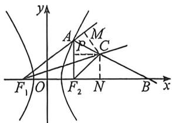

<!-- question-source:start -->
例35 (河北省2025届高考冲刺模拟考试·T8)已知双曲线 $E: \frac{x^2}{a^2} - \frac{y^2}{b^2} = 1 (a > 0, b > 0)$ 的左、右焦点分别为 $F_1, F_2$ , 点 $A$ 为 $E$ 右支上一点, 射线 $AB$ 是 $\angle F_1AF_2$ 的外角平分线, 其与 $x$ 轴的交点为点 $B$ , $\angle AF_1F_2$ 的角平分线与直线 $AB$ 交于点 $C$ , 若 $3\overrightarrow{AC} = \overrightarrow{AB}$ , 则双曲线 $E$ 的离心率为 ( )
A. $\sqrt{2}$ B. $\sqrt{3}$ C. 2
D. $\sqrt{5}$

<!-- question-source:end -->

![[高中/总复习/二轮/2026版高中《MST新思路思维拓展》二轮复习专题/下册/板块1_不等式/考点四_椭圆双曲线焦点三角形与光学性质综合隐藏/questions/answers/Q00093388A1.md]]
