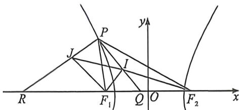

<!-- question-source:start -->
例36 (2024·成都青羊区模拟)已知双曲线 $\frac{x^2}{a^2} -\frac{y^2}{b^2} = 1(a > 0,b > 0)$ 的左、右焦点分别为 $F_{1},F_{2},P$ 为左支上一点， $\angle PF_1F_2 = \frac{2\pi}{3},\triangle PF_1F_2$ 的内切圆圆心为 $I$ ，直线 $PI$ 与 $x$ 轴交于点 $Q$ ，若双曲线的离心率为

$\frac{5}{4}$ , 则 $\frac{|PI|}{|IQ|} =$ \_\_\_\_.

<!-- question-source:end -->

![[高中/总复习/二轮/2026版高中《MST新思路思维拓展》二轮复习专题/下册/板块1_不等式/考点四_椭圆双曲线焦点三角形与光学性质综合隐藏/questions/answers/Q00093389A1.md]]
