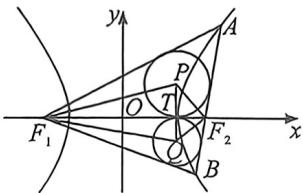
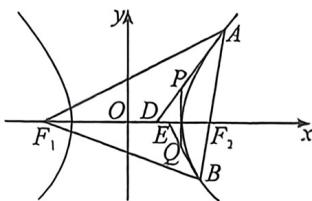

<!-- question-source:start -->
例39 (2025 广东省中学生数学奥林匹克竞赛一试·T12) 已知双曲线 $C: \frac{x^2}{3} - \frac{y^2}{9} = 1$ , 其左、右焦点分别为 $F_1, F_2$ , 过 $F_2$ 的直线 $l$ 与双曲线右支交于 $A, B$ 两点, $P, Q$ 分别为 $\triangle AF_1F_2$ 和 $\triangle BF_1F_2$ 的内心, 设直线 $AP, BQ$ 分别与 $x$ 轴交于 $D, E$ .

(1)求四边形 $PF_{1}QF_{2}$ 面积 S 的取值范围；

(2)求 $DE$ 的取值范围.

<!-- question-source:end -->

![[高中/总复习/二轮/2026版高中《MST新思路思维拓展》二轮复习专题/下册/板块1_不等式/考点四_椭圆双曲线焦点三角形与光学性质综合隐藏/questions/answers/Q00093392A1.md]]
