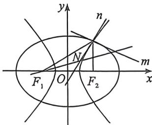

<!-- question-source:start -->
例40 (24-25·高三上安徽蚌埠期末·T14)已知椭圆 $C_1$ 与双曲线 $C_2$ 有相同的焦点 $F_1(-2,0), F_2(2,0)$ , 点 $P(2,3)$ 是 $C_1$ 与 $C_2$ 的交点. 记椭圆 $C_1$ 在点 $P$ 处的切线为直线 $m$ , 双曲线 $C_2$ 在点 $P$ 处的切线为直线 $n, \angle PF_1F_2$ 的平分线与 $m, n$ 分别相交于点 $M, N$ , 则 $\frac{|MF_1|}{|NF_1|} = \_$ .

<!-- question-source:end -->

![[高中/总复习/二轮/2026版高中《MST新思路思维拓展》二轮复习专题/下册/板块1_不等式/考点四_椭圆双曲线焦点三角形与光学性质综合隐藏/questions/answers/Q00093393A1.md]]
