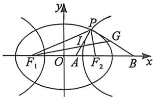

<!-- question-source:start -->
例41 (2023 届哈哈尔滨三中富三一模·T16)如图,椭圆 $\frac{x^{2}}{a^{2}}+\frac{y^{2}}{b^{2}}=1(a>b>0)$ 与双曲线 $\frac{x^{2}}{m^{2}}-\frac{y^{2}}{n^{2}}=1(m>0,$ $n>0$ 有公共焦点 $F_{3}(-c,0),F_{2}(c,0)$ ,椭圆的离心率为 $e_{1}$ ,双曲线的离心率为 $e_{2}$ ,点 $P$ 为两曲线的一个公共点, $\angle F_{1}PF_{2}=60^{\circ}$ ,则 $\frac{1}{e_{1}^{2}}+\frac{3}{e_{2}^{2}}=$ \_\_\_\_;I为 $\triangle PF_{1}F_{2}$ 的内心, $F_{1},I,G$ 三点共线,且 $\overrightarrow{GP}$ · $\overrightarrow{IP}=0,x$ 轴上点A、B满足 $\overrightarrow{AI}=\lambda\overrightarrow{IP},\overrightarrow{BG}=\mu\overrightarrow{GP}$ ,则 $\lambda^{2}+\mu^{2}$ 的最小值为\_\_\_\_.

<!-- question-source:end -->

![[高中/总复习/二轮/2026版高中《MST新思路思维拓展》二轮复习专题/下册/板块1_不等式/考点四_椭圆双曲线焦点三角形与光学性质综合隐藏/questions/answers/Q00093394A1.md]]
