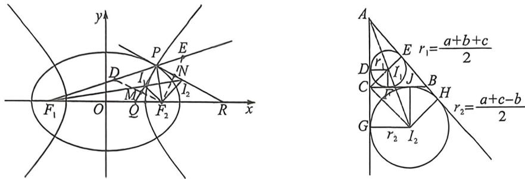

<!-- question-source:start -->
例42 (25 河北沧州高三上期末·T11)椭圆 $C_{1}: \frac{x^{2}}{a_{1}^{2}} + \frac{y^{2}}{b_{1}^{2}} = 1 (a_{1} > b_{1} > 0)$ 与双曲线 $C_{2}: \frac{x^{2}}{a_{2}^{2}} - \frac{y^{2}}{b_{2}^{2}} = 1 (a_{2} > 0, b_{2}$

>0)有共同的左焦点 $F_{1}(-c,0)$ 和右焦点 $F_{2}(c,0), C_{1}$ 与 $C_{2}$ 离心率分别为 $e_{1}, e_{2}$ , 它们在第一象限的交点为 $P(O$ 为坐标原点), 圆 $I_{1}$ 是 $\triangle F_{1}PF_{2}$ 的内切圆, 过点 $P$ 且与直线 $PI_{1}$ 垂直的直线与 $F_{1}I_{1}$ 交于 $I_{2}$ , 则 ( )

A. 当 $|F_{1}F_{2}| = 2|OP|$ 时, $\frac{1}{e_1^2} +\frac{1}{e_2^2} = 2$

B. 当 $|F_{1}F_{2}| = 2|OP|$ 时， $|PI_{1}| + |PI_{2}| = \sqrt{2}(a_{1} - a_{2})$

C. $\left|F_{1}I_{2}\right|-\left|F_{1}I_{1}\right|=a_{1}-a_{2}$

D. 过右焦点 $F_{2}$ 分别作直线 $PI_{1}, PI_{2}$ 的垂线, 垂足分别为 $M, N$ , 则 $|ON| - |OM| = a_{1} - a_{2}$
<!-- question-source:end -->

![[高中/总复习/二轮/2026版高中《MST新思路思维拓展》二轮复习专题/下册/板块1_不等式/考点四_椭圆双曲线焦点三角形与光学性质综合隐藏/questions/answers/Q00093395A1.md]]
