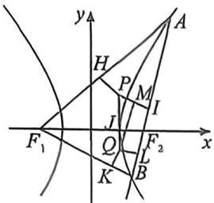
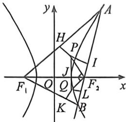

> [!faq]- 例题解析
>
> > [!success]- **【答案】** $\frac{3}{2}$
>
> > [!note]- **【解析】**
> > 解析 由题意, 直线 $y = x - \sqrt{a^2 + b^2} = x - c$ , 则直线过 $F_2$ , 如图, 设 $\triangle AF_1F_2$ 内切圆与各边的切点为 $H, I, J$ , 则 $|AF_1| - |AF_2| = (|AH| + |HF_1|) - (|AI| + |IF_2|) = |HF_1| - |IF_2| = |F_1J| - |JF_2| = 2a$ , 设 $J(m,0)$ , 则 $m = a$ , 即 $P$ 点的横坐标为 $a$ , 同理可得 $Q$ 点的横坐标为 $a$ . 则 $PQ$ 的直线方程为 $x = a$ , 易知 $P, J, F_2, I$ 四点共圆, 则$\angle IPJ = \angle AF_{2}x = \frac{\pi}{4}$ 设 $|PJ| = r_1, |QJ| = r_2$ ，过 $Q$ 作 $QM // AB$ 交 $PI$ 于 $M$ ，易知 $MILQ$ 为矩形，
> >
> > 
> >
> > 
> >
> > $|PQ|=r_{1}+r_{2}=\sqrt{2}a,|PM|=r_{1}-r_{2}=|PQ|\cos\angle IPQ=a$ , 解得: $\left\{\begin{aligned}r_{1}&=\frac{\sqrt{2}+1}{2}a\\ r_{2}&=\frac{\sqrt{2}-1}{2}a\end{aligned}\right.$ ，如右图所示，由于 $PF_{2}$ 和 $QF_{2}$ 分别
> >
> > 为 $\angle PF_{2}F_{1}$ 和 $\angle QF_{2}F_{1}$ 的角平分线，故 $\angle PF_{2}Q = \frac{\pi}{2}, |JF_{2}|^{2} = |PJ| \cdot |QJ| = r_{1}r_{2} \Leftrightarrow (c - a)^{2} = \frac{1}{4}a^{2}$ ，得 $2c = 3a, e = \frac{c}{a} = \frac{3}{2}$ . 故答案为： $\frac{3}{2}$ .
