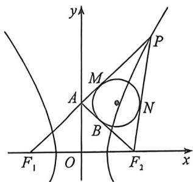
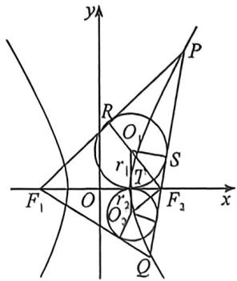

> [!faq]- 例题解析
>
> > [!success]- **【答案】** AD
>
> > [!note]- **【解析】**
> > 解析 已知双曲线 $E: \frac{x^2}{a^2} - \frac{y^2}{b^2} = 1 (a > 0, b > 0)$ 的左右焦点分别为 $F_1, F_2$ ，过其右焦点 $F_2(5,0)$ 的直线 $l$ 与它的右支交于 $P, Q$ 两点， $PF_1$ 与 $y$ 轴相交于点 $A$ ， $\triangle PAF_2$ 的内切圆与边 $AF_2$ 相切于点 $B$ ，设 $|AB| = t$ ，因为 $\triangle PAF_2$ 的内切圆与边 $AF_2$ 相切于点 $B$ ，如图， $M, N$ 为另外两个切点，由切线长定理可知 $|PM| = |PN|$ ， $|F_2B| = |F_2N|$ ， $|AM| = |AB|$ ，因为 $A$ 在 $y$ 轴上，所以 $|AF_1| = |AF_2|$ ， $|PF_1| - |PF_2| = |PM| + |AM| + |AF_1| - (|PN| + |F_2N|) = |AM| + |AF_1| - |F_2N| = |AB| + |AF_2| - |F_2B| = 2|AB| = 2t$ ，
> >
> > 
> >
> > 
> >
> >
> > 所以 $a = t, c = 5, b^2 = 25 - t^2$ ，双曲线 $E$ 的方程为： $\frac{x^2}{t^8} - \frac{y^2}{25 - t^2} = 1$ ，若 $t = 4$ ，则 $a = 4$ ，所以 $||PF_1| - |PF_2|| = 2a = 8$ ，故 A 正确；
> >
> > 对于 B, 因为 $\triangle F_{1}PF_{2}$ 的面积 $S=\frac{b^{2}}{\tan\frac{\theta}{2}}$ , 故 B 错误;
> >
> > 对于 C, t=3，则 a=3, c=5, $b^{2}=16$ ，双曲线的方程为 $\frac{x^{2}}{9}-\frac{y^{2}}{16}=1$ ，直线 l 的方程为 $y=k(x-2)$ ，联立 $\left\{\begin{aligned}y &= k(x-2) \\ \frac{x^{2}}{9} - \frac{y^{2}}{16} &= 1\end{aligned}\right.$ ，消
> >
> > y 得 $(16-9k^{2})x^{2}+36k^{2}x-36k^{2}-36\times4=0$ ，则 $\left\{\begin{aligned}16-9k^{2}\neq0\\ \triangle=(36k^{2})^{2}-4(-36k^{2}-36\times4)(16-9k^{2})>0\end{aligned}\right.$
> >
> > 解得 $-\frac{4\sqrt{5}}{5} < k < \frac{4\sqrt{5}}{5}$ 且 $k \neq \pm \frac{4}{3}$ , 故若 $t = 3$ , 过点(2,0)且斜率为 $k$ 的直线 $l$ 与 $E$ 有 2 个交点时, $-\frac{4\sqrt{5}}{5} < k < \frac{4\sqrt{5}}{5}$ 且 $k \neq \pm \frac{4}{3}$ , 故 $C$ 错误;
> >
> > 对于 D, 若 t=3, 则 a=3, c=5, $b^{2}=16$ , 双曲线的方程为 $\frac{x^{2}}{9}-\frac{y^{2}}{16}=1$ , 如图, 设两内切圆圆心分别为 $O_{1}, O_{2}$ , 半径分别为 $r_{1}, r_{2}$ , 设直线 PQ 的倾斜角为 $\theta$ , 则 $\angle PF_{2}F_{1}=\pi-\theta$ , 在 $Rt_{\triangle O_{1}TF_{1}}, Rt_{\triangle O_{1}TF_{1}}$ 中有 $r_{1}=\frac{c-a}{\tan\frac{\theta}{2}}=\frac{2}{t}, r_{2}=(c-a)\tan\frac{\theta}{2}=2t$ , 设 $m=\tan^{2}\frac{\theta}{2}=t^{2}$ , 所以 $r_{1}^{2}+r_{2}^{2}=\frac{4}{\tan^{2}\frac{\theta}{2}}+4\tan^{2}\frac{\theta}{2}=4m+\frac{4}{m}=4\left(m+\frac{1}{m}\right)$ , 显然, 当 m=1, 即 $\frac{\theta}{2}=\frac{\pi}{4}$ , 即 $\theta=\frac{\pi}{2}$ 取得最小值 8, 记 $\triangle PF_{1}F_{2}$ 的内切圆面积为 $S_{1}, \triangle QF_{1}F_{2}$ 的内切圆面积为 $S_{2}$ , 故若 t=3, 则 $\triangle PF_{1}F_{2}$ 的内切圆与 $\triangle QF_{1}F_{2}$ 的内切圆的面积之和的最小值为 $8\pi$ , 故 D 正确.
> >
> > 故选 **AD**.
