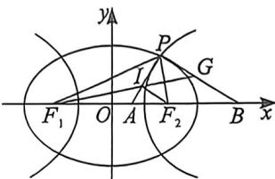
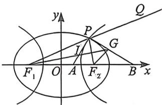

> [!faq]- 例题解析
>
> > [!success]- **【答案】** $4,1 + \frac{\sqrt{3}}{2}$
>
> > [!note]- **【解析】**
> > 解析 这个题第一空很简单,也是一个结论题,我们很容易通过 $\frac{\sin^{2}\frac{\alpha}{2}}{e_{1}^{2}}+\frac{\cos^{2}\frac{\alpha}{2}}{e_{2}^{2}}=1$ 得出 $\frac{1}{e_{1}^{2}}+\frac{3}{e_{2}^{2}}=4$ ;
> >
> > 推导构造加强二级结论,我们证明 $\lambda=\frac{AI}{IP}=e_{1},\mu=\frac{BG}{GP}=e_{2}$ , 然后结合第一空,用柯西不等式解决.
> >
> > 先证 $\lambda = \frac{AI}{IP} = e_1$ ，如下左图，连接 $IF_{2}$ ，则 $\lambda = \frac{AI}{IP} = \frac{F_1A}{F_1P} = \frac{F_2A}{F_2P} = \frac{F_1A + F_2A}{F_1P + F_2P} = \frac{2c}{2a} = e_1$
> >
> > 
> >
> > 
> >
> > 再证 $\mu = \frac{BG}{GP} = e_2$ ，如右上图，延长 $F_{1}P$ 至 $Q$ ，连接 $GF_{2}$ ，由于 $\overrightarrow{GP} \cdot \overrightarrow{IP} = 0$ ，且 $\angle F_{1}PA = \angle APF_{2}$ 故 $\angle F_{2}PB = \angle BPQ$ ，故 $G$ 是 $\triangle F_{1}PF_{2}$ 旁心，同时也满足 $\mu = \frac{BG}{GP} = \frac{BF_{2}}{PF_{2}} = \frac{BF_{1}}{PF_{1}} = \frac{BF_{1} - BF_{2}}{PF_{1} - PF_{2}} = \frac{2c}{2m} = e_{2}$ ，
> >
> > 所以 $\lambda^2 +\mu^2 = \frac{1}{4} (e_1^2 +e_2^2)\left(\frac{1}{e_1^2} +\frac{3}{e_2^2}\right)\geqslant \frac{1}{4} (1 + \sqrt{3})^2 = 1 + \frac{\sqrt{3}}{2}$ ，当且仅当 $\sqrt{3} e_1^2 = e_2^2$ 时等号成立；故答案为： $4,1 + \frac{\sqrt{3}}{2}$
