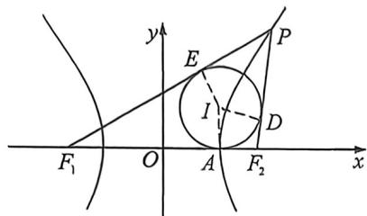
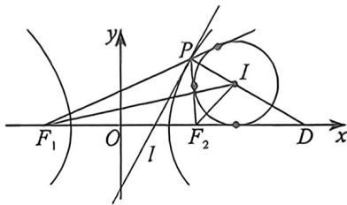
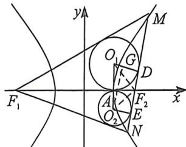
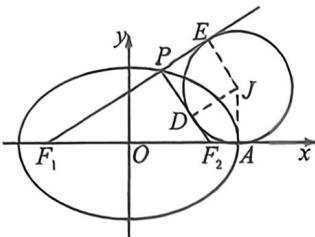
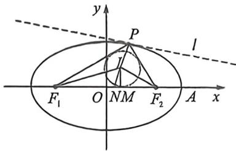

## 考点四_椭圆双曲线焦点三角形与光学性质综合隐藏

## 一、双曲线焦点三角形内心与旁心

1. 双曲线内心轨迹横坐标为 $x_0 = \pm a$

已知双曲线 $\frac{x^2}{a^2} -\frac{y^2}{b^2} = 1(a > 0,b > 0)$ ，则焦点三角形 $PF_{1}F_{2}$ 的内心 $I$ 的轨迹是： $x = \pm a$ ，和实轴的两个顶点相切.

证明:如上左图所示,以点 P 在右支上为例,设内切圆 I 和焦点三角形 $PF_{1}F_{2}$ 的三边分别切于点 D、E、G,则 $2a=|PF_{1}|-|PF_{2}|=|EF_{1}|-|GF_{2}|=|GF_{1}|-|GF_{2}|$ 又 $|GF_{1}|+|GF_{2}|=2c$ ,故 $\left\{\begin{aligned}|GF_{1}|&=a+c\\ |GF_{2}|&=c-a\end{aligned}\right.$ 所以 $|OG|=a$ ，点 G 恰好和双曲线的右端点 A 重合，圆心 I 在直线 x=a 上.

2. 双曲线焦点三角形旁心与离心率

$I$ 是 $\triangle PF_{1}F_{2}$ 的旁心， $F_{1}I, F_{2}I$ 分别是 $\angle PF_{1}D, \angle PF_{2}D$ 的角平分线. 如图则： $\frac{|ID|}{|IP|} = e, \frac{S_{\triangle IF_1D}}{S_{\triangle PF_1I}} = e.$

证明：(外角平分线定理+比例性质)： $\frac{S_{\triangle DIF_{1}}}{S_{\triangle PIF_{1}}}=\frac{|ID|}{|PI|}=\frac{|DF_{1}|}{|PF_{1}|}=\frac{|F_{2}D|}{|PF_{2}|}=\frac{|DF_{1}|-|F_{2}D|}{|PF_{1}|-|PF_{2}|}=\frac{2c}{2a}=e.$

![[高中/总复习/二轮/2026版高中《MST新思路思维拓展》二轮复习专题/下册/板块1_不等式/考点四_椭圆双曲线焦点三角形与光学性质综合隐藏/questions/Q00093388.md]]
![[高中/总复习/二轮/2026版高中《MST新思路思维拓展》二轮复习专题/下册/板块1_不等式/考点四_椭圆双曲线焦点三角形与光学性质综合隐藏/questions/Q00093389.md]]

## 3. 双曲线焦点三角形与双切圆

如图所示, $O_{1}$ 为焦点三角形 $MF_{1}F_{2}$ 的内心, $O_{2}$ 为焦点三角形 $NF_{1}F_{2}$ 的内心, $MN$ 倾斜角为 $\alpha$ , 令 $|AO_{1}| = r_{1}, |AO_{2}| = r_{2}$ , 则一定有 $|O_{1}O_{2}| = r_{1} + r_{2} = \frac{2(c - a)}{\sin \alpha}$ ①; $r_{1}r_{2} = (c - a)^{2}$ ②; $\frac{r_1}{r_2} = \frac{1}{\tan^2\frac{\alpha}{2}}$ ③

证明:由于 $O_{1}O_{2} \parallel y$ 轴,作 $O_{1}D \perp MN$ 于 D, $O_{2}E \perp MN$ 于 E, $O_{2}G \parallel MN$ 交 $O_{1}D$ 于 G, 易知 $\left|O_{1}O_{2}\right| = r_{1} + r_{2}, \left|O_{2}G\right| = \left|DE\right| = 2\left|AF_{2}\right| = 2(c - a), \angle O_{2}O_{1}D = \alpha$ , 所以 $\left|O_{1}O_{2}\right| = \frac{2(c - a)}{\sin\alpha}$ . 根据内心定理, $O_{1}F_{2}, O_{2}F_{2}$ 分别为 $\angle MF_{2}F_{1}$ 和 $\angle NF_{2}F_{1}$ 的平分线, 所以 $O_{1}F_{2} \perp O_{2}F_{2}$ , 根据射影定理, $\left|AO_{1}\right|\left|AO_{2}\right| = \left|AF_{2}\right|^{2}, r_{1}r_{2} = (c - a)^{2}, \frac{r_{1}}{r_{2}} = \frac{\frac{\left|AF_{2}\right|}{\tan\angle AO_{1}F_{2}}}{\left|AF_{2}\right|\tan\angle AF_{2}O_{2}} = \frac{1}{\tan^{2}\frac{\alpha}{2}}.$

![[高中/总复习/二轮/2026版高中《MST新思路思维拓展》二轮复习专题/下册/板块1_不等式/考点四_椭圆双曲线焦点三角形与光学性质综合隐藏/questions/Q00093390.md]]
![[高中/总复习/二轮/2026版高中《MST新思路思维拓展》二轮复习专题/下册/板块1_不等式/考点四_椭圆双曲线焦点三角形与光学性质综合隐藏/questions/Q00093391.md]]
![[高中/总复习/二轮/2026版高中《MST新思路思维拓展》二轮复习专题/下册/板块1_不等式/考点四_椭圆双曲线焦点三角形与光学性质综合隐藏/questions/Q00093392.md]]

## 二、椭圆焦点三角形内心与旁心

1. 椭圆旁心轨迹横坐标为 $x_0 = \pm a$

如图所示,焦点三角形 $PF_{1}F_{2}$ 的旁切圆 J 和 $F_{1}F_{2}$ 的延长线、 $PF_{2}$ 、 $F_{1}P$ 的延长线分别切于点 A(长轴顶点)、D、E,旁心 J 的轨迹为: $x=\pm a$ .

证明： $|F_{1}A| = |F_{1}F_{2}| + |F_{2}A| = |F_{1}F_{2}| + |F_{2}D|, |F_{1}E| = |F_{1}P| + |PE| = |F_{1}P| + |PD|$ ，又 $|F_{1}A| = |F_{1}E|$ ，

故 $2|F_{1}A| = |F_{1}F_{2}| + |F_{2}D| + |F_{1}P| + |PD| = |F_{1}F_{2}| + |F_{1}P| + |F_{2}P| = 2(a + c), |F_{1}C| = a + c,$

又 $|F_1C| = |F_1O| + |OC|$ ，故 $|OA| = a$ ，点 $A$ 恰好和椭圆的长轴端点重合.

2. 椭圆焦点三角形内心与离心率

如图， $I$ 为 $\triangle PF_{1}F_{2}$ 内切圆的圆心， $PI$ 和 $F_{1}F_{2}$ 相交于点 $N$ （区分切点 $M$ ），则 $\frac{|IN|}{|IP|} = e.$

证明:利用角平分线定理+比例性质: $\frac{|IN|}{|IP|}=\frac{|F_{1}N|}{|F_{1}P|}=\frac{|F_{2}N|}{|F_{2}P|}=\frac{|F_{1}N|+|F_{2}N|}{|F_{1}P|+|F_{2}P|}=\frac{2c}{2a}=e,$

![[高中/总复习/二轮/2026版高中《MST新思路思维拓展》二轮复习专题/下册/板块1_不等式/考点四_椭圆双曲线焦点三角形与光学性质综合隐藏/questions/Q00093393.md]]

## 三、椭圆双曲线共焦点三角形内心与旁心

![[高中/总复习/二轮/2026版高中《MST新思路思维拓展》二轮复习专题/下册/板块1_不等式/考点四_椭圆双曲线焦点三角形与光学性质综合隐藏/questions/Q00093394.md]]
![[高中/总复习/二轮/2026版高中《MST新思路思维拓展》二轮复习专题/下册/板块1_不等式/考点四_椭圆双曲线焦点三角形与光学性质综合隐藏/questions/Q00093395.md]]
