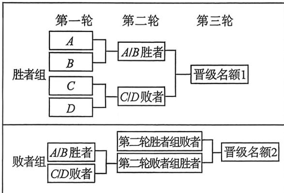

<!-- question-source:start -->
例36 (2026届襄阳四中月考T17)在体育比赛中,近年来一个新型的赛制“双败赛制”赢得了许多赛事的青睐.传统的淘汰赛失败一场就丧失了冠军争夺的资格,而在双败赛制下,每人或者每个队伍只有失败了两场才会淘汰出局,因此更有容错率.假设最终进入半决赛的有四支队伍,传统的淘汰赛制下,会将他们四支队伍两两分组进行比赛,胜者进入总决赛,总决赛的胜者即为最终的冠军;双败赛制下,

两两分组, 胜者进入胜者组, 败者进入败者组, 胜者组两个队伍对决的胜者将进入总决赛, 败者进入败者组, 之前进入败者组的两个队伍对决的败者将直接淘汰, 胜者将跟胜者组的败者对决, 其中的胜者进入总决赛, 最后总决赛的胜者即为冠军 (赛制流程图如图所示). 双败赛制下会发生一个有意思的事情, 在胜者组中的胜者只要输一场比赛即总决赛就无法拿到冠军, 但是其他的队伍却有一次失败的机会, 近年来从败者组杀上来拿到冠军的不在少数, 因此很多人戏谑这个赛制对强者不公平, 是否真的如此呢? 这里我们简单研究一下两个赛制: 假设四支队伍分别为 $A, B, C, D$ , 其中 $A$ 对阵其他三个队伍时获胜的概率均为 $p (0 < p < 1)$ , 另外三支队伍彼此之间对阵时获胜的概率均为 $\frac{1}{2}$ , 最初分组时, $A, B$ 同组, $C, D$ 同组.

(1)若 $p = \frac{3}{4}$ ，在淘汰赛赛制下， $A,C$ 获得冠军的概率分别为多少？

(2)分别计算两种赛制下 A 获得冠军的概率(用 p 表示),并分析一下双败赛制下对队伍的影响,是否如很多人质疑的“对强者不公平”?

双败赛制流程图
<!-- question-source:end -->

![[高中/总复习/二轮/2026版高中《MST新思路思维拓展》二轮复习专题/下册/板块1_不等式/考点四_概率_p_n_与_p__n_1__的不等式问题/questions/answers/Q00093484A1.md]]
