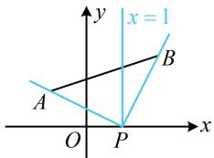

> [!faq]- 《第1节 直线的方程》参考答案
>
> > [!success]- **【答案】** $\left[-\frac{1}{2}, 2\right]$
>
> > [!note]- **【分析】**
> > 本题未单列分析。
>
> > [!note]- **【解析】**
> > 解析：直线 l 的方程含参，先观察是否过定点，
> >
> > 由题意，直线 l 过定点 $P(1,0)$ ，
> >
> > 参数 $m$ 与直线 $l$ 的斜率有关，故可通过分析 $l$ 的斜率的变化范围来求 $m$ 的范围，先考虑斜率不存在的情况，
> >
> > 当 $m = 0$ 时，直线 $l$ 的方程为 $x = 1$ ，如图，满足题意；
> >
> > 当 $m \neq 0$ 时，直线 $l$ 的斜率 $k = -\frac{1}{m}$ ， $k_{PA} = -\frac{1}{2}$ ， $k_{PB} = 2$
> >
> > 直线 $l$ 可从 $PB$ 绕点 $P$ 逆时针旋转至 $PA$ ，过程中经过了竖直线，所以其斜率 $-\frac{1}{m} \leq -\frac{1}{2}$ 或 $-\frac{1}{m} \geq 2$
> >
> > 解得： $0 < m \leq 2$ 或 $-\frac{1}{2} \leq m < 0$
> >
> > 综上所述，实数 $m$ 的取值范围为 $\left[-\frac{1}{2}, 2\right]$ .
> >
> > 
