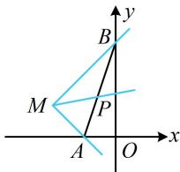

> [!faq]- 《第1节 直线的方程》参考答案
>
> > [!success]- **【答案】** A
>
> > [!note]- **【分析】**
> > 本题未单列分析。
>
> > [!note]- **【解析】**
> > 解析：$ax + y + 2a - 1 = 0\Rightarrow a(x + 2) + (y - 1) = 0$
> >
> > 所以直线 l 过定点 $M(-2,1)$ ，
> >
> > 满足 $\left|PA\right|+\left|PB\right|=\left|AB\right|$ 的点P必在线段AB上，故问题等价于直线l与线段AB有交点，可画图分析，如图， $k_{MA}=\frac{0-1}{-1-(-2)}=-1,\quad k_{MB}=\frac{1-3}{-2-0}=1$ ，
> >
> > 直线 $l$ 从 $MA$ 绕 $M$ 逆时针旋转至 $MB$ ，与线段 $AB$ 有交点，
> >
> > 旋转过程中不经过竖直线，故其斜率的变化范围是[-1,1]，
> >
> > 所以其倾斜角的变化范围是 $\left[0, \frac{\pi}{4}\right] \cup \left[\frac{3\pi}{4}, \pi\right)$ .
> >
> > 
