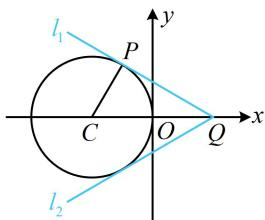

> [!faq]- 《第1节 直线的方程》参考答案
>
> > [!success]- **【答案】** CD
>
> > [!note]- **【分析】**
> > 本题未单列分析。
>
> > [!note]- **【解析】**
> > CD
> >
> > 解析：出现关于 $x, y$ 的一次分式结构，可考虑运用两点连线的斜率来分析，因为 $\frac{y}{x - 1} = \frac{y - 0}{x - 1}$ ，所以 $\frac{y}{x - 1}$ 可看成动点 $P(x, y)$ 与定点 $Q(1,0)$ 的连线斜率，
> >
> > $x^{2} + y^{2} + 2x = 0\Rightarrow (x + 1)^{2} + y^{2} = 1\Rightarrow$ 点 $P$ 可在如图所示的圆上运动， $PQ$ 斜率最小的是 $l_{1}$ ，最大的是 $l_{2}$
> >
> > 观察图形发现 $\triangle PCQ$ 的三边易求出，故可求得 $\tan \angle PQC$ ，进而得到 $l_{1}$ 的斜率，
> >
> > 由题意， $|PC|=1$ ， $C(-1,0)$ ， $|CQ|=2$ ，
> >
> > 所以 $\left|PQ\right|=\sqrt{\left|CQ\right|^{2}-\left|PC\right|^{2}}=\sqrt{3}$ ，
> >
> > 从而 $\tan \angle PQC = \frac{|PC|}{|PQ|} = \frac{\sqrt{3}}{3}$ ，故直线 $l_{1}$ 的斜率为 $-\frac{\sqrt{3}}{3}$ ，
> >
> > 由对称性知直线 $l_{2}$ 的斜率为 $\frac{\sqrt{3}}{3}$
> >
> > 所以 $\frac{y}{x - 1}$ 的最小值为 $-\frac{\sqrt{3}}{3}$ ，最大值为 $\frac{\sqrt{3}}{3}$ .
> >
> > 
