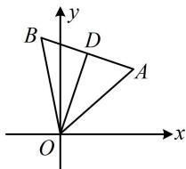

> [!faq]- 《第1节 直线的方程》参考答案
>
> > [!success]- **【答案】** $-\frac{13}{3}$
>
> > [!note]- **【分析】**
> > 本题未单列分析。
>
> > [!note]- **【解析】**
> > 解析：如图， $OD$ 是正 $\triangle AOB$ 的一条高线，其斜率为3，
> >
> > 因为 $AB \perp OD$ ，所以直线 $AB$ 的斜率为 $-\frac{1}{3}$
> >
> > 接下来计算 $OA$ 和 $OB$ 的斜率，可抓住它们与 $OD$ 的夹角均为 $30^{\circ}$ ，夹角问题，用方向向量处理，
> >
> > 直线 $OD$ 的方向向量为 $\pmb {m} = (1,3)$ ，设与直线 $OD$ 夹角为 $30^{\circ}$ 的直线斜率为 $k$ ，则其方向向量为 $\pmb {n} = (1,k)$
> >
> > 所以 $|\cos < m, n >| = \frac{|m \cdot n|}{|m| \cdot |n|} = \frac{|1 + 3k|}{\sqrt{10} \cdot \sqrt{1 + k^2}} = \cos 30^\circ = \frac{\sqrt{3}}{2}$ ,
> >
> > 解得： $k = -2\pm \frac{5}{\sqrt{3}}$ ，由图可知 $OA$ 的斜率为正， $OB$ 的斜
> >
> > 率为负，所以 $k_{OA} = -2 + \frac{5}{\sqrt{3}}$ ， $k_{OB} = -2 - \frac{5}{\sqrt{3}}$
> >
> > 故该正三角形的三边所在直线的斜率之和为
> >
> > $$
> > - 2 + \frac {5}{\sqrt {3}} - 2 - \frac {5}{\sqrt {3}} - \frac {1}{3} = - \frac {1 3}{3}
> > $$
> >
> > 
